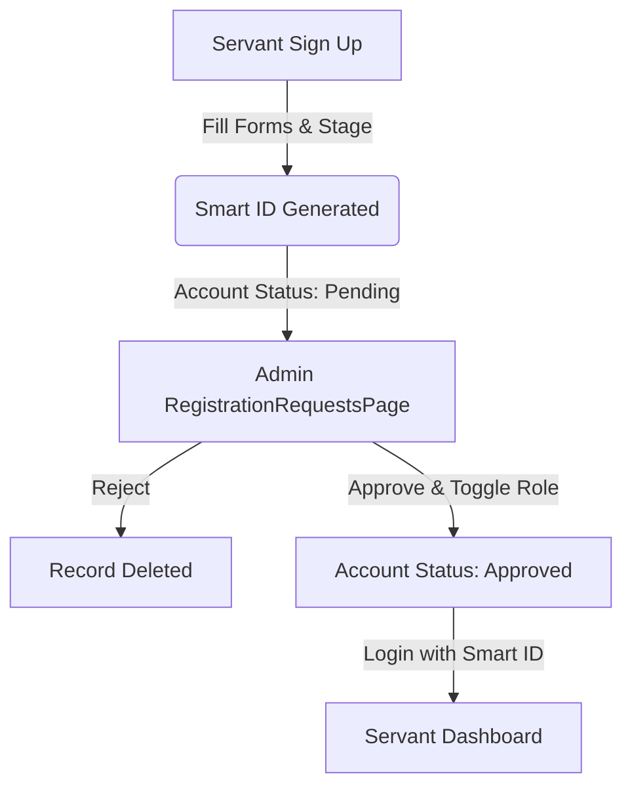
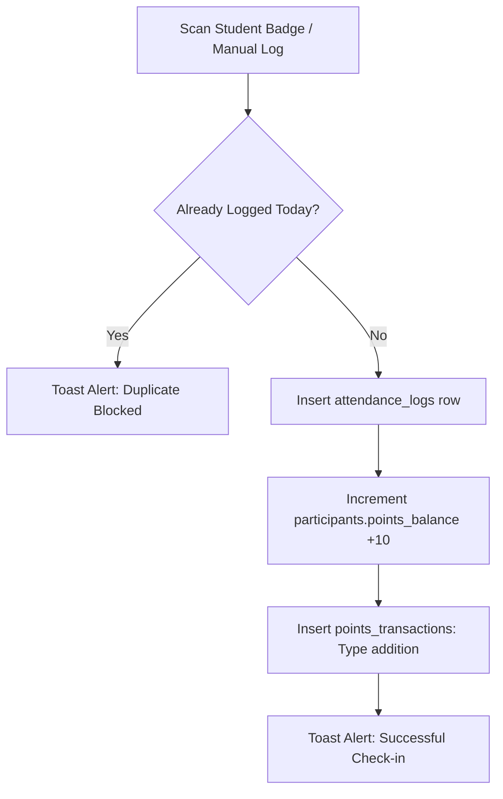
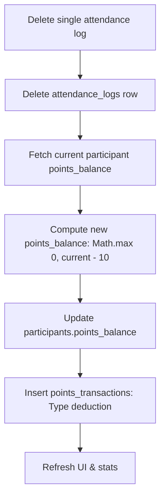

# اريبصالين - Summer Festival Management System
## Complete Technical Documentation

**Current Version:** 1.6.3 (Granular Attendance Management & Security Fixes)  
**Last Updated:** July 6, 2026

---

## 📚 Documentation Index

This document provides a single, cohesive, up-to-date guide for developers and administrators of the Aribsalin Summer Festival Management System. 

1. [Project Overview](#-project-overview)
2. [Technology Stack & Development Tools](#-technology-stack--development-tools)
3. [Key System Features](#-key-system-features)
4. [System Workflows](#-system-workflows)
5. [Project Directory & Folders Structure](#-project-directory--folders-structure)
6. [Detailed File Breakdown](#-detailed-file-breakdown)
7. [Database Schema (Supabase PostgreSQL)](#-database-schema-supabase-postgresql)
8. [Points & Attendance Mechanics](#-points--attendance-mechanics)
9. [Color System & Design Tokens](#-color-system--design-tokens)
10. [Release History & Updates](#-release-history--updates)

---

## 📋 Project Overview

**Project Name:** اريبصالين (Aribsalin)  
**Type:** Summer Festival & Deacon School Management System  
**Church:** Church of the Great Martyr St. Mina the Wonderworker and Pope Kyrillos VI - Aswan  
**Language:** Arabic (RTL)  
**Platform:** Mobile-First Web Application  

Aribsalin is a modern, responsive, and secure administration portal designed to streamline participant registration, check-in, point rewards, purchases, staff onboarding, and financial tracking for the summer deacon school.

---

## 🛠️ Technology Stack & Development Tools

The application is built using the following core technologies:

- **React 18.3.1 & TypeScript:** Ensuring type safety, component-based modular UI, and reliable state management.
- **Tailwind CSS v4:** High-performance, utility-first styling with native CSS variable bindings.
- **Vite 6.3.5:** Next-generation build tool and dev server.
- **Supabase:** Backend-as-a-Service providing PostgreSQL database, Authentication (email/password with teacher ID synthesis), and Storage (for profile photos).
- **Recharts 2.15.2:** Responsive, svg-based data visualizations for statistics and financial dashboards.
- **html5-qrcode:** Hardened scanning engine used to decode participant badges from live camera feeds or uploaded screenshots.
- **qrcode.react 4.2.0:** Lightweight SVG-based component for generating crisp participant QR codes.
- **html2canvas 1.4.1 & jsPDF 4.2.1:** Utilities for exporting high-quality individual ID card PNGs and compiling bulk class badges into a single PDF document.
- **Sonner 2.0.3:** Smooth, customizable, RTL-compatible toast notifications for real-time success or error messages.
- **MUI Material 7.3.5 & Radix UI Primitives:** Providing accessible foundation structures for modals, sheet sliders, and select components.

---

## 🎯 Key System Features

### 1. Unified Authentication & Role-Based Access Control (RBAC)
- **Role Gating:** Views and functions are partitioned into three access tiers:
  - **Admin:** Has full control over database, reviews servant registration requests, manages class sessions, views global statistics, logs transactions, and triggers bulk ID generation.
  - **Supervisor:** Assigned to a specific educational stage (e.g., primary, preparatory). Can view and manage participants, check attendance, and view statistics scoped *exclusively* to their class.
  - **Servant (Normal):** Registered staff who can scan QR codes (for attendance, markets, or rewards), search students, view profiles, and update individual points.
- **Smart ID Authentication:** Signups generate custom credentials (e.g., `A01` for admins, `S01` for servants). Login uses these synthesized IDs mapped to unique emails in Supabase.

### 2. Multi-Mode QR Scanner (Camera + File Upload)
- **Attendance Mode:** Instantly registers attendance, issues +10 points, and records logs.
- **Market Mode:** Scan badges to debit points for market purchases. Validates that the participant has a sufficient balance to prevent overdrafts.
- **Add Points Mode:** Scan to issue custom bonus points to a participant.
- **View Details Mode:** Scan badges to open the participant's detailed profile page.
- **Lossless Upload Parser:** Mobile-optimized file uploader scales small screenshots up to 400px, disables image smoothing, and uses PNG normalization to bypass JPEG compression artifacts, ensuring high recognition rates.

### 3. Dynamic Digital ID Cards
- **Professional Layout:** Designed with church branding (Burgundy-Gold), gender-based profile themes (Blue for boys, Pink for girls, Purple as default), and clean typography.
- **Scan Readiness:** Features a high-density QR code (Level H error correction) that can be scanned even if partially damaged.
- **Single Download:** Generates and downloads the ID card as a high-resolution PNG on the student's profile page.
- **Bulk Download:** Admins can export PDF booklets containing ID cards for selected educational stages, rendering cards in batches of 8 to conserve system memory.

### 4. Granular Attendance & Session Management
- **Manual Check-In:** Offers a date-picker modal in the participants list to log attendance retroactively while preventing double entries on the same date.
- **Individual Deletion:** Admins and supervisors can remove single attendance logs from a student profile. This automatically deducts the 10-point reward and registers a deduction transaction.
- **Macro Session Management:** Admins can view entire attendance sessions grouped by date and stage, allowing them to delete the whole session in chunks of 200 logs to bypass PostgREST URL length limits.

### 5. Advanced Analytics & Ledger
- **Stage Scoping:** Supervisors see charts, timeline graphs, and rankings filtered to their designated educational level. Admins see the system-wide overview.
- **Leaderboards:** Features medals (Gold, Silver, Bronze) for top performers in points and lists top attendance rates.
- **Finance Ledger:** Logs revenues and expenses with descriptive notes, stage tags, and generates analytics (pie charts for category distribution, bar charts for stage-specific budgets).

---

## 🔄 System Workflows

### 1. Servant Registration & Approval Flow


### 2. Attendance & Point Reward Flow


### 3. Attendance Deletion Flow


---

## 🏗️ Project Directory & Folders Structure

```
src/
├── app/
│   ├── App.tsx                   # Main React entry (bootstraps routing)
│   └── utils/
│       └── stageHelpers.ts       # Stage mapping, translations, and year calculations
├── assets/
│   └── images/                   # Coptic logos, festival branding and default assets
├── components/
│   ├── forms/
│   │   └── RegistrationForm.tsx  # Participant onboarding with phone input sanitizers
│   ├── layout/
│   │   └── AppMain.tsx           # Application state hub, auth gating, and data merges
│   ├── modals/
│   │   ├── AddPointsModal.tsx    # Modal for rewarding bonus points
│   │   ├── BulkIDDownloadModal.tsx # PDF compiler compiling ID cards 8-at-a-time
│   │   ├── ManualPointsModal.tsx # Search-based point modifier (no scan needed)
│   │   └── MarketModal.tsx       # Market transaction with overdraft verification
│   ├── shared/
│   │   ├── IDCard.tsx            # Digital badge with barcode and Church colors
│   │   ├── ImageWithFallback.tsx # Themed avatar loading fallback
│   │   ├── ParticipantsList.tsx  # Student table with filters and manual date-picker
│   │   ├── QRScanner.tsx         # Camera and file-upload decoder with PNG canvas normalizer
│   │   ├── TestQRCode.tsx        # Developer-only testing QR triggers
│   │   └── WelcomeScreen.tsx     # Start splash screen with branding animations
│   └── ui/                       # Low-level Tailwind/Radix primitives (48 files)
├── lib/
│   ├── supabase.ts              # Supabase DB client and authentication initializer
│   └── uploadHelper.ts          # Storage upload helper for avatar images
├── pages/
│   ├── Dashboard.tsx            # Central dashboard page for servants, supervisors, and admins
│   ├── FinancePage.tsx          # Expense and revenue ledger with charting
│   ├── LoginPage.tsx            # Credential-based login gateway (ID & password)
│   ├── RegistrationRequestsPage.tsx # Review board for approving pending servant signups
│   ├── RoleSelectionPage.tsx     # Landing page routing between Students and Servants
│   ├── ServantProfile.tsx       # Profile page for servants with storage photo upload
│   ├── SignupPage.tsx            # Onboarding screen with real-time field validation
│   ├── StatisticsPage.tsx       # Analytics panel, restricted/scoped dynamically
│   ├── StudentPortalLogin.tsx    # Access portal for participants to view profiles
│   ├── StudentProfile.tsx        # Profile dashboard for participants with individual downloads
│   └── TeachersPage.tsx          # Directory of servants grouped by stage
├── styles/
│   ├── theme.css                # Color variables (Burgundy, Gold, Beige)
│   ├── fonts.css                # Typography declarations (Tajawal, Cairo)
│   ├── tailwind.css             # Main stylesheet compiling Tailwind CSS v4
│   └── globals.css              # Custom resets and global styles
├── types/
│   └── index.ts                 # Centralized TypeScript interface structures
└── utils/
    └── textUtils.ts             # Arabic character normalizer (for searches)
```

---

## 📱 Detailed File Breakdown

### 📂 App Shell & Core Routing
- **`src/app/App.tsx`**  
  Entry point of the React project. Enforces global structures and triggers the routing lifecycle by rendering `AppMain`.
- **`src/components/layout/AppMain.tsx`**  
  The engine of the application. Listens to auth session changes (`supabase.auth.onAuthStateChange`), handles route transitions (`currentView`), and aggregates festival data (fetching `participants`, `attendance_logs`, and transactions separately to merge them in memory, avoiding schema-cache join crashes). Acts as the database controller for check-ins, markets, and point modifications.

### 📂 Modals & Transaction Blocks
- **`src/components/modals/BulkIDDownloadModal.tsx`**  
  Builds a multipage PDF of participant badges. Admins select educational levels. The component retrieves matches, displays them 8-by-8 inside a hidden off-screen layout, runs `html2canvas` scale-2 snapshots, writes them to `jsPDF` pages, and saves the file once the queue completes.
- **`src/components/modals/MarketModal.tsx`**  
  Enforces checkout logic. Prompts for target points, validates that the purchase doesn't exceed the student's current balance, updates `participants` in Supabase, and logs the debit transaction.
- **`src/components/modals/AddPointsModal.tsx` & `ManualPointsModal.tsx`**  
  Modals to credit points. `ManualPointsModal` is search-driven (requires no barcode), allows debiting or crediting, and shows a preview before applying the database update.

### 📂 Layout Components & Utilities
- **`src/components/shared/QRScanner.tsx`**  
  A custom wrapper around `html5-qrcode`. Implements an iOS Safari camera freeze bypass by omitting track vibrations. Features a hidden `#file-qr-reader` canvas that processes files independently. Sharpens uploaded images (scales them to 400px and disables anti-aliasing) to increase success rates.
- **`src/components/shared/IDCard.tsx`**  
  A static layout module. Sizes the card to exactly 350x550px. Renders the church logo and the festival symbol inside a burgundy-gold header, prints student details, formats a clean tracking ID badge, and appends a Level-H QR code.
- **`src/components/shared/ParticipantsList.tsx`**  
  Lists and filters participants. Standardizes filters (gender, stage, attendance status) and implements a retro manual attendance entry button that opens a calendar modal.

### 📂 Application Pages
- **`src/pages/StatisticsPage.tsx`**  
  Leverages `useMemo` to generate metrics. Scans the logged-in servant's role: if they are a `supervisor`, filters the data array to their `class_stage` and adjusts the active days dynamically. Standardizes Y-axis values to 0 and provides zero-line fallbacks for empty datasets to prevent Recharts crashes.
- **`src/pages/Dashboard.tsx`**  
  Main menu hub. Shows stats summaries, action grids (register, QR scan modes, ledger, teachers directory, pending requests), and includes conditional rendering for supervisors/admins.
- **`src/pages/RegistrationRequestsPage.tsx`**  
  Lists signup requests with `status = 'pending'`. Admin can toggle their role (servant/admin) and approve them (updating state in the db) or delete them.
- **`src/pages/ServantProfile.tsx`**  
  Allows servants to view credentials and upload profile pictures. Invokes `uploadHelper` to write files to the `profiles` storage bucket and saves the URL.
- **`src/pages/StudentProfile.tsx`**  
  Portal view for students. Displays their points ledger, complete registration details, and chronological attendance logs. Allows supervisors and admins to delete individual logs directly.

---

## 💾 Database Schema (Supabase PostgreSQL)

The system connects to a Supabase PostgreSQL instance. Below is the structure of the primary tables:

### 1. `participants` (المشاركين)
Tracks students registered in the deacon school.
```sql
CREATE TABLE public.participants (
  id uuid NOT NULL DEFAULT gen_random_uuid(),
  participant_id text UNIQUE,                     -- Readable Smart ID (e.g. KG001, P023)
  full_name text,
  gender text,                                   -- male | female
  educational_stage text,                        -- kg | primary | preparatory ...
  academic_year text,                            -- Grade year details
  birth_date date,
  class_or_job text,
  father_of_confession text,
  mobile_personal text,
  mobile_father text,
  mobile_mother text,
  address_area text,
  address_details text,
  points_balance integer DEFAULT 0,
  photo_url text,
  created_at timestamp with time zone DEFAULT now(),
  CONSTRAINT participants_pkey PRIMARY KEY (id)
);
```

### 2. `attendance_logs` (سجلات الحضور)
Stores check-in records for participants.
```sql
CREATE TABLE public.attendance_logs (
  id uuid NOT NULL DEFAULT gen_random_uuid(),
  participant_id uuid NOT NULL,
  attendance_date date DEFAULT CURRENT_DATE,      -- Prevents multiple logs per student per day
  scanned_at timestamp with time zone DEFAULT now(),
  servant_id uuid,
  CONSTRAINT attendance_logs_pkey PRIMARY KEY (id),
  CONSTRAINT attendance_logs_participant_id_fkey FOREIGN KEY (participant_id) REFERENCES public.participants(id),
  CONSTRAINT attendance_logs_servant_id_fkey FOREIGN KEY (servant_id) REFERENCES public.servants(id)
);
```

### 3. `servants` (الخدام)
Stores system users and profiles, bound to Auth IDs.
```sql
CREATE TABLE public.servants (
  id uuid NOT NULL DEFAULT gen_random_uuid(),      -- Matches auth.users.id
  teacher_id text NOT NULL UNIQUE,                -- Smart ID (e.g. S01, A01)
  full_name text,
  gender text,
  role text,                                     -- normal | supervisor | admin
  class_stage text,                              -- Scoping level (null for admin)
  academic_year text,
  birth_date date,
  father_of_confession text,
  mobile_personal text,
  address_area text,
  address_details text,
  photo_url text,
  status text DEFAULT 'approved'::text,          -- pending | approved
  created_at timestamp with time zone DEFAULT now(),
  CONSTRAINT servants_pkey PRIMARY KEY (id),
  CONSTRAINT servants_auth_fkey FOREIGN KEY (id) REFERENCES auth.users(id)
);
```

### 4. `points_transactions` (سجل النقاط)
Logs all point balances updates.
```sql
CREATE TABLE public.points_transactions (
  id uuid NOT NULL DEFAULT gen_random_uuid(),
  participant_id uuid,
  servant_id uuid,
  transaction_type text,                         -- addition | deduction
  points_amount integer,
  description text,                              -- Details (e.g. Attendance, Market purchase)
  created_at timestamp with time zone DEFAULT timezone('utc'::text, now()),
  CONSTRAINT points_transactions_pkey PRIMARY KEY (id),
  CONSTRAINT points_transactions_participant_id_fkey FOREIGN KEY (participant_id) REFERENCES public.participants(id),
  CONSTRAINT points_transactions_servant_id_fkey FOREIGN KEY (servant_id) REFERENCES public.servants(id)
);
```

### 5. `financial_transactions` (الحركة المالية)
The ledger tracks the festival's budget.
```sql
CREATE TABLE public.financial_transactions (
  id uuid NOT NULL DEFAULT gen_random_uuid(),
  type text,                                     -- revenue | expense
  title text,
  amount integer,
  transaction_date date DEFAULT CURRENT_DATE,
  education_stage text,
  person_name text,
  description text,
  servant_id uuid,
  created_at timestamp with time zone DEFAULT now(),
  CONSTRAINT financial_transactions_pkey PRIMARY KEY (id),
  CONSTRAINT financial_transactions_servant_id_fkey FOREIGN KEY (servant_id) REFERENCES public.servants(id)
);
```

---

## 📈 Points & Attendance Mechanics

The point reward and attendance systems are bound together to maintain consistency and prevent manual errors.

### 1. Attendance Check-in
* **Reward:** Checking in a student (via QR code scanner or manual registry) automatically awards **+10 points**.
* **Log Entry:** Creates a row in `attendance_logs` and an `addition` transaction in `points_transactions` marked `مكافأة حضور يوم YYYY-MM-DD`.
* **Constraint:** A student can only register attendance once per day.

### 2. Log Deletion
* **Rule:** If a servant removes a student's check-in date from their profile, the system automatically deletes the `attendance_logs` record, calculates the new point balance (deducting **10 points** with a floor at 0), and writes a `deduction` transaction marked `إلغاء مكافأة حضور يوم YYYY-MM-DD`.
* **Security:** Deletion is restricted to users with `admin` or `supervisor` roles.

### 3. Points Adjustments (Market & Manual)
* **Market Debit:** Deducts points for items. Prevents confirming transactions if the required points exceed the student's balance.
* **Add Points (Bonus):** Credits additional points to a student's account.
* **Manual Panel:** Allows admins to adjust balances directly (e.g., correcting mistakes or issuing custom prizes) with transaction logging.

---

## 🎨 Color System & Design Tokens

The application interface adheres to a customized palette inspired by Coptic Orthodox Church branding, providing a premium aesthetic.

| Token | CSS Hex | Location | Purpose |
|---|---|---|---|
| `--primary` | `#8B1538` | Header, Sidebar, Borders | **Burgundy** (Church Theme Color) |
| `--secondary` | `#C9A961` | Medals, Subheaders, QR Frames | **Gold** (Spiritual Accent Color) |
| `--background`| `#FAF7F2` | Main page wrap | **Warm Off-white** (Beige Background) |
| `--foreground`| `#3D2817` | Typography | **Dark Brown** (High-contrast Reading Text) |
| `--muted` | `#F0ECE3` | Disabled elements, placeholders | Light Grayish Beige |
| `--success` | `#10B981` | Add Points UI, Success Alerts | Emerald Green |
| `--danger` | `#EF4444` | Expenses, Delete Triggers | Bright Red |
| `--female` | `#EC4899` | Female Statistics representation | Rose Pink |
| `--male` | `#3B82F6` | Male Statistics representation | Sky Blue |

---

## 📝 Release History & Updates

### v1.6.3 (June 20, 2026) - Granular Attendance Management & Security Fixes
* **Individual Attendance Deletion:** Added ability for admins/supervisors to delete individual attendance records from the student profile, automatically updating point balances and logging transactions.
* **Retroactive Attendance Logging:** Implemented manual attendance logs using date-pickers with duplicate prevention.
* **Sessions Management Dashboard:** Created an admin panel grouping sessions by date/stage, performing deletions in chunks of 200 logs to prevent network failures.
* **Canvas Engine Hardening:** Swapped OKLCH color codes for static Hex codes in `html2canvas` to prevent rendering failures on mobile screens.

### v1.6.1 (June 17, 2026) - Authentication & Folder Restructuring
* **Signup Session Fix:** Fixed session caching immediately after signup to prevent blank pages before admin approval.
* **Path Normalization:** Reorganized files, moving shared components to `src/components` and views to `src/pages`.

### v1.6.0 (June 12, 2026) - Servant Approval Flow & Servant Profiles
* **Servant Approval Portal:** Introduced a portal for reviewing, approving, and promoting new servants.
* **Servant Profile Screen:** Added detailed profiles for servants, including image upload support to the `profiles` storage bucket.
* **Stage & Text Helpers:** Integrated stage normalization helpers and Arabic string normalizers to improve search accuracy.

### v1.5.0 (June 5, 2026) - Scanner Optimization & Bug Fixes
* **iOS Camera Freeze Fix:** Removed `navigator.vibrate` calls to prevent video tracks from freezing on Safari.
* **Isolated File Scanner:** Used an independent scanner instance to allow file uploads without interrupting active cameras.
* **PNG Image Normalization:** Forced canvas file scans to render as lossless PNGs to preserve crisp QR code edges.

### v1.4.0 (May 31, 2026) - Statistics Crash Mitigation
* **Statistics page crash-proofing:** Wrapped charts and leaderboards in safe `useMemo` states with fallback arrays to prevent React crashes.
* **Timeline Y-Axis Guard:** Forced a minimum chart index fallback point when database logs are empty.

### v1.1.0 (May 24, 2026) - ID Card Feature Release & Logo Fix
* **Digital ID Cards:** Introduced the `IDCard.tsx` component with printable branding layouts and QR code embeds.
* **Static Asset Import Fix:** Swapped dynamic URL constructors (`new URL`) for ES module imports to prevent missing image placeholders in builds.

### v1.0.0 (May 2026) - Initial Release
* **Core Launch:** Established participant databases, mock profiles, QR scanning utilities, financial registers, and Arabic RTL page formats.

---

*This document serves as the master guide for the system. For specific features, refer to [FEATURES.md](FEATURES.md) or [ID_CARD_DOCUMENTATION.md](ID_CARD_DOCUMENTATION.md).*
