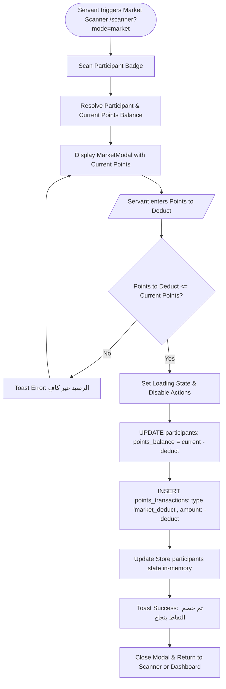
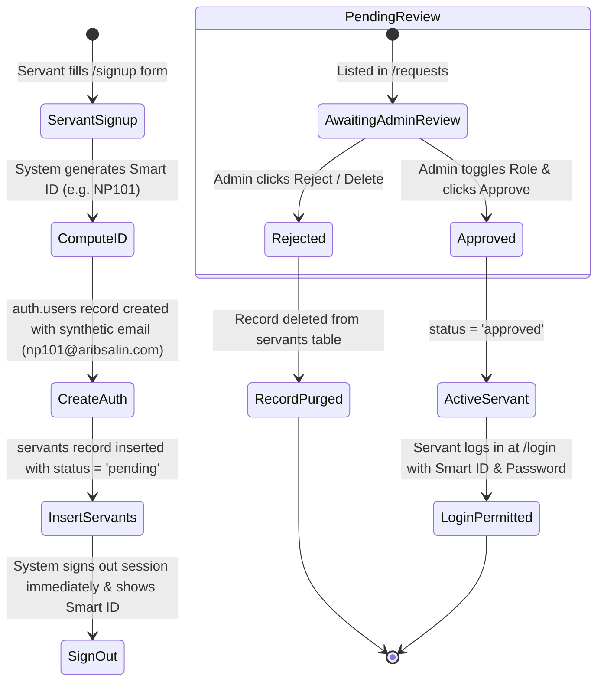
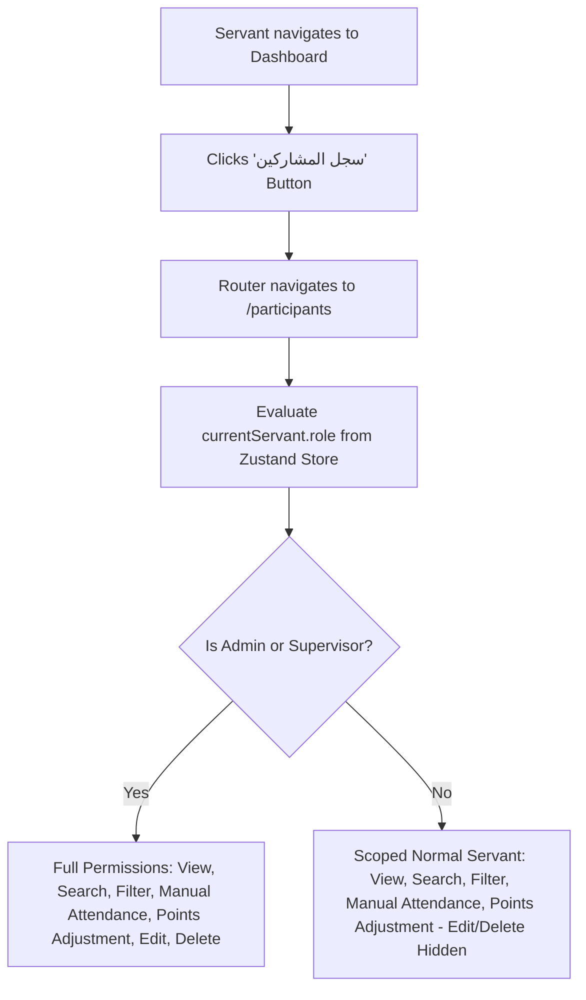
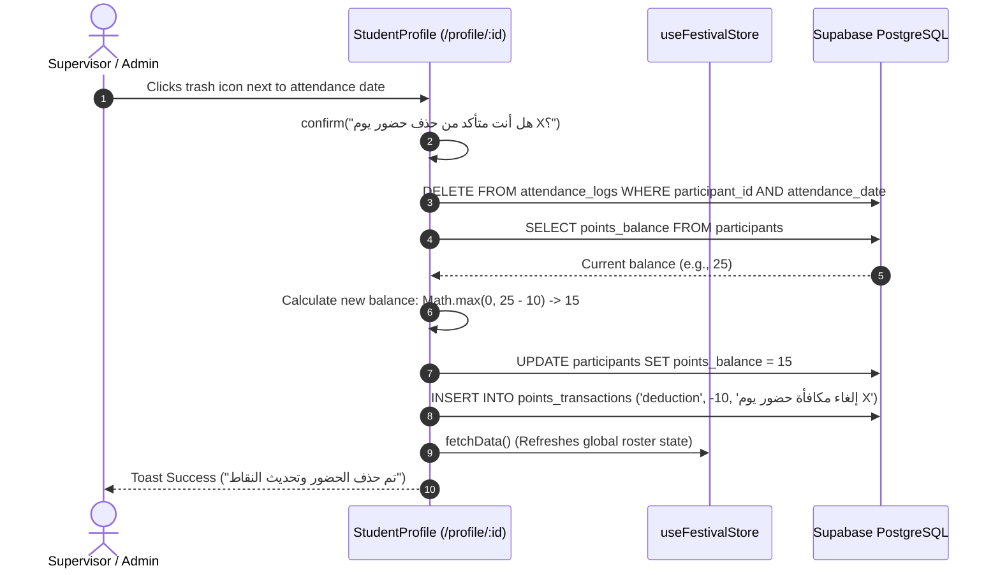
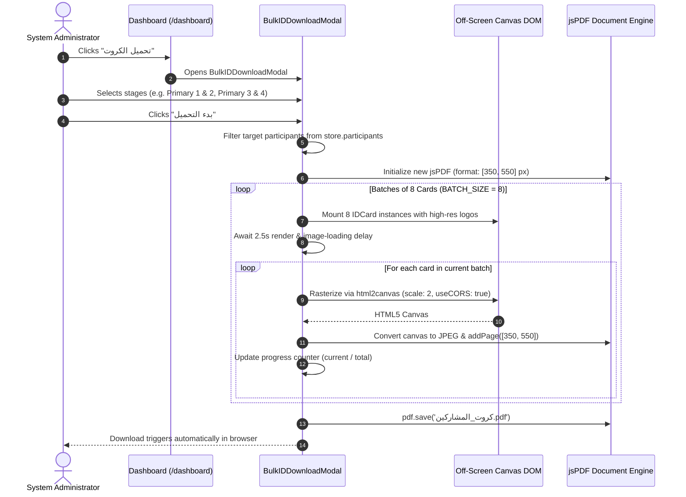

# اريبصالين (Aribsalin) - Summer Festival & Sunday School Management System
## Definitive Master Technical Architecture & Developer Reference Manual

**System Version:** `2.0.0` (URL-Based Routing, Global Zustand Store, Granular RBAC, Smart ID Gap-Filling & Digital Badging)  
**Target Platform:** Mobile-First Responsive Web Application / PWA  
**Primary Language & Direction:** Arabic (`ar`) / Right-to-Left (`dir="rtl"`)  
**Parish / Organization:** Church of the Great Martyr St. Mina the Wonderworker & Pope Kyrillos VI - Aswan  
**Last Revised:** September 2026  

---

## Table of Contents
- [1. Project Idea & Concept](#1-project-idea--concept)
  - [Executive Summary](#executive-summary)
  - [Core Business Problems Solved](#core-business-problems-solved)
  - [Domain Mechanics & Gamification Engine](#domain-mechanics--gamification-engine)
- [2. Tech Stack & Tooling](#2-tech-stack--tooling)
  - [Core Technology Inventory](#core-technology-inventory)
  - [Architectural Rationale: Why These Tools?](#architectural-rationale-why-these-tools)
  - [Configuration & Build Pipeline](#configuration--build-pipeline)
- [3. User Roles & Workflows](#3-user-roles--workflows)
  - [Role-Based Access Control (RBAC) Matrix](#role-based-access-control-rbac-matrix)
  - [Portals & Experience Design](#portals--experience-design)
    - [1. Student / Participant Portal](#1-student--participant-portal)
    - [2. Normal Servant Portal](#2-normal-servant-portal)
    - [3. Class Supervisor Portal](#3-class-supervisor-portal)
    - [4. Administrator Portal](#4-administrator-portal)
  - [End-to-End Operational Workflows](#end-to-end-operational-workflows)
    - [Workflow A: Participant Registration & Smart ID Gap-Filling](#workflow-a-participant-registration--smart-id-gap-filling)
    - [Workflow B: High-Speed QR Attendance Scanning & Conflict Prevention](#workflow-b-high-speed-qr-attendance-scanning--conflict-prevention)
    - [Workflow C: Festival Marketplace Point Deduction with Overdraft Guard](#workflow-c-festival-marketplace-point-deduction-with-overdraft-guard)
    - [Workflow D: Servant Onboarding, Synthetic Auth & Approval Lifecycle](#workflow-d-servant-onboarding-synthetic-auth--approval-lifecycle)
    - [Workflow E: Universal Participants Directory Access & Scoped RBAC](#workflow-e-universal-participants-directory-access--scoped-rbac)
    - [Workflow F: Attendance Cancellation & Compensating Point Rollback](#workflow-f-attendance-cancellation--compensating-point-rollback)
    - [Workflow G: Bulk Printable ID Card Deck Generation](#workflow-g-bulk-printable-id-card-deck-generation)
- [4. Architecture & State Management](#4-architecture--state-management)
  - [System Architectural Overview](#system-architectural-overview)
  - [Global Reactive State Architecture (Zustand Store)](#global-reactive-state-architecture-zustand-store)
  - [Authentication Lifecycle, Initialization & Route Guards](#authentication-lifecycle-initialization--route-guards)
  - [Data Ingestion & In-Memory Stitching Pattern](#data-ingestion--in-memory-stitching-pattern)
  - [Database Schema Specification (Supabase PostgreSQL)](#database-schema-specification-supabase-postgresql)
- [5. Folder Structure & Deep Dive](#5-folder-structure--deep-dive)
  - [Source Tree (ASCII)](#source-tree-ascii)
  - [Directory & Component Deep Dive](#directory--component-deep-dive)
    - [📂 `src/app/`](#-srcapp)
    - [📂 `src/assets/images/`](#-srcassetsimages)
    - [📂 `src/components/auth/`](#-srccomponentsauth)
    - [📂 `src/components/forms/`](#-srccomponentsforms)
    - [📂 `src/components/layout/`](#-srccomponentslayout)
    - [📂 `src/components/modals/`](#-srccomponentsmodals)
    - [📂 `src/components/shared/`](#-srccomponentsshared)
    - [📂 `src/components/ui/`](#-srccomponentsui)
    - [📂 `src/lib/`](#-srclib)
    - [📂 `src/pages/`](#-srcpages)
    - [📂 `src/store/`](#-srcstore)
    - [📂 `src/styles/`](#-srcstyles)
    - [📂 `src/types/`](#-srctypes)
    - [📂 `src/utils/`](#-srcutils)
- [6. Developer Guide: How to Work on This Project](#6-developer-guide-how-to-work-on-this-project)
  - [Design System & UI/UX Governance](#design-system--uiux-governance)
    - [Aesthetic Philosophy: The Coptic Heritage Palette](#aesthetic-philosophy-the-coptic-heritage-palette)
    - [Strict Frontend Implementation Rules](#strict-frontend-implementation-rules)
  - [Local Development Setup](#local-development-setup)
    - [Prerequisites](#prerequisites)
    - [Installation & Execution Commands](#installation--execution-commands)
    - [Production Build & Verification](#production-build--verification)
  - [Critical Architectural Invariants & Edge Cases](#critical-architectural-invariants--edge-cases)
    - [1. Smart ID Gap-Filling Scheme](#1-smart-id-gap-filling-scheme)
    - [2. Synthetic Domain Email Authentication Pattern](#2-synthetic-domain-email-authentication-pattern)
    - [3. iOS Safari Camera Freeze Prevention](#3-ios-safari-camera-freeze-prevention)
    - [4. Supabase PostgREST URL Length Limits (200-Chunk Batches)](#4-supabase-postgrest-url-length-limits-200-chunk-batches)
    - [5. `html2canvas` Color Space & Rendering Constraints](#5-html2canvas-color-space--rendering-constraints)
    - [6. Universal Directory Access with Granular Scoped RBAC](#6-universal-directory-access-with-granular-scoped-rbac)
    - [7. URL-Based Routing & Global Store Architectural Decoupling](#7-url-based-routing--global-store-architectural-decoupling)
  - [Document Maintenance Note](#document-maintenance-note)

---

## 1. Project Idea & Concept

### Executive Summary
**اريبصالين (Aribsalin)** is an enterprise-grade, mobile-first festival and Sunday school management system engineered specifically for the **Church of the Great Martyr St. Mina the Wonderworker & Pope Kyrillos VI in Aswan**. Architected as a modern, reactive single-page application (SPA), the platform digitizes and centralizes participant enrollment, alphanumeric Smart ID allocation, hardware-accelerated QR badge scanning, automated attendance accounting, gamified point economies, festival market redemptions, staff onboarding and role-based credentialing, financial accounting, and demographic intelligence across all educational stages—spanning Kindergarten through University and Graduates.

The name *Aribsalin* derives from the Coptic hymnological tradition (meaning *"Chant / Sing"* — أريبصالين), honoring the spiritual, educational, and community heritage of the church festival.

```
       +-------------------------------------------------------------+
       |                  اريبصالين (Aribsalin)                     |
       |         Church Festival & Sunday School Engine              |
       +-------------------------------------------------------------+
                                       |
          +----------------------------+----------------------------+
          |                                                         |
          v                                                         v
+-------------------------------+                         +-------------------------------+
|       Student Portal          |                         |       Servant Portal          |
|  - Smart ID / QR Badge Access |                         |  - Multi-tier RBAC (Admin,    |
|  - Points & Attendance Gauges |                         |    Supervisor, Normal)        |
|  - Transaction Ledger History |                         |  - High-Speed QR Scanner      |
|  - Digital ID Card PNG Export |                         |  - Treasury, Sessions & Stats |
+-------------------------------+                         +-------------------------------+
```

### Core Business Problems Solved
Traditional church festivals, summer programs, and Sunday schools operate under intense operational pressure during arrival windows, relying on paper rosters, physical stamp cards, and manual bookkeeping. Aribsalin eliminates these operational failures:

1. **Morning Arrival Bottlenecks:** Manual roll-calls for hundreds of arriving youth create long lines and delay spiritual workshops. Aribsalin provides **hardware camera and screenshot-based QR badge scanning** that processes and logs check-ins in under 300 milliseconds.
2. **Attendance Fraud & Duplicate Claims:** Paper cards and punch stamps are easily faked or stamped multiple times in a single day. The system enforces an atomic database-level unique constraint (`unique_daily_attendance` on `participant_id` and `attendance_date`), strictly preventing multiple check-in rewards on the same calendar day.
3. **Loss of Physical Badges:** Physical laminated cards get lost, forgotten, or destroyed. Aribsalin generates **dynamic digital badges** rendered client-side (350x550px) that can be downloaded as high-resolution PNGs directly by students and parents or compiled by administrators into printable PDF decks.
4. **Disorganized Reward Economy:** Points awarded for memorization, good behavior, and attendance often descend into disputes when kept in paper notebooks. Aribsalin maintains an auditable, append-only **double-entry points ledger** (`points_transactions`) with debit validation in the festival marketplace that blocks overdrafts.
5. **Decentralized Multi-Stage Management:** Different cohorts (Kindergarten, Primary 1 & 2, Primary 3 & 4, Primary 5 & 6, Preparatory, Secondary, University/Graduates) have dedicated leaders. Class supervisors require visibility into their assigned cohort without exposing or mutating other stages.
6. **Financial Opacity:** Tracking expenditures (gifts, prizes, transportation, catering, sound equipment) against revenues (donations, enrollment fees) requires auditable accounting. The integrated **Treasury Ledger** connects financial records directly to stages, dates, and supervisors.

### Domain Mechanics & Gamification Engine

```
+---------------------------------------------------------------------------------------+
|                               Attendance & Points Lifecycle                           |
+---------------------------------------------------------------------------------------+
|  [Student Badge Scanned]                                                              |
|          |                                                                            |
|          v                                                                            |
|  [Check: attendance_logs for Today] ---> (Already Present) ---> [Informational Toast] |
|          |                                                                            |
|          +---> (First Time Today)                                                     |
|                     |                                                                 |
|                     +--> 1. INSERT INTO attendance_logs (scanned_at, servant_id)      |
|                     +--> 2. UPDATE participants.points_balance (+10 points)           |
|                     +--> 3. INSERT INTO points_transactions ('attendance_bonus', +10)|
|                     +--> 4. Optimistic Store Update (Reflects in UI < 50ms)           |
+---------------------------------------------------------------------------------------+
```

* **Automated Attendance Bonus:** Every valid attendance check-in immediately credits the student with **+10 points** and registers an audit row in `points_transactions` with `transaction_type = 'attendance_bonus'`.
* **Compensating Rollback on Deletion:** When an authorized supervisor or admin deletes a student's attendance record for a specific date, the system immediately deducts **10 points** (clamped at a floor of zero via `Math.max(0, current - 10)`) and records a `deduction` audit entry.
* **Festival Marketplace Purchases:** Accumulated points serve as internal festival currency. When students purchase items at festival booths, the servant scans the student's badge, enters the item cost, and the system executes a balance check. Overdrafts are rejected with an explanatory toast.
* **Ad-Hoc Bonus Rewards:** Servants can grant custom point increments (for hymns, scripture memorization, or exemplary conduct) via modal scan workflows.

---

## 2. Tech Stack & Tooling

### Core Technology Inventory

| Domain | Technology / Package | Version | Architectural Purpose in Codebase |
|---|---|---|---|
| **Core Framework** | React | `18.3.1` | Component lifecycle, hooks, and virtual DOM rendering. |
| **Language & Typing** | TypeScript | `~5.x` | Strict type contracts across models (`StudentData`, `Participant`, `TeacherData`). |
| **Client-Side Routing** | React Router DOM | `^7.18.3` | URL-based routing, code-splitting (`lazy`/`Suspense`), route guards, and history management. |
| **Global State Store** | Zustand | `^5.0.15` | Centralized, reactive state store (`useFestivalStore`) replacing props drilling. |
| **Bundler & Dev Server** | Vite | `6.3.5` | Instant HMR, ESM bundling, path aliases (`@/`), and asset plugins. |
| **Styling Engine** | Tailwind CSS (v4) | `4.1.12` | Next-gen CSS engine using native CSS variables (`@theme inline`) with zero runtime overhead. |
| **Component Primitives** | Radix UI | Various | Accessible, headless UI foundations (Dialog, Select, DropdownMenu, Tabs, Popover, Tooltip). |
| **UI Library Extensions** | Material UI (MUI) | `7.3.5` | Supporting design icons (`@mui/icons-material`) and system components. |
| **Database & Auth** | `@supabase/supabase-js` | `^2.106.2` | Managed PostgreSQL database, JWT authentication, and S3-compatible file storage. |
| **QR Code Generation** | `qrcode.react` | `^4.2.0` | High-density SVG/Canvas QR generation with Level-H error correction for badges. |
| **QR Code Decoding** | `html5-qrcode` | `^2.3.8` | Resilient camera stream decoder and lossless canvas screenshot analyzer. |
| **Canvas & PDF Export** | `html2canvas` & `jspdf` | `^1.4.1` / `^4.2.1` | Client-side DOM-to-Canvas rasterization and multi-page batch PDF booklet generation. |
| **Data Visualization** | `recharts` | `^2.15.2` | Responsive SVG charts (LineChart, BarChart, PieChart) for demographics and finances. |
| **Notifications** | `sonner` | `2.0.3` | Lightweight, stackable, RTL-compatible toast notification system. |
| **Iconography** | `lucide-react` | `0.487.0` | Tree-shakeable SVG icons representing system workflows. |
| **Package Manager** | `pnpm` | Workspace | Fast, disk-efficient package management with strict dependency isolation. |
| **Hosting & CI/CD** | Vercel | Static Build | Global edge CDN deployment using `@vercel/static-build` configured via `vercel.json`. |

### Architectural Rationale: Why These Tools?

1. **React Router v7 + Code Splitting:**  
   The application leverages `react-router-dom` v7 with `lazy()` dynamic imports wrapped in `<Suspense fallback={<LoadingFallback />}>`. This eliminates monolithic bundle bloat on low-power mobile devices. Servants scanning badges load only the lightweight scanner bundle, while administrative pages (`FinancePage`, `StatisticsPage`, `SessionsManagementPage`) are fetched on demand.
2. **Zustand 5 for State Management:**  
   Unlike nested React Context Providers that trigger cascading re-renders across the entire component tree when a single counter increments, Zustand provides lightweight, selector-based reactivity. Components bind only to the specific slices of state they need (`currentServant`, `participants`, `isAuthenticated`), ensuring 60fps mobile responsiveness.
3. **Tailwind CSS v4 with Native CSS Variables:**  
   Tailwind v4's direct CSS engine eliminates `tailwind.config.js` in favor of `@theme inline` in `src/styles/theme.css`. Design tokens bind directly to CSS variables (`var(--primary)`, `var(--secondary)`, `var(--background)`), allowing instantaneous theme overrides and dark-mode adaptation.
4. **Supabase (BaaS Architecture):**  
   Eliminates backend maintenance overhead while providing PostgreSQL referential integrity, row-level security (RLS), persistent file storage buckets (`profiles/`), and reliable ACID transactions for financial and attendance records.
5. **Hardened `html5-qrcode` Implementation:**  
   Mobile browsers (particularly Safari on iOS) freeze camera video tracks if `navigator.vibrate()` is invoked during scanning callbacks. The codebase eliminates vibration calls and adds a dedicated, hidden off-screen canvas reader (`#file-qr-reader`) with disabled image smoothing to parse low-resolution screenshot uploads.
6. **Client-Side Document Synthesis (`html2canvas` + `jsPDF`):**  
   Church administrators need to print hundreds of student badges without server bandwidth costs. By rasterizing off-screen DOM nodes in batches of 8 at 2x scale and appending them to a 350x550px PDF page, badges are synthesized entirely inside browser memory.

### Configuration & Build Pipeline

* **`package.json` Scripts:**
  - `pnpm dev`: Boots the local Vite development server with HMR.
  - `pnpm build`: Runs Vite production build, outputting optimized bundles to `dist/`.
* **Path Aliasing & Custom Plugins (`vite.config.ts`):**
  - `@/` maps directly to `src/` for clean imports.
  - Custom plugin `figmaAssetResolver()` maps `figma:asset/*` namespaces to `src/assets/`.
  - Configures `assetsInclude` for `.svg` and `.csv` files.
* **Deployment Spec (`vercel.json`):**
  - Uses `@vercel/static-build` targeting the `dist` directory with client-side SPA routing fallbacks.
* **Workspace Config (`pnpm-workspace.yaml`):**
  - Declares root workspace packages and build tool policies.

---

## 3. User Roles & Workflows

### Role-Based Access Control (RBAC) Matrix

The system features four distinct user tiers:

| Feature / Action | Student / Participant (`student`) | Normal Servant (`normal`) | Class Supervisor (`supervisor`) | Admin / General (`admin`) |
|---|:---:|:---:|:---:|:---:|
| **Access Gateway** | Student Portal (`/student-portal`) | Staff Login (`/login`) | Staff Login (`/login`) | Staff Login (`/login`) |
| **Authentication Identity** | Smart ID or QR Badge | `T-ID` + Password | `T-ID` + Password | `T-ID` + Password |
| **View Own Points & Attendance** | Read-Only | Read-Only | Read-Only | Read-Only |
| **Download Individual ID Card (PNG)** | Yes (`/profile/:id`) | Yes (from profile) | Yes | Yes |
| **Scan Badges: Attendance (+10 pts)** | No | Yes (All Classes) | Yes (All Classes) | Yes (All Classes) |
| **Scan Badges: Market Deductions** | No | Yes (Balance Checked) | Yes | Yes |
| **Scan Badges: Add Bonus Points** | No | Yes | Yes | Yes |
| **Access Participants Directory (`/participants`)**| No | Yes (Read / Attendance / Points) | Yes (Full CRUD) | Yes (Full CRUD) |
| **Manual Points Adjustment Dialog** | No | Yes (via Directory) | Yes | Yes |
| **Manual Retroactive Attendance** | No | Yes (via Directory) | Yes (Date Picker) | Yes (Date Picker) |
| **Register New Participant (`/registration`)** | No | No | Yes | Yes |
| **Edit Participant Details (`?edit=:id`)** | No | No | Yes (Scoped) | Yes (All Stages) |
| **Delete Participant Record** | No | No | Yes (Scoped) | Yes (All Stages) |
| **Delete Single Attendance Log** | No | No | Yes (Rollback -10 pts) | Yes (Rollback -10 pts) |
| **Festival Statistics (`/statistics`)** | No | No | Yes (Auto-filtered) | Yes (Global + Stage Filters) |
| **Treasury & Finance Ledger (`/finance`)** | No | No | No | Yes (Revenues / Expenses) |
| **Macro Session Deletion (`/sessions`)** | No | No | No | Yes (200-Chunk Batches) |
| **Servants Approval Board (`/requests`)** | No | No | No | Yes (Approve / Reject) |
| **Servants Directory (`/teachers`)** | No | No | No | Yes (Grouped by Stage) |
| **Bulk ID Cards PDF Export** | No | No | No | Yes (Multi-Stage Batching) |

---

### Portals & Experience Design

#### 1. Student / Participant Portal
* **Target Audience:** Festival youth and their guardians.
* **Authentication Route:** `/student-portal`  
  Zero-friction login requiring no password. The student enters their human-readable Smart ID (e.g., `P301`, `K002`) or scans their physical badge via camera (`/scanner?mode=viewDetails`).
* **Experience (`/profile/:id`):** Displays the student's avatar photo, age, confession father, educational stage, real-time points gauge, percentage attendance circular meter, chronological attendance history, and an action to download their digital badge as a high-resolution PNG.

#### 2. Normal Servant Portal
* **Target Audience:** Service teachers assisting with festival events.
* **Authentication Route:** `/login`  
  Login via assigned Teacher Smart ID (e.g., `NP101`) and password. Requires prior approval by the administrator (`status = 'approved'`).
* **Experience (`/dashboard`):** Fast-action mobile interface prioritizing QR scanner workflows (Attendance check-in, Market checkout, Bonus points, Participant lookup) and full access to the **Participants Directory ("سجل المشاركين" at `/participants`)** to search participants, record manual attendance, and adjust points. Edit and delete mutations are hidden from this role.

#### 3. Class Supervisor Portal
* **Target Audience:** Stage leaders (أمين فصل) responsible for a specific cohort (e.g., Primary 3 & 4).
* **Authentication Route:** `/login`  
  Login via Supervisor Smart ID (e.g., `SP301`).
* **Experience:** In addition to scanner tools and directory access, supervisors receive participant enrollment forms (`/registration`), editing rights, deletion capabilities, attendance log deletion with automated 10-point rollback, and a dedicated **Statistics Page (`/statistics`)** that automatically isolates metrics to their assigned educational stage (`class_stage`).

#### 4. Administrator Portal
* **Target Audience:** Head of service (أمين الخدمة) and festival coordinators.
* **Authentication Route:** `/login`  
  Login via Admin Smart ID (e.g., `A01`).
* **Experience:** Full system management suite containing the **Financial Ledger (`/finance`)**, **Staff Approvals Board (`/requests`)**, **Staff Directory (`/teachers`)**, **Macro Session Wipe Manager (`/sessions`)**, and **Bulk Printable PDF ID Generator (`BulkIDDownloadModal`)**.

---

### End-to-End Operational Workflows

#### Workflow A: Participant Registration & Smart ID Gap-Filling


```mermaid
sequenceDiagram
    autonumber
    actor Supervisor as Admin / Supervisor
    participant Page as RegistrationPage
    participant Form as RegistrationForm
    participant Store as useFestivalStore
    participant DB as Supabase PostgreSQL

    Supervisor->>Page: Navigates to /registration
    Page->>Form: Renders form with stage & academic year options
    Supervisor->>Form: Enters student details & selects photo
    Form->>Page: onSubmit(data)
    Page->>DB: Query exact full_name match
    alt Duplicate Name Found
        DB-->>Page: Existing record returned
        Page-->>Supervisor: Toast Error ("هذا المخدوم مسجل بالفعل في النظام!")
    else Unique Record
        Page->>Page: Compute Prefix: Stage 'P' + Year '3' -> 'P3'
        Page->>DB: SELECT participant_id WHERE id LIKE 'P3%'
        DB-->>Page: Existing IDs ['P301', 'P302', 'P304']
        Page->>Page: Execute Gap-Filling Algorithm -> Next ID: 'P303'
        Page->>DB: INSERT INTO participants (participant_id: 'P303', points_balance: 0, ...)
        DB-->>Page: Record Created
        Page->>Store: fetchData() (Refreshes participants cache)
        Page-->>Supervisor: Toast Success ("تم تسجيل المشارك بنجاح")
        Page->>Supervisor: Redirects to /dashboard
    end
```

#### Workflow B: High-Speed QR Attendance Scanning & Conflict Prevention


```mermaid
sequenceDiagram
    autonumber
    actor Servant as Servant / Teacher
    participant Scanner as QRScanner (/scanner)
    participant Store as useFestivalStore
    participant DB as Supabase PostgreSQL

    Servant->>Scanner: Aims camera at Student Badge
    Scanner->>Scanner: Decodes QR payload (Smart ID e.g. 'P301' or UUID)
    Scanner->>Store: Resolve participant from store.participants
    alt Code Not Found in Store
        Scanner-->>Servant: Toast Error ("هذا الكود غير مسجل في النظام")
    else Participant Resolved
        Scanner->>DB: INSERT INTO attendance_logs (participant_id, servant_id, attendance_date: TODAY)
        alt Duplicate Check-in for Today
            DB-->>Scanner: Unique Constraint Violation (unique_daily_attendance)
            Scanner-->>Servant: Toast Info ("تم تسجيل حضور هذا المشارك مسبقاً اليوم")
        else First Check-in Today
            DB-->>Scanner: 201 Created
            Scanner->>DB: UPDATE participants SET points_balance = points_balance + 10
            Scanner->>DB: INSERT INTO points_transactions ('attendance_bonus', 10)
            Scanner->>Store: setParticipants(optimistic update: points + 10, attended = true)
            Scanner-->>Servant: Toast Success ("تم تسجيل الحضور بنجاح وإضافة 10 نقاط")
            Scanner->>Scanner: Set 2-second throttle lock, then resume camera
        end
    end
```

#### Workflow C: Festival Marketplace Point Deduction with Overdraft Guard


```mermaid
flowchart TD
    Start([Servant triggers Market Scanner /scanner?mode=market]) --> Scan[Scan Participant Badge]
    Scan --> Resolve[Resolve Participant & Current Points Balance]
    Resolve --> OpenModal[Display MarketModal with Current Points]
    OpenModal --> InputPoints[/Servant enters Points to Deduct/]
    CheckBalance{Points to Deduct <= Current Points?}
    InputPoints --> CheckBalance
    CheckBalance -- No --> OverdraftError[Toast Error: الرصيد غير كافٍ]
    OverdraftError --> OpenModal
    CheckBalance -- Yes --> SetProcessing[Set Loading State & Disable Actions]
    SetProcessing --> DBUpdate[UPDATE participants: points_balance = current - deduct]
    DBUpdate --> DBLog[INSERT points_transactions: type 'market_deduct', amount: -deduct]
    DBLog --> StateSync[Update Store participants state in-memory]
    StateSync --> SuccessToast[Toast Success: تم خصم النقاط بنجاح]
    SuccessToast --> CloseModal[Close Modal & Return to Scanner or Dashboard]
```

#### Workflow D: Servant Onboarding, Synthetic Auth & Approval Lifecycle


```mermaid
stateDiagram-v2
    [*] --> ServantSignup: Servant fills /signup form
    ServantSignup --> ComputeID: System generates Smart ID (e.g. NP101)
    ComputeID --> CreateAuth: auth.users record created with synthetic email (np101@aribsalin.com)
    CreateAuth --> InsertServants: servants record inserted with status = 'pending'
    InsertServants --> SignOut: System signs out session immediately & shows Smart ID
    
    state PendingReview {
        [*] --> AwaitingAdminReview: Listed in /requests
        AwaitingAdminReview --> Rejected: Admin clicks Reject / Delete
        AwaitingAdminReview --> Approved: Admin toggles Role & clicks Approve
    }
    
    Rejected --> RecordPurged: Record deleted from servants table
    RecordPurged --> [*]
    
    Approved --> ActiveServant: status = 'approved'
    ActiveServant --> LoginPermitted: Servant logs in at /login with Smart ID & Password
    LoginPermitted --> [*]
```

#### Workflow E: Universal Participants Directory Access & Scoped RBAC


```mermaid
flowchart TD
    A[Servant navigates to Dashboard] --> B[Clicks 'سجل المشاركين' Button]
    B --> C[Router navigates to /participants]
    C --> D[Evaluate currentServant.role from Zustand Store]
    D --> E{Is Admin or Supervisor?}
    E -- Yes --> F[Full Permissions: View, Search, Filter, Manual Attendance, Points Adjustment, Edit, Delete]
    E -- No --> G[Scoped Normal Servant: View, Search, Filter, Manual Attendance, Points Adjustment - Edit/Delete Hidden]
```

#### Workflow F: Attendance Cancellation & Compensating Point Rollback


```mermaid
sequenceDiagram
    autonumber
    actor User as Supervisor / Admin
    participant Profile as StudentProfile (/profile/:id)
    participant Store as useFestivalStore
    participant DB as Supabase PostgreSQL

    User->>Profile: Clicks trash icon next to attendance date
    Profile->>Profile: confirm("هل أنت متأكد من حذف حضور يوم X؟")
    Profile->>DB: DELETE FROM attendance_logs WHERE participant_id AND attendance_date
    Profile->>DB: SELECT points_balance FROM participants
    DB-->>Profile: Current balance (e.g., 25)
    Profile->>Profile: Calculate new balance: Math.max(0, 25 - 10) -> 15
    Profile->>DB: UPDATE participants SET points_balance = 15
    Profile->>DB: INSERT INTO points_transactions ('deduction', -10, 'إلغاء مكافأة حضور يوم X')
    Profile->>Store: fetchData() (Refreshes global roster state)
    Profile-->>User: Toast Success ("تم حذف الحضور وتحديث النقاط")
```

#### Workflow G: Bulk Printable ID Card Deck Generation


```mermaid
sequenceDiagram
    autonumber
    actor Admin as System Administrator
    participant Dashboard as Dashboard (/dashboard)
    participant Modal as BulkIDDownloadModal
    participant DOM as Off-Screen Canvas DOM
    participant PDF as jsPDF Document Engine

    Admin->>Dashboard: Clicks "تحميل الكروت"
    Dashboard->>Modal: Opens BulkIDDownloadModal
    Admin->>Modal: Selects stages (e.g. Primary 1 & 2, Primary 3 & 4)
    Admin->>Modal: Clicks "بدء التحميل"
    Modal->>Modal: Filter target participants from store.participants
    Modal->>PDF: Initialize new jsPDF (format: [350, 550] px)
    loop Batches of 8 Cards (BATCH_SIZE = 8)
        Modal->>DOM: Mount 8 IDCard instances with high-res logos
        Modal->>Modal: Await 2.5s render & image-loading delay
        loop For each card in current batch
            Modal->>DOM: Rasterize via html2canvas (scale: 2, useCORS: true)
            DOM-->>Modal: HTML5 Canvas
            Modal->>PDF: Convert canvas to JPEG & addPage([350, 550])
            Modal->>Modal: Update progress counter (current / total)
        end
    end
    Modal->>PDF: pdf.save('كروت_المشاركين.pdf')
    Modal-->>Admin: Download triggers automatically in browser
```

---

## 4. Architecture & State Management

### System Architectural Overview

```
                                  [Browser Client]
                                         │
                 ┌───────────────────────┴───────────────────────┐
                 │                                               │
           React Router v7                                Zustand Store
     (/login, /dashboard, etc.)                       (useFestivalStore)
                 │                                               │
         AuthInitializer                                  Central Reactive
       (Session & Welcome)                                Data Cache & APIs
                 │                                               │
                 ├───────────────────────┬───────────────────────┤
                 ▼                       ▼                       ▼
          Supabase Auth          Supabase PostgreSQL      Supabase Storage
        (Synthetic Emails)        (Relational Roster)       ('profiles' bucket)
```

### Global Reactive State Architecture (Zustand Store)

The global state is encapsulated inside `src/store/useFestivalStore.ts`, replacing legacy props drilling with a lightweight reactive store:

```typescript
export interface FestivalState {
  isAuthenticated: boolean;
  currentServant: any | null;
  viewerRole: 'servant' | 'student';
  participants: any[];
  todayAttendance: number;
  isInitialized: boolean;

  setAuth: (isAuthenticated: boolean) => void;
  setCurrentServant: (servant: any) => void;
  setViewerRole: (role: 'servant' | 'student') => void;
  setParticipants: (participants: any[] | ((prev: any[]) => any[])) => void;
  setTodayAttendance: (val: number | ((prev: number) => number)) => void;
  setInitialized: (initialized: boolean) => void;
  logout: () => Promise<void>;
  fetchData: () => Promise<void>;
  initializeAuth: () => Promise<void>;
}
```

#### State Properties:
* `isAuthenticated: boolean` — Flags whether an active Supabase JWT session exists.
* `currentServant: TeacherData | null` — Holds the full account profile of the authenticated servant (ID, role, educational stage, photo).
* `viewerRole: 'servant' | 'student'` — Dictates UI presentation mode (Servant management vs. Student personal badge view).
* `participants: Participant[]` — The primary in-memory cached roster of all festival participants, enriched with attendance dates and points.
* `isInitialized: boolean` — Indicates whether the initial session check and profile retrieval have completed.

### Authentication Lifecycle, Initialization & Route Guards

1. **`AuthInitializer.tsx` (`src/components/auth/AuthInitializer.tsx`):**  
   Mounted at the top of the router tree inside `App.tsx`. On mount, it triggers `initializeAuth()` and `fetchData()`, attaches a listener to `supabase.auth.onAuthStateChange`, renders the global Sonner `<Toaster />`, and displays the first-visit `<WelcomeScreen />`.
2. **`RoleGuard.tsx` (`src/components/auth/RoleGuard.tsx`):**  
   Guards restricted routes (`/statistics`, `/registration`, `/finance`, `/sessions`, `/requests`, `/teachers`).
   - If `!isInitialized`, displays a branded loading spinner.
   - If `!isAuthenticated`, redirects to `/login` preserving target location.
   - If `allowedRoles` is specified and does not include `currentServant?.role`, displays a toast (`غير مصرح لك بالدخول لهذه الصفحة`) and redirects to `/dashboard`.
3. **`AuthGuard` (`src/components/auth/RoleGuard.tsx`):**  
   Generic authentication guard wrapping routes requiring any logged-in servant (`/dashboard`, `/participants`, `/servant-profile/:id`).

### Data Ingestion & In-Memory Stitching Pattern

Rather than performing expensive and fragile nested SQL joins via PostgREST (`participants?select=*,attendance_logs(*)`), which fail when foreign key relationship caches fall out of sync, `useFestivalStore.fetchData()` executes an independent two-step fetch:

1. **Query 1:** `supabase.from('participants').select('*').order('created_at', { ascending: false })`
2. **Query 2:** `supabase.from('attendance_logs').select('participant_id, scanned_at, attendance_date').limit(50000)`
3. **In-Memory Stitching:** Iterates over participants, maps matching attendance logs to unique ISO date strings (`attendanceDays`), checks if today's date exists in the array (`attended`), and constructs the final normalized `Participant` models.

### Database Schema Specification (Supabase PostgreSQL)

```sql
-- 1. PARTICIPANTS TABLE (المشاركين)
CREATE TABLE public.participants (
  id uuid NOT NULL DEFAULT gen_random_uuid(),
  participant_id text UNIQUE,                     -- Human-readable Smart ID (e.g. P301, K002)
  full_name text NOT NULL,                        -- Normalized Arabic full name
  gender text CHECK (gender IN ('male', 'female')),
  educational_stage text NOT NULL,                -- kg | primary | preparatory | secondary | university | graduate
  academic_year text,                            -- Grade level (e.g., الصف الثالث الابتدائي)
  birth_date date,
  class_or_job text,                             -- School, College, or Employment
  father_of_confession text,                     -- Name of Father of Confession
  mobile_personal text,
  mobile_father text,
  mobile_mother text,
  address_area text,                             -- Neighborhood / District
  address_details text,                          -- Detailed street address
  points_balance integer DEFAULT 0,              -- Current accumulated point balance
  photo_url text,                                -- Public URL in 'profiles' bucket
  created_at timestamp with time zone DEFAULT now(),
  CONSTRAINT participants_pkey PRIMARY KEY (id)
);

-- 2. SERVANTS TABLE (الخدام)
CREATE TABLE public.servants (
  id uuid NOT NULL DEFAULT gen_random_uuid(),      -- Matches auth.users.id
  teacher_id text NOT NULL UNIQUE,                -- Smart ID (e.g. A01, SP301, NP101)
  full_name text NOT NULL,
  gender text CHECK (gender IN ('male', 'female')),
  role text CHECK (role IN ('normal', 'supervisor', 'admin')),
  class_stage text,                              -- Scoping level (e.g., primary_34)
  educational_stage text,                        -- Personal education level
  academic_year text,
  class_or_job text,                             -- Personal job or faculty
  birth_date date,
  father_of_confession text,
  mobile_personal text,
  address_area text,
  address_details text,
  photo_url text,
  status text DEFAULT 'approved' CHECK (status IN ('pending', 'approved')),
  created_at timestamp with time zone DEFAULT now(),
  CONSTRAINT servants_pkey PRIMARY KEY (id),
  CONSTRAINT servants_auth_fkey FOREIGN KEY (id) REFERENCES auth.users(id) ON DELETE CASCADE
);

-- 3. ATTENDANCE LOGS TABLE (سجلات الحضور)
CREATE TABLE public.attendance_logs (
  id uuid NOT NULL DEFAULT gen_random_uuid(),
  participant_id uuid NOT NULL,
  attendance_date date DEFAULT CURRENT_DATE,      -- Enforces calendar day uniqueness
  scanned_at timestamp with time zone DEFAULT now(),
  servant_id uuid,
  CONSTRAINT attendance_logs_pkey PRIMARY KEY (id),
  CONSTRAINT attendance_logs_participant_id_fkey FOREIGN KEY (participant_id) REFERENCES public.participants(id) ON DELETE CASCADE,
  CONSTRAINT attendance_logs_servant_id_fkey FOREIGN KEY (servant_id) REFERENCES public.servants(id) ON DELETE SET NULL,
  CONSTRAINT unique_daily_attendance UNIQUE (participant_id, attendance_date)
);

-- 4. POINTS TRANSACTIONS TABLE (سجل حركة النقاط)
CREATE TABLE public.points_transactions (
  id uuid NOT NULL DEFAULT gen_random_uuid(),
  participant_id uuid NOT NULL,
  servant_id uuid,
  transaction_type text NOT NULL,                 -- attendance_bonus | market_deduct | bonus_add | deduction | manual
  points_amount integer NOT NULL,                 -- Positive (credit) or Negative (debit)
  description text,                              -- Explanatory note
  created_at timestamp with time zone DEFAULT timezone('utc'::text, now()),
  CONSTRAINT points_transactions_pkey PRIMARY KEY (id),
  CONSTRAINT points_transactions_participant_id_fkey FOREIGN KEY (participant_id) REFERENCES public.participants(id) ON DELETE CASCADE,
  CONSTRAINT points_transactions_servant_id_fkey FOREIGN KEY (servant_id) REFERENCES public.servants(id) ON DELETE SET NULL
);

-- 5. FINANCIAL TRANSACTIONS TABLE (الخزينة والحركات المالية)
CREATE TABLE public.financial_transactions (
  id uuid NOT NULL DEFAULT gen_random_uuid(),
  type text CHECK (type IN ('revenue', 'expense')),
  title text NOT NULL,
  amount integer NOT NULL,
  transaction_date date DEFAULT CURRENT_DATE,
  education_stage text,                          -- Scoped stage or 'all'
  person_name text,                              -- Collector or Payee
  description text,
  servant_id uuid,
  created_at timestamp with time zone DEFAULT now(),
  CONSTRAINT financial_transactions_pkey PRIMARY KEY (id),
  CONSTRAINT financial_transactions_servant_id_fkey FOREIGN KEY (servant_id) REFERENCES public.servants(id) ON DELETE SET NULL
);

-- 6. AREAS TABLE (المناطق السكنية)
CREATE TABLE public.areas (
  id uuid NOT NULL DEFAULT gen_random_uuid(),
  name character varying NOT NULL UNIQUE,
  created_at timestamp with time zone DEFAULT timezone('utc'::text, now()),
  CONSTRAINT areas_pkey PRIMARY KEY (id)
);
```

---

## 5. Folder Structure & Deep Dive

### Source Tree (ASCII)

```
src/
├── app/
│   ├── App.tsx                     # React Router v7 root, code splitting & route definitions
│   └── utils/
│       └── stageHelpers.ts         # Stage normalization & sub-stage mapping (e.g. primary_34)
├── assets/
│   └── images/                     # Church crests, festival insignias, brand assets
│       ├── Arebsalin Logo.png         # Primary festival emblem
│       ├── aribsalin.jpeg          # Alternative festival banner
│       ├── meni_Logo.png           # St. Mina Church historical insignia
│       └── AVA Mina Church.png     # Official St. Mina & Pope Kyrillos VI church crest
├── components/
│   ├── auth/
│   │   ├── AuthInitializer.tsx     # Session listener, Sonner Toaster & WelcomeScreen trigger
│   │   └── RoleGuard.tsx           # Route guards (RoleGuard & AuthGuard) for RBAC enforcement
│   ├── forms/
│   │   └── RegistrationForm.tsx    # Participant onboarding form with duplicate validation
│   ├── layout/
│   │   └── AppMain.tsx             # Deprecated facade delegating to App.tsx
│   ├── modals/
│   │   ├── AddPointsModal.tsx      # Modal for crediting custom reward points
│   │   ├── BulkIDDownloadModal.tsx # Multi-card PDF compiler (8-at-a-time off-screen engine)
│   │   ├── ManualPointsModal.tsx   # Search-driven manual points adjustment dialog
│   │   └── MarketModal.tsx         # Marketplace point debit dialog with overdraft check
│   ├── shared/
│   │   ├── IDCard.tsx              # Digital badge rendering component (350x550px)
│   │   ├── ImageWithFallback.tsx   # Avatar image loader with initials/fallback icon
│   │   ├── ParticipantsList.tsx    # Compact student table with filters & manual check-in
│   │   ├── QRScanner.tsx           # Camera & screenshot QR decoder with vibration suppression
│   │   ├── TestQRCode.tsx          # Developer testing utility for barcode simulations
│   │   └── WelcomeScreen.tsx       # Splash modal for first-time session greetings
│   └── ui/                         # Radix UI & Tailwind CSS headless primitive components
│       ├── accordion.tsx, alert-dialog.tsx, alert.tsx, aspect-ratio.tsx, avatar.tsx,
│       ├── badge.tsx, breadcrumb.tsx, button.tsx, calendar.tsx, card.tsx, carousel.tsx,
│       ├── chart.tsx, checkbox.tsx, collapsible.tsx, command.tsx, context-menu.tsx,
│       ├── dialog.tsx, drawer.tsx, dropdown-menu.tsx, form.tsx, hover-card.tsx,
│       ├── input-otp.tsx, input.tsx, label.tsx, menubar.tsx, navigation-menu.tsx,
│       ├── pagination.tsx, popover.tsx, progress.tsx, radio-group.tsx, resizable.tsx,
│       ├── scroll-area.tsx, select.tsx, separator.tsx, sheet.tsx, sidebar.tsx,
│       ├── skeleton.tsx, slider.tsx, sonner.tsx, switch.tsx, table.tsx, tabs.tsx,
│       ├── textarea.tsx, toggle-group.tsx, toggle.tsx, tooltip.tsx, use-mobile.ts, utils.ts
├── lib/
│   ├── supabase.ts                 # Supabase client singleton with environment guards
│   └── uploadHelper.ts             # S3 image uploader to 'profiles' storage bucket
├── pages/
│   ├── Dashboard.tsx               # Primary landing dashboard for authenticated servants
│   ├── FinancePage.tsx             # Treasury ledger with budget breakdown & Recharts
│   ├── LoginPage.tsx               # Smart ID & password authentication portal
│   ├── ParticipantsPage.tsx        # Dedicated full-page participant directory & management
│   ├── RegistrationPage.tsx        # Full-page participant registration & edit container
│   ├── RegistrationRequestsPage.tsx# Review board for pending servant accounts
│   ├── RoleSelectionPage.tsx       # Root gateway (Servant vs. Participant selection)
│   ├── ServantProfile.tsx          # Servant profile details and avatar viewer
│   ├── SessionsManagementPage.tsx  # Macro attendance session manager with 200-chunk deletion
│   ├── SignupPage.tsx              # Servant onboarding with automated Smart ID generation
│   ├── StatisticsPage.tsx          # Analytics dashboard with supervisor stage scoping
│   ├── StudentPortalLogin.tsx      # Participant login portal via Smart ID or QR
│   ├── StudentProfile.tsx          # Participant profile, points ledger & PNG ID card export
│   └── TeachersPage.tsx            # Servant directory grouped by stage with supervisor flags
├── store/
│   └── useFestivalStore.ts         # Global Zustand store managing roster, auth & sync
├── styles/
│   ├── fonts.css                   # Google Fonts imports (Tajawal, Cairo) and RTL direction
│   ├── globals.css                 # Custom CSS resets
│   ├── index.css                   # Aggregator importing fonts, tailwind, and theme
│   ├── tailwind.css                # Tailwind CSS v4 compiler entry (@import "tailwindcss")
│   └── theme.css                   # Coptic design tokens, CSS variables & typography rules
├── types/
│   └── index.ts                    # TypeScript interfaces (StudentData, Participant, TeacherData)
├── utils/
│   └── textUtils.ts                # Arabic text normalizer (strips diacritics, unifies Alef/Haa)
├── main.tsx                        # DOM mount point (createRoot)
└── vite-env.d.ts                   # Vite client types declaration
```

---

### Directory & Component Deep Dive

#### 📂 `src/app/`
* **`App.tsx`:** The root routing controller. Implements React Router v7 with lazy loading across all pages, wraps routes in `<AuthInitializer>`, and secures sensitive routes with `<AuthGuard>` and `<RoleGuard>`.
* **`utils/stageHelpers.ts`:** Normalization layer that maps database strings (`'kg'`, `'primary_12'`, `'primary_34'`, etc.) to human-readable Arabic labels (`stageLabels`). Provides `getParticipantClassStage(stage, year)` to intelligently parse primary school grade years into three distinct sub-stages:
  - `primary_12` (Grades 1 & 2)
  - `primary_34` (Grades 3 & 4)
  - `primary_56` (Grades 5 & 6)

#### 📂 `src/assets/images/`
Contains the static visual identity assets of the parish and festival:
* `Arebsalin Logo.png`: The official circular festival emblem.
* `AVA Mina Church.png`: High-resolution crest of the Church of St. Mina & Pope Kyrillos VI.
* `aribsalin.jpeg` & `meni_Logo.png`: Supplementary historical brand assets.

#### 📂 `src/components/auth/`
* **`AuthInitializer.tsx`:** Coordinates application bootstrapping. Initiates `initializeAuth()` and `fetchData()` from `useFestivalStore`, monitors Supabase auth state changes, displays the `<Toaster />`, and opens `<WelcomeScreen />` on first login.
* **`RoleGuard.tsx`:** Exports `RoleGuard` and `AuthGuard`. Handles authentication checks and evaluates whether the authenticated servant's `role` is included in `allowedRoles`, redirecting unauthorized users to `/dashboard` with an error toast.

#### 📂 `src/components/forms/`
* **`RegistrationForm.tsx`:** Participant enrollment and modification form. Features live photo previews, neighborhood selection from the `areas` table, strict phone validation (personal, father, mother), and duplicate name verification.

#### 📂 `src/components/layout/`
* **`AppMain.tsx`:** Maintained as a lightweight backward-compatibility facade delegating directly to `<App />`.

#### 📂 `src/components/modals/`
* **`BulkIDDownloadModal.tsx`:** Compiles printable multi-page PDF card decks. Allows admins to select one or multiple educational stages. Renders student badges in off-screen batches of 8 using `html2canvas` at 2x scale, appending each card to a custom-dimensioned `jsPDF` document (`[350, 550] px`) to prevent memory leaks.
* **`MarketModal.tsx`:** Handles festival market purchases. Displays current student points, validates that the entered debit amount does not exceed the balance, and executes point deductions with audit logging.
* **`AddPointsModal.tsx`:** Scan-driven reward modal allowing servants to grant custom points to participants.
* **`ManualPointsModal.tsx`:** Search-driven point adjustment interface that does not require barcode scanning. Allows searching by student name or Smart ID, selecting an action (Add / Deduct), and previewing the new balance before committing.

#### 📂 `src/components/shared/`
* **`IDCard.tsx`:** The official participant digital badge (350x550px). Renders the Church crest, festival emblem, participant photo, full name, educational stage, birth date, human-readable Smart ID, and an error-correcting (Level H) QR code. Automatically applies color theming based on gender (Sky Blue for boys, Rose Pink for girls, Burgundy/Gold default).
* **`QRScanner.tsx`:** Hardened scanner wrapper utilizing `html5-qrcode`. Contains custom fixes for iOS Safari camera track freezes (omits `navigator.vibrate`), handles safe unmounting, and provides an auxiliary `#file-qr-reader` canvas that scales screenshots up to 400px and disables image smoothing to parse phone screenshots.
* **`ParticipantsList.tsx`:** Compact roster table supporting full-text search (powered by `normalizeArabicText`), gender filters, stage filters, and attendance status filters. Includes a calendar date-picker for supervisors to log attendance retroactively.
* **`ImageWithFallback.tsx`:** Resilient image loader with fallback initials and avatar icons.
* **`WelcomeScreen.tsx`:** Welcome dialog displayed upon initial user login.

#### 📂 `src/components/ui/`
A complete library of 48+ atomic UI primitives built on Radix UI and styled with Tailwind CSS tokens (`button.tsx`, `card.tsx`, `dialog.tsx`, `dropdown-menu.tsx`, `input.tsx`, `select.tsx`, `table.tsx`, `tabs.tsx`, `sonner.tsx`, etc.).

#### 📂 `src/lib/`
* **`supabase.ts`:** Exports the configured Supabase client singleton with environment guards.
* **`uploadHelper.ts`:** Handles uploading profile pictures to the `profiles` storage bucket (in `participants/` and `servants/` subfolders) and returns the public CDN URL.

#### 📂 `src/pages/`
* **`Dashboard.tsx`:** Primary hub for authenticated staff. Dynamically displays quick-action scan tiles, secondary management buttons ("سجل المشاركين" visible to all authenticated servants, and admin-only shortcuts), and logout options.
* **`ParticipantsPage.tsx`:** Full-screen participant directory accessible to all servants via Dashboard ("سجل المشاركين"). Features real-time search, multi-faceted filtering (Academic Year, Gender, Area), manual attendance dialog, points management, and dynamic permissions (`canEdit` and `canDelete` dynamically passed based on role).
* **`RegistrationPage.tsx`:** Container page for registering new participants or editing existing ones via the `?edit=:id` query parameter. Computes Smart IDs and updates the global store.
* **`FinancePage.tsx`:** Comprehensive financial accounting ledger. Tracks Revenues and Expenses, categorizes entries by educational stage, calculates net treasury balance, and visualizes cash flow using Recharts (Pie charts for expenditure categories, Bar charts for stage budgets).
* **`StatisticsPage.tsx`:** Analytics dashboard. For supervisors, it strictly isolates metrics, leaderboards, and attendance timelines to their assigned `class_stage` and recalculates effective total days. For admins, it presents global festival metrics.
* **`SessionsManagementPage.tsx`:** Macro attendance session manager. Groups check-in logs by date and stage. Enables admins to wipe an entire day's session for a stage, executing deletions in batches of 200 logs to circumvent PostgREST URL length limits.
* **`RegistrationRequestsPage.tsx`:** Administrative gatekeeping panel displaying pending servant signups (`status = 'pending'`). Admins can inspect servant data, toggle their role (`normal`, `supervisor`, `admin`), approve access, or reject/delete records.
* **`TeachersPage.tsx`:** Staff directory grouping approved servants by educational stage, highlighting designated class supervisors with crown icons.
* **`StudentProfile.tsx` & `ServantProfile.tsx`:** Detailed personal records. `StudentProfile` includes individual PNG badge download and granular attendance deletion with point rollbacks. `ServantProfile` displays personal and service details.
* **`StudentPortalLogin.tsx`:** Login screen for students via Smart ID input or QR camera scanning.
* **`RoleSelectionPage.tsx`:** Initial entry screen allowing visitors to choose between Student Portal or Servant Portal.
* **`LoginPage.tsx`:** Servant credentials authentication interface with synthetic email construction.
* **`SignupPage.tsx`:** Servant registration interface with automatic Smart ID generation and pending status assignment.

#### 📂 `src/store/`
* **`useFestivalStore.ts`:** Global Zustand store holding session state, servant profile, participant cache, and data-fetching actions.

#### 📂 `src/styles/`
* **`theme.css`:** Custom CSS design tokens defining the Coptic Orthodox aesthetic (Burgundy, Gold, Warm Beige) across root variables (`--primary`, `--secondary`, `--background`, `--foreground`).
* **`fonts.css`:** Imports Arabic web fonts (`Tajawal`, `Cairo`) and enforces RTL (`direction: rtl`).
* **`tailwind.css`:** Tailwind CSS v4 compiler directive (`@import "tailwindcss"`).
* **`index.css`:** Aggregates fonts, Tailwind, and theme imports.
* **`globals.css`:** Base CSS resets and styling rules.

#### 📂 `src/types/`
* **`index.ts`:** Domain model definitions:
  - `StudentData`: Participant demographic and educational fields.
  - `Participant`: Full participant object including points balance, attendance logs, and photo.
  - `TeacherData`: Servant account profile, authentication fields, and assigned stage/role.

#### 📂 `src/utils/`
* **`textUtils.ts`:** Exports `normalizeArabicText(text: string)`. Strips Arabic diacritics (التشكيل), normalizes variants of Alef (`أ`, `إ`, `آ` -> `ا`), converts Taa Marbouta to Haa (`ة` -> `ه`), converts Alef Maksoura to Yaa (`ى` -> `ي`), and normalizes Hamzas (`ؤ` -> `و`, `ئ` -> `ي`). Guarantees that searching for "احمد" matches "أحمد" or "إحمد".

---

## 6. Developer Guide: How to Work on This Project

### Design System & UI/UX Governance

#### Aesthetic Philosophy: The Coptic Heritage Palette
The visual design reflects the spiritual and cultural heritage of the Coptic Orthodox Church, blending solemn dignity with modern mobile software ergonomics:

| Design Token | CSS Variable | Hex Color | Semantic Role in Interface |
|---|---|---|---|
| **Imperial Burgundy** | `var(--primary)` | `#8B1538` | Headers, primary CTA buttons, active tabs, Church branding. |
| **Spiritual Gold** | `var(--secondary)` | `#C9A961` | Accent badges, medals, QR frame borders, subheadings. |
| **Warm Beige / Parchment** | `var(--background)` | `#FAF7F2` | Main application background, soft card contrasts. |
| **Deep Walnut** | `var(--foreground)` | `#3D2817` | High-contrast typography for readability under sunlight. |
| **Muted Sand** | `var(--muted)` | `#E8DCC8` | Inactive borders, card outlines, disabled control backgrounds. |
| **Emerald Green** | `var(--success)` | `#10B981` | Points bonus confirmations, check-in success badges. |
| **Crimson Red** | `var(--destructive)` | `#D4183D` | Expenses, delete actions, attendance cancellations. |
| **Sky Blue** | `--male` | `#3B82F6` | Male student badge accents and demographic charts. |
| **Rose Pink** | `--female` | `#EC4899` | Female student badge accents and demographic charts. |

#### Strict Frontend Implementation Rules
1. **Never Hardcode Harsh Black Borders:**  
   Do not use `border: 1px solid black` or `border-black`. Always use the design system's border token: `border border-border` (which evaluates to `rgba(139, 21, 56, 0.15)`).
2. **Strict Use of CSS Variables:**  
   Components must bind to theme variables: `bg-primary`, `text-primary-foreground`, `bg-secondary`, `text-foreground`.
3. **Typography & Font Stack:**  
   Base font must always resolve to `'Tajawal', 'Cairo', -apple-system, sans-serif`. All typography must respect Right-to-Left (RTL) reading flow.
4. **Mobile Touch Ergonomics:**  
   Buttons must have a minimum touch target of 44x44px. Interactive elements must feature active-state micro-interactions (`active:scale-95` or `active:scale-[0.98] transition-transform`).
5. **No Native Alert Boxes:**  
   Never call `window.alert()` in production workflows. Always use the `sonner` toast notification engine: `toast.success()`, `toast.error()`, `toast.info()`.

---

### Local Development Setup

#### Prerequisites
* **Node.js:** `v18.18.0` or higher (Node 20+ recommended).
* **Package Manager:** `pnpm` (v8 or v9). If not installed, run `npm install -g pnpm`.
* **Browser:** Modern Chromium or Safari browser with webcam permissions enabled for QR testing.

#### Installation & Execution Commands

```bash
# 1. Clone or navigate to the project directory
cd D:\Aribsalin\Aribsalin

# 2. Install workspace dependencies
pnpm install

# 3. Configure environment variables
# Create a .env file in the root directory with your Supabase credentials:
cat <<EOF > .env
VITE_SUPABASE_URL=https://your-project-id.supabase.co
VITE_SUPABASE_ANON_KEY=your-anon-public-key
EOF

# 4. Start the local Vite development server
pnpm dev
```

The application will launch at `http://localhost:5173` (or the next available port).

#### Production Build & Verification

```bash
# Test the production bundle compilation
pnpm build

# Preview the production build locally
pnpm preview
```

---

### Critical Architectural Invariants & Edge Cases

When modifying or extending this codebase, developers and AI agents must preserve the following architectural implementations:

#### 1. Smart ID Gap-Filling Scheme
Participant and servant IDs are not simple database autoincrements. They follow a formatted alphanumeric prefix scheme (`LXYY` for students, e.g., `P301`, and `RLXYY` for staff, e.g., `SP301`).  
When a record is deleted, the algorithm finds the **first missing integer in the sequence** (gap filling) rather than blindly appending to the end:
```typescript
// Gap-filling implementation in RegistrationPage.tsx and SignupPage.tsx
let nextNum = 1;
if (existingIds && existingIds.length > 0) {
  const numbers = existingIds
    .map(row => parseInt(String(row.participant_id).replace(prefix, ''), 10))
    .filter(n => !isNaN(n))
    .sort((a, b) => a - b);

  for (const num of numbers) {
    if (num === nextNum) nextNum++;
    else if (num > nextNum) break; // Found the missing gap!
  }
}
const smartId = `${prefix}${String(nextNum).padStart(2, '0')}`;
```
*Never replace this logic with random UUIDs or plain autoincrements.*

#### 2. Synthetic Domain Email Authentication Pattern
To keep login simple for church servants who might not have corporate email addresses, staff log in using their Smart ID (e.g., `A01`, `SP301`). Under the hood, `LoginPage.tsx` synthesizes a virtual domain email:
```typescript
const email = `${teacherId.trim().toLowerCase()}@aribsalin.com`;
const { data, error } = await supabase.auth.signInWithPassword({ email, password });
```
*Do not prompt servants for standard email addresses unless the synthetic auth layer is refactored across `LoginPage`, `SignupPage`, and Supabase triggers.*

#### 3. iOS Safari Camera Freeze Prevention
On iOS devices running Mobile Safari, calling the standard `navigator.vibrate()` API causes the active camera stream (`MediaStreamTrack`) to freeze indefinitely. In `src/components/shared/QRScanner.tsx`, all vibration triggers have been intentionally removed. *Never reintroduce `navigator.vibrate()` inside scanner callbacks.*

#### 4. Supabase PostgREST URL Length Limits (200-Chunk Batches)
When an administrator deletes an entire session containing hundreds of attendance records in `SessionsManagementPage.tsx`, executing `.in('id', longArrayOfUuids)` will cause HTTP 414 (URI Too Long) errors in PostgREST. The codebase chunks all array deletions into batches of 200:
```typescript
const chunkSize = 200;
for (let i = 0; i < logIds.length; i += chunkSize) {
  const chunk = logIds.slice(i, i + chunkSize);
  await supabase.from('attendance_logs').delete().in('id', chunk);
}
```
*Always maintain chunking on bulk delete or update operations.*

#### 5. `html2canvas` Color Space & Rendering Constraints
When rasterizing the digital ID card in `html2canvas`, modern CSS color spaces like OKLCH (`oklch(...)`) can cause mobile canvas rendering to crash or produce black boxes. `src/components/shared/IDCard.tsx` uses static hexadecimal color codes (`#8B1538`, `#C9A961`, `#FAF7F2`) on exported nodes to ensure rendering fidelity across all mobile devices.

#### 6. Universal Directory Access with Granular Scoped RBAC
The Participants Directory (`/participants`) is universally accessible to all authenticated servants via the Dashboard button **"سجل المشاركين"**. However, mutation rights must strictly depend on the user's role:
```tsx
const userRole = currentServant?.role || 'normal';
const canManage = ['admin', 'supervisor'].includes(userRole);

<ParticipantsPage
  canEdit={canManage}
  canDelete={canManage}
  // Normal servants have read-only visibility into student details,
  // but can record manual attendance and adjust points.
/>
```
*Never restrict access to the Participants Directory from normal servants; restrict only the edit and delete mutation actions.*

#### 7. URL-Based Routing & Global Store Architectural Decoupling
The codebase has migrated from the legacy monolithic `AppMain.tsx` controller to **React Router v7** and **Zustand 5**. Do not re-introduce large state hubs or nested context wrappers into `AppMain.tsx`. New features should be added as modular routed pages under `src/pages/` and interact with the centralized store via `useFestivalStore()`.

---

### Document Maintenance Note
This document is the authoritative master technical specification for the Aribsalin codebase. Any architectural alterations, new database tables, or workflow updates must be documented herein. For historical version releases, consult `MD/CHANGELOG.md`. For specific details on digital badge dimensions and logo imports, consult `MD/ID_CARD_DOCUMENTATION.md`. For database schema snapshots, consult `MD/schema.md`.