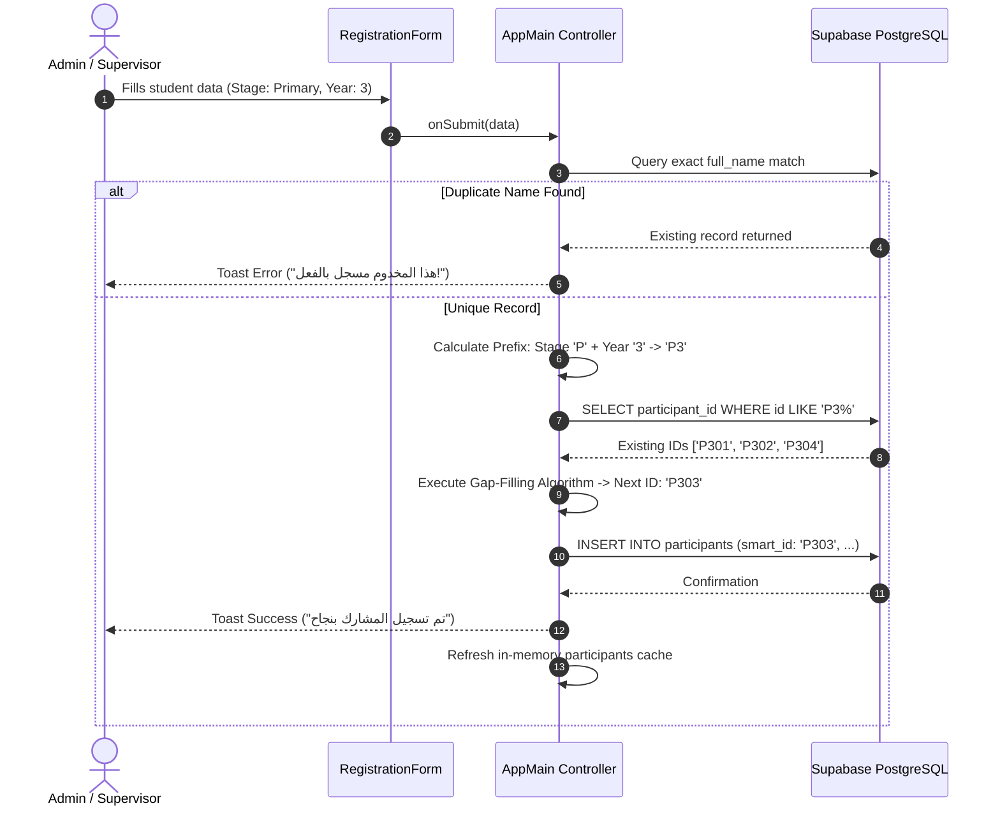
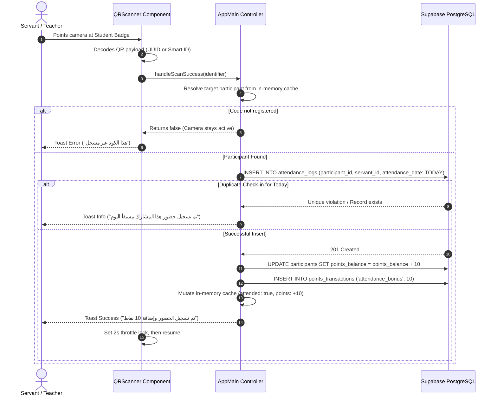
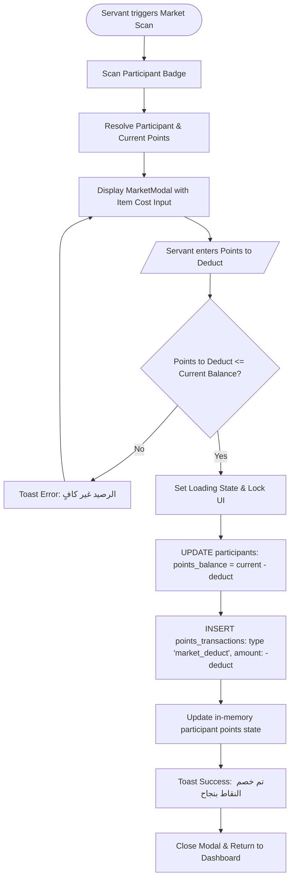
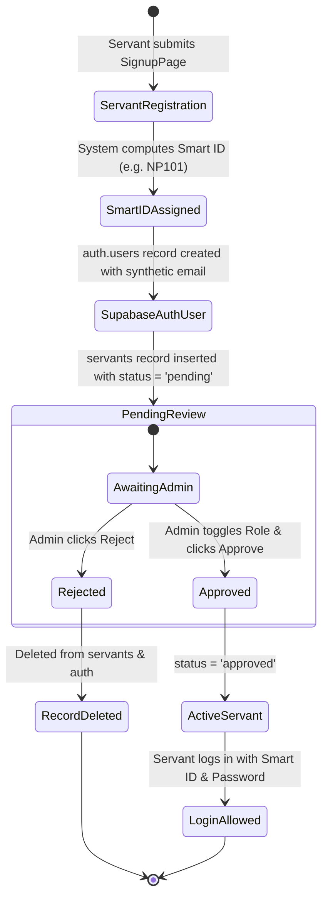

**# اريبصالين (Aribsalin) - Summer Festival Management System
## Definitive Master Technical Documentation & Architecture Manual

**System Version:** `1.6.3` (Granular Attendance, RBAC Scoping, Session Batching & Digital Badging)  
**Target Platform:** Mobile-First Web Application / PWA  
**Language & Direction:** Arabic (`ar`) / Right-to-Left (`dir="rtl"`)  
**Parish / Organization:** Church of the Great Martyr St. Mina the Wonderworker & Pope Kyrillos VI - Aswan  
**Last Revised:** September 2026

---

## Table of Contents
- [Definitive Master Technical Documentation \& Architecture Manual](#definitive-master-technical-documentation--architecture-manual)
- [Table of Contents](#table-of-contents)
- [1. Project Idea \& Concept](#1-project-idea--concept)
  - [Executive Summary](#executive-summary)
  - [Core Business Problems Solved](#core-business-problems-solved)
  - [Domain Mechanics \& Gamification](#domain-mechanics--gamification)
- [2. Tech Stack \& Tooling](#2-tech-stack--tooling)
  - [Core Stack Inventory](#core-stack-inventory)
  - [Architectural Rationale: Why These Tools?](#architectural-rationale-why-these-tools)
  - [Configuration \& Build Pipeline](#configuration--build-pipeline)
- [3. User Roles \& Workflows](#3-user-roles--workflows)
  - [Role-Based Access Control (RBAC) Matrix](#role-based-access-control-rbac-matrix)
  - [Portals \& Experience Design](#portals--experience-design)
    - [1. Student / Participant Portal (`studentPortal`)](#1-student--participant-portal-studentportal)
    - [2. Normal Servant Portal (`dashboard` with `normal` role)](#2-normal-servant-portal-dashboard-with-normal-role)
    - [3. Class Supervisor Portal (`dashboard` with `supervisor` role)](#3-class-supervisor-portal-dashboard-with-supervisor-role)
    - [4. Administrator Portal (`dashboard` with `admin` role)](#4-administrator-portal-dashboard-with-admin-role)
  - [End-to-End Workflow Specifications](#end-to-end-workflow-specifications)
    - [Workflow A: Participant Registration \& Smart ID Generation](#workflow-a-participant-registration--smart-id-generation)
    - [Workflow B: QR Attendance Check-in with Conflict Prevention](#workflow-b-qr-attendance-check-in-with-conflict-prevention)
    - [Workflow C: Marketplace Redemption with Overdraft Guard](#workflow-c-marketplace-redemption-with-overdraft-guard)
    - [Workflow D: Staff Onboarding \& Approval Lifecycle](#workflow-d-staff-onboarding--approval-lifecycle)
- [4. Architecture \& State Management](#4-architecture--state-management)
  - [Application Lifecycle \& Centralized State Hub](#application-lifecycle--centralized-state-hub)
  - [Virtual State Domains (In-Memory Contexts)](#virtual-state-domains-in-memory-contexts)
    - [1. Auth \& Identity Domain](#1-auth--identity-domain)
    - [2. Festival Data \& Roster Domain](#2-festival-data--roster-domain)
    - [3. View Routing \& Navigation Domain](#3-view-routing--navigation-domain)
    - [4. Hardware \& QR Scanner Domain](#4-hardware--qr-scanner-domain)
    - [5. Modals \& Mutations Domain](#5-modals--mutations-domain)
  - [Data Flow \& Relational Integrity](#data-flow--relational-integrity)
  - [Database Schema Specification (Supabase PostgreSQL)](#database-schema-specification-supabase-postgresql)
- [5. Folder Structure \& Deep Dive](#5-folder-structure--deep-dive)
  - [Source Tree (ASCII)](#source-tree-ascii)
  - [Directory-by-Directory Deep Dive](#directory-by-directory-deep-dive)
    - [📂 `src/app/`](#-srcapp)
    - [📂 `src/components/layout/`](#-srccomponentslayout)
    - [📂 `src/components/forms/`](#-srccomponentsforms)
    - [📂 `src/components/modals/`](#-srccomponentsmodals)
    - [📂 `src/components/shared/`](#-srccomponentsshared)
    - [📂 `src/lib/`](#-srclib)
    - [📂 `src/pages/`](#-srcpages)
    - [📂 `src/styles/`](#-srcstyles)
    - [📂 `src/utils/`](#-srcutils)
- [6. Developer Guide: How to Work on This Project](#6-developer-guide-how-to-work-on-this-project)
  - [Design System \& UI/UX Governance](#design-system--uiux-governance)
    - [Aesthetic Philosophy: The Coptic Heritage Palette](#aesthetic-philosophy-the-coptic-heritage-palette)
    - [Strict Frontend Implementation Rules](#strict-frontend-implementation-rules)
  - [Local Development Setup](#local-development-setup)
    - [Prerequisites](#prerequisites)
    - [Installation \& Execution Commands](#installation--execution-commands)
    - [Production Build \& Verification](#production-build--verification)
  - [Critical Architectural Invariants \& Edge Cases](#critical-architectural-invariants--edge-cases)
    - [1. Smart ID Gap-Filling Algorithm](#1-smart-id-gap-filling-algorithm)
    - [2. Synthetic Email Authentication for Staff](#2-synthetic-email-authentication-for-staff)
    - [3. iOS Safari Camera Freeze Prevention](#3-ios-safari-camera-freeze-prevention)
    - [4. Supabase PostgREST URL Length Limits (200-Chunk Batches)](#4-supabase-postgrest-url-length-limits-200-chunk-batches)
    - [5. `html2canvas` Color \& Rendering Constraints](#5-html2canvas-color--rendering-constraints)
  - [Document Maintenance Note](#document-maintenance-note)

---

## 1. Project Idea & Concept

### Executive Summary
**اريبصالين (Aribsalin)** is an enterprise-grade, mobile-first festival and deacon school management portal developed for the **Church of the Great Martyr St. Mina and Pope Kyrillos VI in Aswan**. Built as a high-performance single-page application (SPA), the system digitizes and centralizes participant enrollment, attendance tracking, gamified reward points, marketplace redemptions, staff credentialing, financial accounting, and analytics across all educational stages (from Kindergarten through University and Graduates).

The name *Aribsalin* derives from the Coptic hymnological tradition (meaning "Chant / Sing"), reflecting the spiritual, educational, and community nature of the festival.

```
       +-------------------------------------------------------------+
       |                  اريبصالين (Aribsalin)                     |
       |             Festival & Deacon School Engine                 |
       +-------------------------------------------------------------+
                                      |
         +----------------------------+----------------------------+
         |                                                         |
         v                                                         v
+-------------------------------+                         +-------------------------------+
|       Student Portal          |                         |       Servant Portal          |
|  - Smart ID / QR Badge Access |                         |  - Multi-tier RBAC (Admin,    |
|  - Points & Attendance Gauges |                         |    Supervisor, Normal)        |
|  - Transaction Ledger History |                         |  - High-Speed QR Scanner      |
|  - Digital ID Card PNG Export |                         |  - Financial Treasury & Stats |
+-------------------------------+                         +-------------------------------+
```

### Core Business Problems Solved
Traditional youth festivals, summer academies, and church schools face severe operational bottlenecks when relying on manual rosters, paper tokens, and decentralized communication:

1. **Slow & Inaccurate Check-ins:** Manual roll-calls for hundreds of students during high-traffic morning hours cause delays, inaccuracies, and lost session time. Aribsalin resolves this via **hardware camera and screenshot-based QR badge scanning** that logs check-ins in under 300 milliseconds.
2. **Attendance Fraud & Duplicate Claims:** Paper cards and punch-holes are prone to forgery or duplicate claims on the same day. The system enforces strict database constraints and in-memory checks: one check-in per student per calendar date (`attendance_date`).
3. **Loss of Participant Physical Badges:** Paper badges degrade or get lost. Aribsalin provides **dynamic digital badges** with client-side PNG rendering and printable PDF compilation, allowing students and parents to retrieve credentials instantly via mobile.
4. **Disorganized Economy & Rewards:** Incentive systems (points for memorization, attendance, good conduct) become difficult to audit. Aribsalin features a **double-entry points ledger** (`points_transactions`) with debit validation in the festival market, preventing overdrafts.
5. **Decentralized Multi-Stage Management:** Different educational stages (KG, Primary, Preparatory, Secondary, University) operate semi-autonomously. Supervisors require visibility into their assigned cohort without exposing or corrupting other classes' data.
6. **Financial Opacity:** Managing festival expenditures (gifts, prizes, transportation, catering, stage assets) against revenues requires auditable accounting. The integrated **Finance Ledger** connects transactions to stages, dates, and supervisors.

### Domain Mechanics & Gamification

```
+---------------------------------------------------------------------------------------+
|                               Attendance & Points Lifecycle                           |
+---------------------------------------------------------------------------------------+
|  [Student Badge Scanned]                                                              |
|          |                                                                            |
|          v                                                                            |
|  [Check: attendance_logs for Today] ---> (Already Present) ---> [Informational Toast] |
|          |                                                                            |
|          +---> (First Time Today)                                                     |
|                     |                                                                 |
|                     +--> 1. INSERT INTO attendance_logs (scanned_at, servant_id)      |
|                     +--> 2. UPDATE participants.points_balance (+10 points)           |
|                     +--> 3. INSERT INTO points_transactions ('attendance_bonus', +10)|
|                     +--> 4. Optimistic UI update (State reflection in <100ms)         |
+---------------------------------------------------------------------------------------+
```

* **Automatic Attendance Reward:** Each valid attendance scan immediately credits the participant with **+10 points** and records an audit log.
* **Compensating Rollback on Deletion:** When an admin or supervisor removes an attendance session, the engine deducts **10 points** (bounded at a zero floor via `Math.max(0, current - 10)`) and records a `deduction` audit entry.
* **Marketplace Purchases:** Points can be spent at festival market stalls. Transactions are blocked if the requested debit exceeds the participant's current balance.
* **Bonus & Custom Adjustments:** Servants can grant ad-hoc points for hymns, spiritual competitions, or behavior, with mandatory description logging.

---

## 2. Tech Stack & Tooling

### Core Stack Inventory

| Domain | Technology / Package | Exact Version | Architectural Purpose in Codebase |
|---|---|---|---|
| **Core Framework** | React | `18.3.1` | Component-based UI, hooks, and virtual DOM rendering. |
| **Language & Typing** | TypeScript | `~5.x` | Strict type safety for data models (`StudentData`, `Participant`, `TeacherData`). |
| **Bundler & Dev Server** | Vite | `6.3.5` | Instant HMR, ESM bundling, path aliases (`@/`), and custom asset plugins. |
| **Styling Framework** | Tailwind CSS (v4) | `4.1.12` | Next-generation CSS engine using native CSS variables (`@theme inline`) and zero runtime. |
| **Component Primitives** | Radix UI | Various | Unstyled, accessible UI foundations (Dialogs, Select, DropdownMenu, Tabs, Popover). |
| **UI Library Extensions** | Material UI (MUI) | `7.3.5` | Supporting design components, icons (`@mui/icons-material`), and layout adapters. |
| **Database & Auth** | `@supabase/supabase-js` | `^2.106.2` | Managed PostgreSQL database, JWT authentication, and S3-compatible file storage. |
| **QR Code Generation** | `qrcode.react` | `^4.2.0` | High-density SVG/Canvas QR generation with Level-H error correction for badges. |
| **QR Code Decoding** | `html5-qrcode` | `^2.3.8` | Resilient camera stream decoder and lossless canvas file screenshot analyzer. |
| **Canvas & PDF Export** | `html2canvas` & `jspdf` | `^1.4.1` / `^4.2.1` | Client-side DOM-to-Canvas rasterization and multi-page batch PDF booklet generation. |
| **Data Visualization** | `recharts` | `^2.15.2` | Responsive SVG charts (LineChart, BarChart, PieChart) for demographics and finances. |
| **Notifications** | `sonner` | `2.0.3` | Lightweight, stackable, RTL-compatible toast notification system. |
| **Iconography** | `lucide-react` | `0.487.0` | Tree-shakeable SVG icons representing system workflows. |
| **Package Manager** | `pnpm` | Workspace | Fast, disk-efficient package management with strict dependency isolation. |
| **Hosting & CI/CD** | Vercel | Static Build | Global edge CDN deployment using `@vercel/static-build` configured via `vercel.json`. |

### Architectural Rationale: Why These Tools?

1. **Vite 6 + Tailwind CSS v4:**  
   Tailwind v4's direct CSS engine eliminates `tailwind.config.js` in favor of `@theme inline` in `src/styles/theme.css`. Combined with Vite's `@tailwindcss/vite` plugin, builds achieve sub-second rebuilds. A custom plugin (`figmaAssetResolver`) in `vite.config.ts` handles asset namespaces seamlessly.
2. **Supabase (PostgreSQL + Auth + Storage):**  
   Avoids maintaining a custom backend server. Provides row-level security (RLS), real-time capabilities, persistent storage buckets (`profiles/`), and reliable ACID transactions for financial and attendance records.
3. **html5-qrcode with Custom Optimizations:**  
   Camera feeds across mobile web browsers (especially Safari on iOS) frequently suffer from video track suspension when browser APIs like `navigator.vibrate` are called. The codebase utilizes a hardened implementation with vibration suppression and an isolated off-screen file scanner canvas (`#file-qr-reader`).
4. **Client-Side Document Synthesis (`html2canvas` + `jsPDF`):**  
   Church administrators need to print 500+ student badges without bogging down server bandwidth. By rendering batches of 8 cards in an off-screen DOM canvas at 2x scale and appending them to a 350x550px PDF page, the browser produces crisp printouts entirely on the client.
5. **Recharts with Guarded Dimensions:**  
   Analytics dashboards render dynamic demographics. The implementation wraps data sets in `useMemo` hooks with safe zero-value fallbacks to prevent runtime crashes when an educational stage has zero recorded attendance.

### Configuration & Build Pipeline

* **`package.json` Scripts:**
  - `pnpm dev`: Boots the local Vite development server with HMR.
  - `pnpm build`: Runs Vite production build, outputting optimized bundles to `dist/`.
* **Path Aliasing (`vite.config.ts`):**
  - `@/` maps directly to `src/` for clean imports.
  - Custom assets included: `.svg`, `.csv`, `.png`, `.jpg`.
* **Deployment Spec (`vercel.json`):**
  - Uses `@vercel/static-build` targeting the `dist` directory with client-side SPA routing fallbacks.

---

## 3. User Roles & Workflows

### Role-Based Access Control (RBAC) Matrix

The system features four distinct participant and staff roles:

| Feature / Action | Student / Participant (`student`) | Normal Servant (`normal`) | Class Supervisor (`supervisor`) | Admin / General (`admin`) |
|---|:---:|:---:|:---:|:---:|
| **Access Gateway** | Student Portal (Smart ID / QR) | Staff Login (`T-ID` + Pass) | Staff Login (`T-ID` + Pass) | Staff Login (`T-ID` + Pass) |
| **View Own Points & Profile** | Read-Only | Read-Only | Read-Only | Read-Only |
| **Download Own ID Card (PNG)** | Yes | Yes (from profile) | Yes | Yes |
| **Scan Badges (Attendance / +10 pts)** | No | Yes (All Classes) | Yes (All Classes) | Yes (All Classes) |
| **Scan Badges (Market Deductions)** | No | Yes (With Balance Check) | Yes | Yes |
| **Scan Badges (Add Bonus Points)** | No | Yes | Yes | Yes |
| **Manual Points Adjustment Modal** | No | No | Yes | Yes |
| **Manual Retroactive Attendance** | No | No | Yes (Date Picker) | Yes (Date Picker) |
| **Delete Single Attendance Log** | No | No | Yes (Own Stage) | Yes (All Stages) |
| **Register / Edit Participants** | No | No | Yes (Scoped) | Yes (All Stages) |
| **Delete Participant** | No | No | Yes (Scoped) | Yes (All Stages) |
| **Stage Scoped Statistics** | No | No | Yes (Auto-filtered) | Yes (Global + Filters) |
| **Bulk ID Cards PDF Export** | No | No | No | Yes (Multi-Stage) |
| **Registration Requests Review** | No | No | No | Yes (Approve / Reject) |
| **Teachers Directory & Editing** | No | No | No | Yes (Full Roster) |
| **Macro Session Batch Deletion** | No | No | No | Yes (200-Chunk Batches) |
| **Finance & Treasury Ledger** | No | No | No | Yes (Revenues / Expenses) |

---

### Portals & Experience Design

#### 1. Student / Participant Portal (`studentPortal`)
* **Target Audience:** Festival youth and their guardians.
* **Authentication:** Zero-friction login requiring no password. The student enters their human-readable Smart ID (e.g., `P301`, `K002`) or scans their physical badge using the device camera (`studentScanner`).
* **Experience:** Displays the student's photo, age, confession father, educational stage, real-time points gauge, percentage attendance circular meter, detailed chronological attendance log, and an action to download their digital badge as a high-resolution PNG.

#### 2. Normal Servant Portal (`dashboard` with `normal` role)
* **Target Audience:** Service teachers assisting with event operations.
* **Authentication:** Login via assigned Teacher Smart ID (e.g., `NP101`) and password. Requires prior approval by the administrator.
* **Experience:** Fast-action mobile interface prioritizing QR scanner workflows (Attendance check-in, Market checkout, Bonus points, Participant lookup) and full-text participant search.

#### 3. Class Supervisor Portal (`dashboard` with `supervisor` role)
* **Target Audience:** Stage leaders (أمين فصل) responsible for a specific cohort (e.g., Primary 3 & 4).
* **Authentication:** Login via Supervisor Smart ID (e.g., `SP301`).
* **Experience:** In addition to scanner tools, supervisors receive participant enrollment forms with automatic Smart ID allocation, a manual attendance calendar to record retroactive check-ins, attendance log deletion with automated point rollbacks, manual point modifiers, and stage-isolated analytics.

#### 4. Administrator Portal (`dashboard` with `admin` role)
* **Target Audience:** Head of service (أمين الخدمة) and system administrators.
* **Authentication:** Login via Admin Smart ID (e.g., `A01`).
* **Experience:** Full management suite containing the Financial Ledger, Staff Approvals board, Bulk PDF Card Generation suite, Macro Sessions manager, and global statistical charts.

---

### End-to-End Workflow Specifications

#### Workflow A: Participant Registration & Smart ID Generation


```mermaid
sequenceDiagram
    autonumber
    actor Supervisor as Admin / Supervisor
    participant UI as RegistrationForm
    participant App as AppMain Controller
    participant DB as Supabase PostgreSQL

    Supervisor->>UI: Fills student data (Stage: Primary, Year: 3)
    UI->>App: onSubmit(data)
    App->>DB: Query exact full_name match
    alt Duplicate Name Found
        DB-->>App: Existing record returned
        App-->>Supervisor: Toast Error ("هذا المخدوم مسجل بالفعل!")
    else Unique Record
        App->>App: Calculate Prefix: Stage 'P' + Year '3' -> 'P3'
        App->>DB: SELECT participant_id WHERE id LIKE 'P3%'
        DB-->>App: Existing IDs ['P301', 'P302', 'P304']
        App->>App: Execute Gap-Filling Algorithm -> Next ID: 'P303'
        App->>DB: INSERT INTO participants (smart_id: 'P303', ...)
        DB-->>App: Confirmation
        App-->>Supervisor: Toast Success ("تم تسجيل المشارك بنجاح")
        App->>App: Refresh in-memory participants cache
    end
```

#### Workflow B: QR Attendance Check-in with Conflict Prevention


```mermaid
sequenceDiagram
    autonumber
    actor Servant as Servant / Teacher
    participant Scanner as QRScanner Component
    participant App as AppMain Controller
    participant DB as Supabase PostgreSQL

    Servant->>Scanner: Points camera at Student Badge
    Scanner->>Scanner: Decodes QR payload (UUID or Smart ID)
    Scanner->>App: handleScanSuccess(identifier)
    App->>App: Resolve target participant from in-memory cache
    alt Code not registered
        App-->>Scanner: Returns false (Camera stays active)
        Scanner-->>Servant: Toast Error ("هذا الكود غير مسجل")
    else Participant Found
        App->>DB: INSERT INTO attendance_logs (participant_id, servant_id, attendance_date: TODAY)
        alt Duplicate Check-in for Today
            DB-->>App: Unique violation / Record exists
            App-->>Servant: Toast Info ("تم تسجيل حضور هذا المشارك مسبقاً اليوم")
        else Successful Insert
            DB-->>App: 201 Created
            App->>DB: UPDATE participants SET points_balance = points_balance + 10
            App->>DB: INSERT INTO points_transactions ('attendance_bonus', 10)
            App->>App: Mutate in-memory cache (attended: true, points: +10)
            App-->>Servant: Toast Success ("تم تسجيل الحضور وإضافة 10 نقاط")
            Scanner->>Scanner: Set 2s throttle lock, then resume
        end
    end
```

#### Workflow C: Marketplace Redemption with Overdraft Guard


```mermaid
flowchart TD
    Start([Servant triggers Market Scan]) --> Scan[Scan Participant Badge]
    Scan --> Identify[Resolve Participant & Current Points]
    Identify --> OpenModal[Display MarketModal with Item Cost Input]
    OpenModal --> InputPoints[/Servant enters Points to Deduct/]
    InputPoints --> CheckBalance{Points to Deduct <= Current Balance?}
    CheckBalance -- No --> OverdraftError[Toast Error: الرصيد غير كافٍ]
    OverdraftError --> OpenModal
    CheckBalance -- Yes --> SetProcessing[Set Loading State & Lock UI]
    SetProcessing --> DBUpdate[UPDATE participants: points_balance = current - deduct]
    DBUpdate --> DBLog[INSERT points_transactions: type 'market_deduct', amount: -deduct]
    DBLog --> StateSync[Update in-memory participant points state]
    StateSync --> SuccessToast[Toast Success: تم خصم النقاط بنجاح]
    SuccessToast --> CloseModal[Close Modal & Return to Dashboard]
```

#### Workflow D: Staff Onboarding & Approval Lifecycle


```mermaid
stateDiagram-v2
    [*] --> ServantRegistration: Servant submits SignupPage
    ServantRegistration --> SmartIDAssigned: System computes Smart ID (e.g. NP101)
    SmartIDAssigned --> SupabaseAuthUser: auth.users record created with synthetic email
    SupabaseAuthUser --> PendingReview: servants record inserted with status = 'pending'
    
    state PendingReview {
        [*] --> AwaitingAdmin
        AwaitingAdmin --> Rejected: Admin clicks Reject
        AwaitingAdmin --> Approved: Admin toggles Role & clicks Approve
    }
    
    Rejected --> RecordDeleted: Deleted from servants & auth
    RecordDeleted --> [*]
    
    Approved --> ActiveServant: status = 'approved'
    ActiveServant --> LoginAllowed: Servant logs in with Smart ID & Password
    LoginAllowed --> [*]
```

---

## 4. Architecture & State Management

### Application Lifecycle & Centralized State Hub
Unlike applications that decompose global state across dozens of fragmented React Context Providers (which can introduce nested provider hell and cascading re-renders on mobile devices), Aribsalin implements a **Centralized Root State Hub Pattern** encapsulated inside `src/components/layout/AppMain.tsx`.

`AppMain` serves as the application's root controller, orchestrating:
1. **Persistent Authentication & Session Lifecycle:** Synchronized with Supabase's `onAuthStateChange` stream.
2. **Synchronous View State Machine:** Clean transitions between 18 distinct views without browser URL dependencies, ideal for web app wrappers.
3. **Optimistic Data Synthesis:** Decoupled database querying where `participants` and `attendance_logs` are fetched independently and joined in memory.
4. **Hardware Scanner Coordination:** Managing camera state, flash toggles, error recovery, and scan-lock timeouts.

```
+-----------------------------------------------------------------------------------------+
|                                    AppMain Controller                                   |
|                                                                                         |
|  [Auth Stream]           [View State Machine]           [Festival Data Cache]           |
|  - session: Session      - currentView: View            - participants: Participant[]   |
|  - currentServant: any   - viewerRole: Role             - attendance_logs: In-Memory    |
|  - isAuthenticated       - scanMode: ScanMode           - activeDayCalculators          |
+-----------------------------------------------------------------------------------------+
       |                           |                               |
       v                           v                               v
+------------------+     +-------------------+           +-------------------+
|  Auth Gateway    |     |  Dashboard Hub    |           |  Modal / Action   |
|  - RoleSelection |     |  - Servant Info   |           |  - MarketModal    |
|  - LoginPage     |     |  - Action Buttons |           |  - AddPointsModal |
|  - SignupPage    |     |  - Filtered Lists |           |  - ManualPoints   |
|  - StudentPortal |     |  - Sub-Pages      |           |  - BulkIDDownload |
+------------------+     +-------------------+           +-------------------+
```

### Virtual State Domains (In-Memory Contexts)
The global state managed inside `AppMain.tsx` maps to five distinct functional domains:

#### 1. Auth & Identity Domain
* `isAuthenticated: boolean` — Validates whether an active session exists.
* `currentServant: TeacherData | null` — Stores full profile of logged-in staff (ID, role, educational stage, photo).
* `viewerRole: 'servant' | 'student'` — Determines whether the UI renders administrative dashboards or participant profile cards.

#### 2. Festival Data & Roster Domain
* `participants: Participant[]` — In-memory cached array of all registered participants, containing:
  - Demographic records (`fullName`, `gender`, `educational_stage`, `academic_year`, `address`).
  - Computed points balance (`points_balance`).
  - Joined attendance records (`attendanceDays: string[]`).
  - Attendance flag for the current date (`attended: boolean`).
* **Why In-Memory Merge?** PostgREST nested resource joins (`participants?select=*,attendance_logs(*)`) can exceed connection query limits or crash if foreign key caches desynchronize. Fetching `participants` and `attendance_logs` separately and joining them in JavaScript guarantees high performance and fault tolerance.

#### 3. View Routing & Navigation Domain
* `currentView: View` — The active route rendered on screen:
  `'roleSelection' | 'login' | 'signup' | 'studentPortal' | 'studentScanner' | 'dashboard' | 'registration' | 'scanner' | 'market' | 'addPoints' | 'manualPoints' | 'profile' | 'finance' | 'statistics' | 'teachers' | 'servantProfile' | 'registrationRequests' | 'sessions'`
* `selectedParticipantId: string | null` — Pointer to the active participant for modal actions or profile views.
* `selectedServantProfileId: string | null` — Pointer for servant profile inspection.

#### 4. Hardware & QR Scanner Domain
* `scanMode: 'attendance' | 'market' | 'addPoints' | 'viewDetails'` — Configures how the scanner component processes decoded badges.
* `scanLockRef: boolean` — Prevents rapid double-scanning of the same barcode before the database transaction completes.

#### 5. Modals & Mutations Domain
* `selectedParticipantForPoints` — Active record being adjusted in `ManualPointsModal`.
* `editData` — Pre-filled payload passed to `RegistrationForm` or `SignupPage` when updating an existing record.
* `isProcessingMarket` / `isProcessingAddPoints` — UI loading locks preventing multi-click duplicate writes.

---

### Data Flow & Relational Integrity

```
[Browser Client]
       │
       ├─── 1. Authenticate with Smart ID (Synthesized: {id}@aribsalin.com) ───► Supabase Auth
       │
       ├─── 2. Fetch Roster & Logs Independently ──────────────────────────────► PostgreSQL
       │       (SELECT * FROM participants)
       │       (SELECT participant_id, scanned_at, attendance_date FROM attendance_logs)
       │
       ├─── 3. In-Memory Data Stitching & Sanitization (AppMain.tsx)
       │
       ├─── 4. Upload Profile Avatars ────────────────────────────────────────► Supabase Storage ('profiles')
       │
       └─── 5. Write Transactions & Logs (Atomic Mutations) ──────────────────► PostgreSQL
               - attendance_logs
               - points_transactions
               - financial_transactions
```

### Database Schema Specification (Supabase PostgreSQL)

The backend database operates on a relational PostgreSQL schema designed for high throughput:

```sql
-- 1. PARTICIPANTS TABLE (المشاركين)
CREATE TABLE public.participants (
  id uuid NOT NULL DEFAULT gen_random_uuid(),
  participant_id text UNIQUE,                     -- Human-readable Smart ID (e.g. P301, K002)
  full_name text NOT NULL,                        -- Normalized Arabic full name
  gender text CHECK (gender IN ('male', 'female')),
  educational_stage text NOT NULL,                -- kg | primary | preparatory | secondary | university | graduate
  academic_year text,                            -- Grade level (e.g., الصف الثالث الابتدائي)
  birth_date date,
  class_or_job text,                             -- School, College, or Employment
  father_of_confession text,                     -- Name of Father of Confession
  mobile_personal text,
  mobile_father text,
  mobile_mother text,
  address_area text,                             -- Neighborhood / District
  address_details text,                          -- Detailed street address
  points_balance integer DEFAULT 0,              -- Current accumulated point balance
  photo_url text,                                -- Public URL in 'profiles' bucket
  created_at timestamp with time zone DEFAULT now(),
  CONSTRAINT participants_pkey PRIMARY KEY (id)
);

-- 2. SERVANTS TABLE (الخدام)
CREATE TABLE public.servants (
  id uuid NOT NULL DEFAULT gen_random_uuid(),      -- Matches auth.users.id
  teacher_id text NOT NULL UNIQUE,                -- Smart ID (e.g. A01, SP301, NP101)
  full_name text NOT NULL,
  gender text CHECK (gender IN ('male', 'female')),
  role text CHECK (role IN ('normal', 'supervisor', 'admin')),
  class_stage text,                              -- Scoping level (e.g., primary_34)
  academic_year text,
  birth_date date,
  father_of_confession text,
  mobile_personal text,
  address_area text,
  address_details text,
  photo_url text,
  status text DEFAULT 'approved' CHECK (status IN ('pending', 'approved')),
  created_at timestamp with time zone DEFAULT now(),
  CONSTRAINT servants_pkey PRIMARY KEY (id),
  CONSTRAINT servants_auth_fkey FOREIGN KEY (id) REFERENCES auth.users(id) ON DELETE CASCADE
);

-- 3. ATTENDANCE LOGS TABLE (سجلات الحضور)
CREATE TABLE public.attendance_logs (
  id uuid NOT NULL DEFAULT gen_random_uuid(),
  participant_id uuid NOT NULL,
  attendance_date date DEFAULT CURRENT_DATE,      -- Prevents multiple check-ins per day
  scanned_at timestamp with time zone DEFAULT now(),
  servant_id uuid,
  CONSTRAINT attendance_logs_pkey PRIMARY KEY (id),
  CONSTRAINT attendance_logs_participant_id_fkey FOREIGN KEY (participant_id) REFERENCES public.participants(id) ON DELETE CASCADE,
  CONSTRAINT attendance_logs_servant_id_fkey FOREIGN KEY (servant_id) REFERENCES public.servants(id) ON DELETE SET NULL,
  CONSTRAINT unique_daily_attendance UNIQUE (participant_id, attendance_date)
);

-- 4. POINTS TRANSACTIONS TABLE (سجل حركة النقاط)
CREATE TABLE public.points_transactions (
  id uuid NOT NULL DEFAULT gen_random_uuid(),
  participant_id uuid NOT NULL,
  servant_id uuid,
  transaction_type text NOT NULL,                 -- attendance_bonus | market_deduct | bonus_add | manual | addition | deduction
  points_amount integer NOT NULL,                 -- Positive (credit) or Negative (debit)
  description text,                              -- Explanatory note
  created_at timestamp with time zone DEFAULT timezone('utc'::text, now()),
  CONSTRAINT points_transactions_pkey PRIMARY KEY (id),
  CONSTRAINT points_transactions_participant_id_fkey FOREIGN KEY (participant_id) REFERENCES public.participants(id) ON DELETE CASCADE,
  CONSTRAINT points_transactions_servant_id_fkey FOREIGN KEY (servant_id) REFERENCES public.servants(id) ON DELETE SET NULL
);

-- 5. FINANCIAL TRANSACTIONS TABLE (الخزينة والحركات المالية)
CREATE TABLE public.financial_transactions (
  id uuid NOT NULL DEFAULT gen_random_uuid(),
  type text CHECK (type IN ('revenue', 'expense')),
  title text NOT NULL,
  amount integer NOT NULL,
  transaction_date date DEFAULT CURRENT_DATE,
  education_stage text,                          -- Scoped stage or 'all'
  person_name text,                              -- Collector or Payee
  description text,
  servant_id uuid,
  created_at timestamp with time zone DEFAULT now(),
  CONSTRAINT financial_transactions_pkey PRIMARY KEY (id),
  CONSTRAINT financial_transactions_servant_id_fkey FOREIGN KEY (servant_id) REFERENCES public.servants(id) ON DELETE SET NULL
);

-- 6. AREAS TABLE (المناطق السكنية)
CREATE TABLE public.areas (
  id uuid NOT NULL DEFAULT gen_random_uuid(),
  name character varying NOT NULL UNIQUE,
  created_at timestamp with time zone DEFAULT timezone('utc'::text, now()),
  CONSTRAINT areas_pkey PRIMARY KEY (id)
);
```

---

## 5. Folder Structure & Deep Dive

### Source Tree (ASCII)

```
D:\Aribsalin\Aribsalin\src\
├── app/
│   ├── App.tsx                     # Top-level React bootstrap component
│   └── utils/
│       └── stageHelpers.ts         # Educational stage normalization & labels mapping
├── assets/
│   └── images/                     # Static festival branding, Church crests, default avatars
│       ├── Arebsalin-1.png         # Main festival emblem
│       ├── aribsalin.jpeg          # Alternative festival banner
│       ├── meni_Logo.png           # St. Mina Church historical insignia
│       └── new-church-logo.png     # Official high-resolution Church crest
├── components/
│   ├── forms/
│   │   └── RegistrationForm.tsx    # Participant onboarding form with duplicate validation
│   ├── layout/
│   │   └── AppMain.tsx             # Central state hub, route controller & auth manager
│   ├── modals/
│   │   ├── AddPointsModal.tsx      # Modal for crediting bonus points
│   │   ├── BulkIDDownloadModal.tsx # Multi-card PDF compiler (8-at-a-time off-screen engine)
│   │   ├── ManualPointsModal.tsx   # Search-driven manual points adjustment dialog
│   │   └── MarketModal.tsx         # Marketplace point debit dialog with overdraft check
│   ├── shared/
│   │   ├── IDCard.tsx              # Digital badge rendering component (350x550px)
│   │   ├── ImageWithFallback.tsx   # Avatar image loader with initials/fallback icon
│   │   ├── ParticipantsList.tsx    # Interactive student table with filters & manual check-in
│   │   ├── QRScanner.tsx           # Camera & screenshot QR decoder with vibration suppression
│   │   ├── TestQRCode.tsx          # Developer testing utility for barcode simulations
│   │   └── WelcomeScreen.tsx       # Splash modal for first-time session greetings
│   └── ui/                         # 48 Radix UI & Tailwind CSS headless primitive components
│       ├── accordion.tsx, alert-dialog.tsx, alert.tsx, avatar.tsx, badge.tsx, button.tsx,
│       ├── calendar.tsx, card.tsx, carousel.tsx, chart.tsx, checkbox.tsx, dialog.tsx,
│       ├── dropdown-menu.tsx, form.tsx, input.tsx, popover.tsx, select.tsx, sheet.tsx,
│       ├── table.tsx, tabs.tsx, textarea.tsx, tooltip.tsx ... (and others)
├── lib/
│   ├── supabase.ts                 # Supabase client singleton with environment guards
│   └── uploadHelper.ts             # S3 image uploader to 'profiles' storage bucket
├── pages/
│   ├── Dashboard.tsx               # Primary landing dashboard for authenticated servants
│   ├── FinancePage.tsx             # Treasury ledger with budget breakdown & Recharts
│   ├── LoginPage.tsx               # Smart ID & password authentication portal
│   ├── RegistrationRequestsPage.tsx# Review board for pending servant accounts
│   ├── RoleSelectionPage.tsx       # Root gateway (Servant vs. Participant selection)
│   ├── ServantProfile.tsx          # Servant profile details and avatar uploader
│   ├── SessionsManagementPage.tsx  # Macro attendance session manager with 200-chunk deletion
│   ├── SignupPage.tsx              # Servant onboarding with automated Smart ID generation
│   ├── StatisticsPage.tsx          # Analytics dashboard with supervisor stage scoping
│   ├── StudentPortalLogin.tsx      # Participant login portal via Smart ID or QR
│   ├── StudentProfile.tsx          # Detailed participant profile, points ledger & PNG export
│   └── TeachersPage.tsx            # Servant directory grouped by stage with supervisor flags
├── styles/
│   ├── fonts.css                   # Google Fonts imports (Tajawal, Cairo) and RTL direction
│   ├── globals.css                 # Custom CSS resets
│   ├── index.css                   # Aggregator importing fonts, tailwind, and theme
│   ├── tailwind.css                # Tailwind CSS v4 compiler entry (`@import "tailwindcss"`)
│   └── theme.css                   # Coptic design tokens, CSS variables & typography rules
├── types/
│   └── index.ts                    # TypeScript interfaces (StudentData, Participant, TeacherData)
├── utils/
│   └── textUtils.ts                # Arabic text normalizer (strips diacritics, unifies Alef/Haa)
├── main.tsx                        # DOM mount point (`createRoot`)
└── vite-env.d.ts                   # Vite client types declaration
```

---

### Directory-by-Directory Deep Dive

#### 📂 `src/app/`
* **`App.tsx`:** The root React application component. Mounts `<AppMain />`.
* **`utils/stageHelpers.ts`:** Normalization layer that maps database strings (e.g., `'ابتدائي'`, `'primary'`, `'primary_12'`) to unified UI labels (`stageLabels`). Provides `getParticipantClassStage(stage, year)` to intelligently parse primary school grade years into three distinct sub-stages:
  - `primary_12` (Grades 1 & 2)
  - `primary_34` (Grades 3 & 4)
  - `primary_56` (Grades 5 & 6)

#### 📂 `src/components/layout/`
* **`AppMain.tsx`:** The architectural brain of the application (1,180+ lines). Holds global application state, listens to Supabase authentication events, handles view routing transitions, merges participants with attendance logs in memory, calculates active festival days, and acts as the database controller for attendance, market debits, and points bonuses.

#### 📂 `src/components/forms/`
* **`RegistrationForm.tsx`:** Participant enrollment and editing form. Features live client-side photo previews, neighborhood selection from the `areas` table, strict validation on personal and parent phone numbers, and duplicate name checks against the database before insertion.

#### 📂 `src/components/modals/`
* **`BulkIDDownloadModal.tsx`:** Compiles printable PDF card decks. Allows admins to select one or multiple educational stages. Renders student badges in off-screen batches of 8 using `html2canvas` at 2x scale, appending each rendered card to a custom-dimensioned `jsPDF` document (`[350, 550] px`) to prevent browser memory exhaustion.
* **`MarketModal.tsx`:** Handles festival market purchases. Displays current student points, validates that the entered debit amount does not exceed the balance, and executes point deductions with audit logging.
* **`AddPointsModal.tsx`:** Simple scan-driven reward modal allowing servants to grant custom points to participants.
* **`ManualPointsModal.tsx`:** Search-driven point adjustment interface that does not require physical barcode scanning. Allows searching by student name or Smart ID, selecting an action (Add / Deduct), and previewing the new balance before committing.

#### 📂 `src/components/shared/`
* **`IDCard.tsx`:** The official participant digital badge (350x550px). Renders the Church crest, festival emblem, participant photo, full name, educational stage, birth date, human-readable Smart ID, and an error-correcting (Level H) QR code. Automatically applies color theming based on gender (Sky Blue for boys, Rose Pink for girls, Royal Burgundy/Gold for default).
* **`QRScanner.tsx`:** Hardened scanner wrapper utilizing `html5-qrcode`. Contains custom fixes for iOS Safari camera track freezes (omits `navigator.vibrate`), handles safe unmounting during back navigation, and provides an auxiliary `#file-qr-reader` canvas that scales screenshots up to 400px and disables image smoothing to parse low-resolution phone screenshots.
* **`ParticipantsList.tsx`:** Roster table supporting full-text search (powered by `normalizeArabicText`), gender filters, stage filters, and attendance status filters. Includes a calendar date-picker for supervisors to log attendance retroactively.

#### 📂 `src/lib/`
* **`supabase.ts`:** Initializes the `@supabase/supabase-js` client using `import.meta.env.VITE_SUPABASE_URL` and `import.meta.env.VITE_SUPABASE_ANON_KEY`. Includes environment guards that log descriptive Arabic error messages in developer tools if keys are missing.
* **`uploadHelper.ts`:** Asynchronous utility that takes a browser `File`, generates a collision-resistant filename (`{random}_{timestamp}.ext`), uploads it to the `profiles` storage bucket in the specified subfolder (`participants` or `servants`), and returns the public CDN URL.

#### 📂 `src/pages/`
* **`Dashboard.tsx`:** Primary hub for authenticated staff. Dynamically displays quick-action scan tiles, secondary management buttons, role-based visibility toggles, and the main participants directory.
* **`FinancePage.tsx`:** Comprehensive financial accounting ledger. Tracks Revenues and Expenses, categorizes entries by educational stage, calculates net treasury balance, and visualizes cash flow using Recharts (Pie charts for expenditure categories, Bar charts for stage budgets).
* **`StatisticsPage.tsx`:** Analytics dashboard. For supervisors, it strictly isolates metrics, leaderboards, and attendance timelines to their assigned `class_stage` and recalculates effective total days. For admins, it presents global festival metrics.
* **`SessionsManagementPage.tsx`:** Macro attendance session manager. Groups check-in logs by date and stage. Enables admins to wipe an entire day's session for a stage, executing deletions in batches of 200 logs to circumvent PostgREST URL length limits.
* **`RegistrationRequestsPage.tsx`:** Administrative gatekeeping panel displaying pending servant signups (`status = 'pending'`). Admins can inspect servant data, toggle their role (`normal`, `supervisor`, `admin`), approve access, or reject/delete records.
* **`TeachersPage.tsx`:** Staff directory grouping approved servants by educational stage, highlighting designated class supervisors with crown icons.
* **`StudentProfile.tsx` & `ServantProfile.tsx`:** Detailed personal records. `StudentProfile` includes individual PNG badge download and granular attendance deletion with point rollbacks. `ServantProfile` allows profile picture updates.

#### 📂 `src/styles/`
* **`theme.css`:** Custom CSS design tokens defining the Coptic Orthodox aesthetic (Burgundy, Gold, Warm Beige) across root variables (`--primary`, `--secondary`, `--background`, `--foreground`).
* **`fonts.css`:** Imports Arabic web fonts (`Tajawal`, `Cairo`) and enforces RTL (`direction: rtl`).
* **`tailwind.css`:** Tailwind CSS v4 compiler directive (`@import "tailwindcss"`).

#### 📂 `src/utils/`
* **`textUtils.ts`:** Exports `normalizeArabicText(text: string)`. Strips Arabic diacritics (التشكيل), normalizes variants of Alef (`أ`, `إ`, `آ` -> `ا`), converts Taa Marbouta to Haa (`ة` -> `ه`), converts Alef Maksoura to Yaa (`ى` -> `ي`), and normalizes Hamzas (`ؤ` -> `و`, `ئ` -> `ي`). Guarantees that searching for "احمد" matches "أحمد" or "إحمد".

---

## 6. Developer Guide: How to Work on This Project

### Design System & UI/UX Governance

#### Aesthetic Philosophy: The Coptic Heritage Palette
The visual design reflects the spiritual and cultural heritage of the Coptic Orthodox Church, blending solemn dignity with modern mobile software ergonomics:

| Design Token | CSS Variable | Hex Color | Semantic Role in Interface |
|---|---|---|---|
| **Imperial Burgundy** | `var(--primary)` | `#8B1538` | Headers, primary CTA buttons, active tabs, Church branding. |
| **Spiritual Gold** | `var(--secondary)` | `#C9A961` | Accent badges, medals, QR frame borders, subheadings. |
| **Warm Beige / Parchment** | `var(--background)` | `#FAF7F2` | Main application background, soft card contrasts. |
| **Deep Walnut** | `var(--foreground)` | `#3D2817` | High-contrast typography for readability under sunlight. |
| **Muted Sand** | `var(--muted)` | `#E8DCC8` | Inactive borders, card outlines, disabled control backgrounds. |
| **Emerald Green** | `var(--success)` | `#10B981` | Points bonus confirmations, check-in success badges. |
| **Crimson Red** | `var(--destructive)` | `#D4183D` | Expenses, delete actions, attendance cancellations. |
| **Sky Blue** | `--male` | `#3B82F6` | Male student badge accents and demographic charts. |
| **Rose Pink** | `--female` | `#EC4899` | Female student badge accents and demographic charts. |

#### Strict Frontend Implementation Rules
1. **Never Hardcode Harsh Black Borders:**  
   Do not use `border: 1px solid black` or `border-black`. Always use the design system's border token: `border border-border` (which evaluates to `rgba(139, 21, 56, 0.15)`).
2. **Strict Use of CSS Variables:**  
   Components must bind to theme variables: `bg-primary`, `text-primary-foreground`, `bg-secondary`, `text-foreground`.
3. **Typography & Font Stack:**  
   Base font must always resolve to `'Tajawal', 'Cairo', -apple-system, sans-serif`. All typography must respect Right-to-Left (RTL) reading flow.
4. **Mobile Touch Ergonomics:**  
   Buttons must have a minimum touch target of 44x44px. Interactive elements must feature active-state micro-interactions (`active:scale-95` or `active:scale-[0.98] transition-transform`).
5. **No Native Alert Boxes:**  
   Never call `window.alert()` in production workflows. Always use the `sonner` toast notification engine: `toast.success()`, `toast.error()`, `toast.info()`.

---

### Local Development Setup

#### Prerequisites
* **Node.js:** `v18.18.0` or higher (Node 20+ recommended).
* **Package Manager:** `pnpm` (v8 or v9). If not installed, run `npm install -g pnpm`.
* **Browser:** Modern Chromium or Safari browser with webcam permissions enabled for QR testing.

#### Installation & Execution Commands

```bash
# 1. Clone or navigate to the project directory
cd D:\Aribsalin\Aribsalin

# 2. Install workspace dependencies
pnpm install

# 3. Configure environment variables
# Create a .env file in the root directory with your Supabase credentials:
cat <<EOF > .env
VITE_SUPABASE_URL=https://your-project-id.supabase.co
VITE_SUPABASE_ANON_KEY=your-anon-public-key
EOF

# 4. Start the local Vite development server
pnpm dev
```

The application will launch at `http://localhost:5173` (or the next available port).

#### Production Build & Verification

```bash
# Test the production bundle compilation
pnpm build

# Preview the production build locally
pnpm preview
```

---

### Critical Architectural Invariants & Edge Cases

When modifying or extending this codebase, developers and AI agents must preserve the following architectural implementations:

#### 1. Smart ID Gap-Filling Algorithm
Participant and servant IDs are not simple database autoincrements. They follow a formatted alphanumeric prefix scheme (`LXYY` for students, e.g., `P301`, and `RLXYY` for staff, e.g., `SP301`).  
When a record is deleted, the algorithm finds the **first missing integer in the sequence** (gap filling) rather than blindly appending to the end:
```ts
// Example gap-filling implementation in AppMain.tsx
let nextNum = 1;
if (existingIds && existingIds.length > 0) {
  const numbers = existingIds
    .map(row => parseInt(String(row.participant_id).replace(prefix, ''), 10))
    .filter(n => !isNaN(n))
    .sort((a, b) => a - b);

  for (const num of numbers) {
    if (num === nextNum) nextNum++;
    else if (num > nextNum) break; // Found the missing gap!
  }
}
const smartId = `${prefix}${String(nextNum).padStart(2, '0')}`;
```
*Never replace this logic with random UUIDs or plain autoincrements.*

#### 2. Synthetic Email Authentication for Staff
To keep login simple for church servants who might not have corporate email addresses, staff log in using their Smart ID (e.g., `A01`, `SP301`). Under the hood, `LoginPage.tsx` synthesizes a virtual domain email:
```ts
const email = `${teacherId.trim().toLowerCase()}@aribsalin.com`;
const { data, error } = await supabase.auth.signInWithPassword({ email, password });
```
*Do not prompt servants for standard email addresses unless the synthetic auth layer is refactored across `LoginPage`, `SignupPage`, and Supabase triggers.*

#### 3. iOS Safari Camera Freeze Prevention
On iOS devices running Mobile Safari, calling the standard `navigator.vibrate()` API causes the active camera stream (`MediaStreamTrack`) to freeze indefinitely. In `src/components/shared/QRScanner.tsx`, all vibration triggers have been intentionally removed. *Never reintroduce `navigator.vibrate()` inside scanner callbacks.*

#### 4. Supabase PostgREST URL Length Limits (200-Chunk Batches)
When an administrator deletes an entire session containing hundreds of attendance records in `SessionsManagementPage.tsx`, executing `.in('id', longArrayOfUuids)` will cause HTTP 414 (URI Too Long) errors in PostgREST. The codebase chunks all array deletions into batches of 200:
```ts
const chunkSize = 200;
for (let i = 0; i < logIds.length; i += chunkSize) {
  const chunk = logIds.slice(i, i + chunkSize);
  await supabase.from('attendance_logs').delete().in('id', chunk);
}
```
*Always maintain chunking on bulk delete or update operations.*

#### 5. `html2canvas` Color & Rendering Constraints
When rasterizing the digital ID card in `html2canvas`, modern CSS color spaces like OKLCH (`oklch(...)`) can cause mobile canvas rendering to crash or produce black boxes. `src/components/shared/IDCard.tsx` uses static hexadecimal color codes (`#8B1538`, `#C9A961`, `#FAF7F2`) on exported nodes to ensure rendering fidelity across all mobile devices.

---

### Document Maintenance Note
This document is the authoritative master specification for the Aribsalin codebase. Any architectural alterations, new database tables, or workflow updates must be documented herein. For historical changes, consult `MD/CHANGELOG.md`. For specific details on digital badge dimensions and logo imports, consult `MD/ID_CARD_DOCUMENTATION.md`.
**