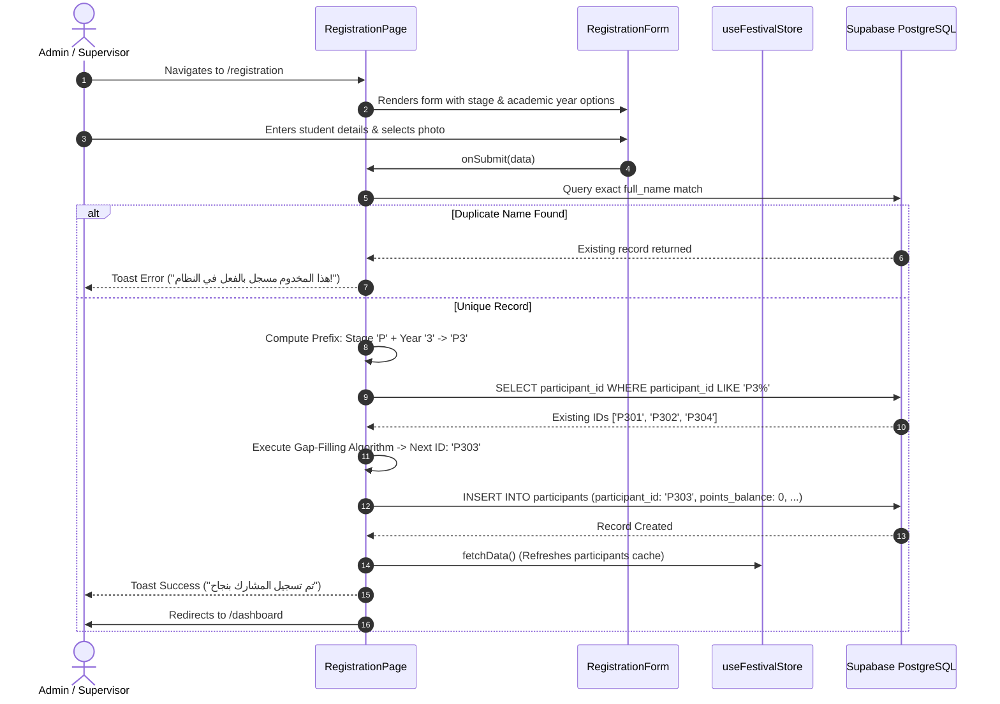
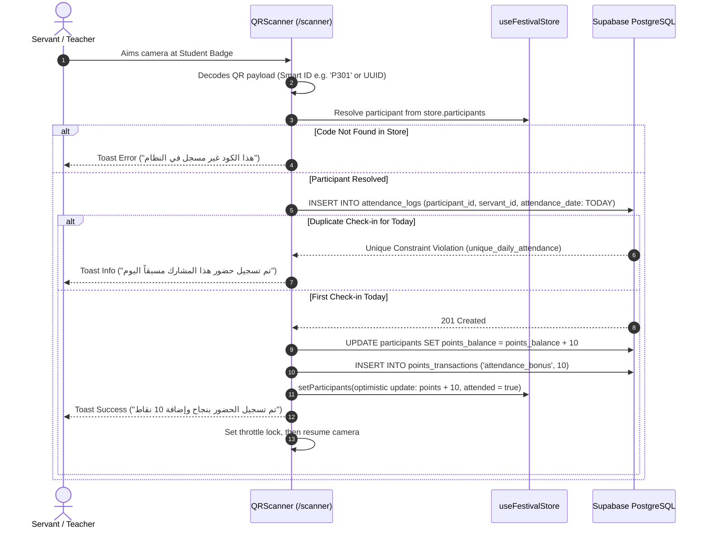
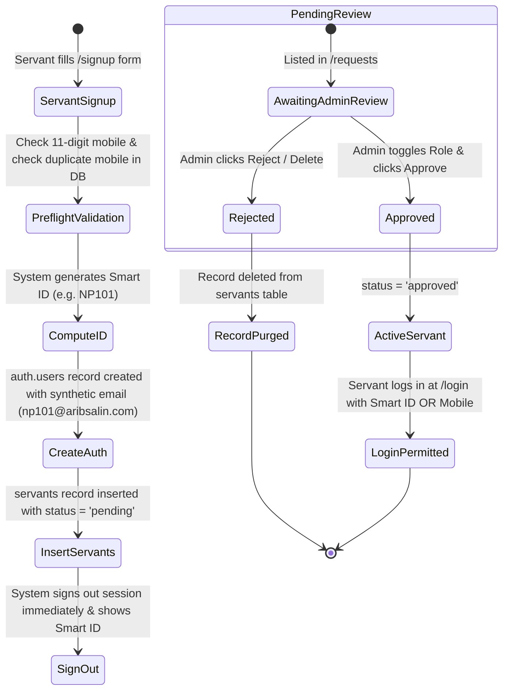
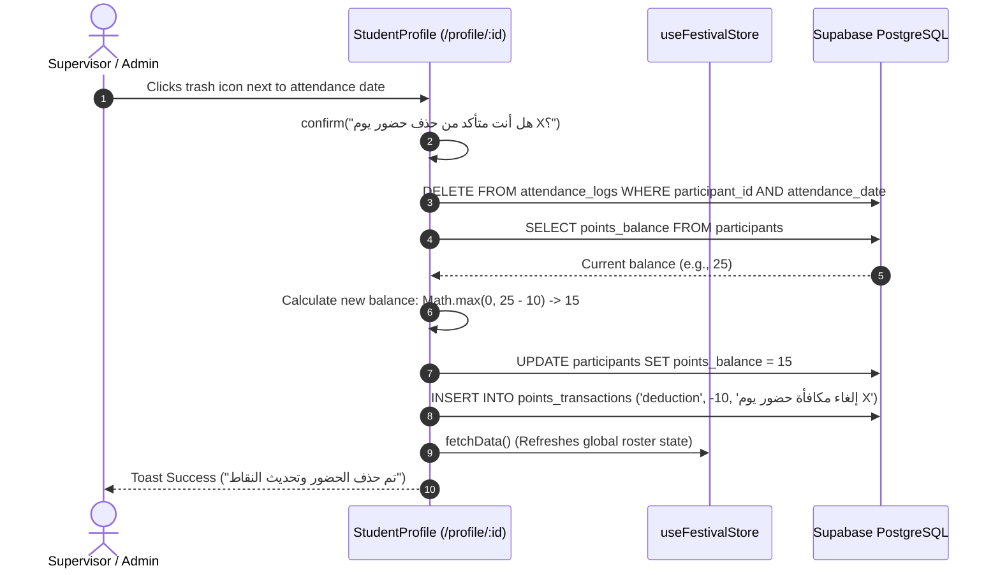
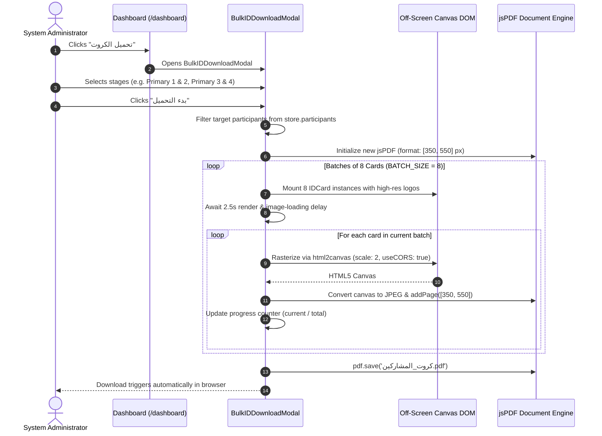
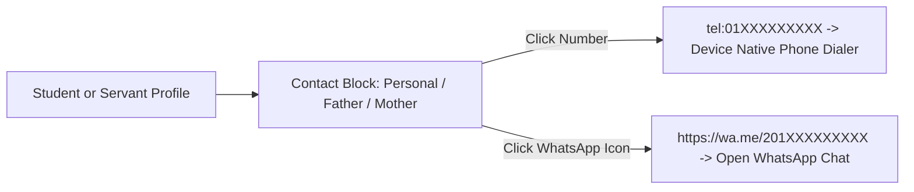

# اريبصالين (Aribsalin) - Church Festival & Sunday School Management System
## Definitive Master Technical Architecture & Developer Reference Manual

**System Version:** `2.2.0` (Dual-Login Engine, Developer God-Mode RBAC, Actionable WhatsApp & Phone Links, URL-Based Routing, Global Zustand Store, Smart ID Gap-Filling, Phone Uniqueness Guard, Offline-Safe QR Scanning & Digital Badging)  
**Target Platform:** Mobile-First Responsive Web Application / PWA-Ready  
**Primary Language & Direction:** Arabic (`ar`) / Right-to-Left (`dir="rtl"`)  
**Parish / Organization:** Church of the Great Martyr St. Mina the Wonderworker & Pope Kyrillos VI - Aswan, Egypt (كنيسة الشهيد العظيم مارمينا العجائبي والبابا كيرلس السادس بأسوان)  
**Repository Working Directory:** `D:\Aribsalin\Aribsalin`  
**Documentation Path:** `MD/ARIBSALIN-DOCUMENTATION.md`  
**Last Updated:** September 2026  

---

## Table of Contents
1. [Project Idea & Concept](#1-project-idea--concept)
   - [Executive Summary](#executive-summary)
   - [Core Business Problems Solved](#core-business-problems-solved)
   - [Domain Mechanics & Gamification Engine](#domain-mechanics--gamification-engine)
2. [Tech Stack & Tooling](#2-tech-stack--tooling)
   - [Core Technology Inventory](#core-technology-inventory)
   - [Architectural Rationale: Why These Tools?](#architectural-rationale-why-these-tools)
   - [Build Pipeline & Configuration Specs](#build-pipeline--configuration-specs)
3. [User Roles & Workflows](#3-user-roles--workflows)
   - [User Roles Inventory & RBAC Matrix](#user-roles-inventory--rbac-matrix)
   - [Portals & Experience Design](#portals--experience-design)
   - [Dual-Login Credential Resolution](#dual-login-credential-resolution)
   - [End-to-End Operational Workflows](#end-to-end-operational-workflows)
4. [Architecture & State Management](#4-architecture--state-management)
   - [End-to-End System Data Flow](#end-to-end-system-data-flow)
   - [State Management Architecture: Zustand Domain Store vs. UI Contexts](#state-management-architecture-zustand-domain-store-vs-ui-contexts)
   - [Session Management & Boundary Guards](#session-management--boundary-guards)
   - [Data Ingestion & In-Memory Stitching Pattern](#data-ingestion--in-memory-stitching-pattern)
   - [Database Schema Specification (Supabase PostgreSQL)](#database-schema-specification-supabase-postgresql)
5. [Folder Structure & Deep Dive](#5-folder-structure--deep-dive)
   - [ASCII Directory Tree of `src/`](#ascii-directory-tree-of-src)
   - [Major Directory & Key File Deep Dive](#major-directory--key-file-deep-dive)
6. [Developer Guide: How to Work on This Project](#6-developer-guide-how-to-work-on-this-project)
   - [Design System & UI/UX Governance (The Coptic Heritage Palette)](#design-system--uiux-governance-the-coptic-heritage-palette)
   - [Strict Frontend Implementation Rules](#strict-frontend-implementation-rules)
   - [Local Development Setup](#local-development-setup)
   - [Production Build & Verification](#production-build--verification)
   - [The 9 Critical Architectural Invariants & Edge Cases](#the-9-critical-architectural-invariants--edge-cases)
   - [Document Maintenance Policy](#document-maintenance-policy)

---

## 1. Project Idea & Concept

### Executive Summary
**اريبصالين (Aribsalin)** is an enterprise-grade, mobile-first festival, Sunday school, and church ministry management system engineered specifically for the **Church of the Great Martyr St. Mina the Wonderworker & Pope Kyrillos VI in Aswan, Egypt**. Built as a reactive single-page application (SPA), the platform digitizes and unifies the operational lifecycle of summer deacon programs, spiritual festivals, and weekly youth services across all educational cohorts—from Kindergarten (`حضانة`) through University and Graduates (`جامعيين وخريجين`).

The name **Aribsalin** originates in the Coptic hymnological tradition (from Coptic: ⲁⲣⲓⲯⲁⲗⲓⲛ, meaning *"Chant"* or *"Sing hymns"* — أريبصالين), honoring the liturgical, spiritual, and educational mission of the church's annual summer festival.

```
       +-------------------------------------------------------------+
       |                  اريبصالين (Aribsalin)                     |
       |         Church Festival & Sunday School Engine              |
       +-------------------------------------------------------------+
                                       |
          +----------------------------+----------------------------+
          |                                                         |
          v                                                         v
+-------------------------------+                         +-------------------------------+
|       Student Portal          |                         |       Servant Portal          |
|  - Zero-password Smart ID/QR  |                         |  - Dual Login (ID or Mobile)  |
|  - Real-time Points Gauge     |                         |  - 4-Tier RBAC + Developer    |
|  - Circular Attendance %      |                         |  - High-Speed QR Scanner      |
|  - Full Transaction Ledger    |                         |  - Actionable WhatsApp & Tel  |
|  - Digital ID Card PNG Export |                         |  - Treasury, Sessions & Stats |
|  - Actionable WhatsApp & Tel  |                         |  - Bulk Card Deck PDF Engine  |
+-------------------------------+                         +-------------------------------+
```

### Core Business Problems Solved
Traditional parish festivals, youth camps, and Sunday schools operate under intense arrival pressures, managing hundreds of children and teenagers within narrow check-in windows. Previously reliant on paper rosters, physical stamp cards, and fragmented cash logs, operations suffered from recurring systemic failures:

1. **Morning Arrival Bottlenecks:**  
   Manual paper roll-calls for hundreds of arriving participants produced queues, congestion, and delays to morning prayer and liturgy. Aribsalin provides **hardware camera and screenshot-based QR badge scanning** that parses credentials, writes attendance logs, awards points, and updates state in under **300 milliseconds**.
2. **Attendance Fraud & Duplicate Claims:**  
   Physical punch cards and paper check-ins are easily duplicated, forged, or stamped multiple times in a single day. Aribsalin enforces an atomic PostgreSQL unique constraint (`unique_daily_attendance` on `participant_id` and `attendance_date`), strictly blocking duplicate check-in credits on the same calendar day.
3. **Loss of Physical Badges:**  
   Children frequently lose, damage, or forget physical paper badges. Aribsalin generates **dynamic digital ID cards** rendered client-side (350x550px) that can be downloaded as high-resolution PNGs directly onto student smartphones, or compiled by church leaders into printable, batch-processed PDF card decks.
4. **Disorganized Reward Economy:**  
   Points awarded for scripture memorization, hymn recitation, attendance, and good behavior were previously recorded in personal notebooks, causing disputes during festival marketplace prize redemptions. Aribsalin provides an immutable, append-only **double-entry points ledger** (`points_transactions`) with strict balance validation that prevents overdrafts during marketplace redemptions.
5. **Decentralized Multi-Stage Management:**  
   Church cohorts (Kindergarten, Primary 1–2, Primary 3–4, Primary 5–6, Preparatory, Secondary, University/Graduates) have distinct supervisors. Class supervisors need immediate visibility into their cohort's attendance, point distribution, and member profiles without corrupting or modifying data from other stages.
6. **Financial Opacity & Fragmented Expenses:**  
   Tracking expenses (catering, transport, audio gear, trophies, prizes) against donations and enrollment fees was historically done on disjointed paper receipts. The integrated **Treasury Ledger (`/finance`)** links financial records directly to specific educational stages, transaction dates, and responsible servants.
7. **Servant Login Friction & Forgotten Codes:**  
   Servants frequently forget their auto-generated alphanumeric Smart IDs on mobile devices. Aribsalin provides a **Dual-Login Mechanism** in `LoginPage.tsx` that seamlessly accepts either a Smart ID (e.g., `NP101`) or an 11-digit Egyptian mobile phone number (`01XXXXXXXXX`), backed by pre-flight uniqueness validation in `SignupPage.tsx` and a unique constraint on `servants.mobile_personal`.
8. **Communication Gaps with Parents and Servants:**  
   Quick follow-ups with parents or servants previously required leaving the application and manually typing 11-digit numbers into external phone dialers or WhatsApp. Aribsalin integrates **Actionable Contact Links** directly into profile screens, offering native one-tap dialing (`tel:`) and instant WhatsApp chat opening (`https://wa.me/201XXXXXXXXX`) with the Egyptian country code automatically formatted.

### Domain Mechanics & Gamification Engine

```
+---------------------------------------------------------------------------------------+
|                               Attendance & Points Lifecycle                           |
+---------------------------------------------------------------------------------------+
|  [Student Badge Scanned]                                                              |
|          |                                                                            |
|          v                                                                            |
|  [Check: attendance_logs for Today] ---> (Already Present) ---> [Informational Toast] |
|          |                                                                            |
|          +---> (First Time Today)                                                     |
|                     |                                                                 |
|                     +--> 1. INSERT INTO attendance_logs (scanned_at, servant_id)      |
|                     +--> 2. UPDATE participants.points_balance (+10 points)           |
|                     +--> 3. INSERT INTO points_transactions ('attendance_bonus', +10)|
|                     +--> 4. Optimistic Store Update (Reflects in UI < 50ms)           |
+---------------------------------------------------------------------------------------+
```

* **Automated Attendance Credit:** Every valid attendance scan registers an audit row in `attendance_logs`, adds **+10 points** to the participant's `points_balance`, and creates a ledger entry in `points_transactions` with `transaction_type = 'attendance_bonus'`.
* **Compensating Rollback on Deletion:** When a supervisor or administrator deletes a participant's attendance log for a given date, the system executes an automated compensating transaction: it decrements **10 points** (clamped to a zero floor: `Math.max(0, current - 10)`), writes a `deduction` transaction to `points_transactions`, and updates the global cache.
* **Festival Marketplace Purchases:** Accumulated points act as festival currency. At the festival shop/market, servants scan the student's badge, specify the cost, and the system executes an overdraft-guarded debit. Insufficient balances trigger immediate user-facing error toasts.
* **Ad-Hoc Bonus Rewards:** Servants can grant custom point increments (for hymn mastery, Bible study competitions, or altar service) via scan or manual search modals.

---

## 2. Tech Stack & Tooling

### Core Technology Inventory

| Technology / Library | Version | Category | Architectural Purpose in Aribsalin |
|---|---|---|---|
| **React** | `18.3.1` | UI Framework | Declarative component lifecycle, hooks, and virtual DOM rendering. |
| **TypeScript** | `~5.6.2` | Language | Strict type definitions (`StudentData`, `Participant`, `TeacherData`). |
| **React Router DOM** | `^7.18.3` | Routing | URL-based routing, route guards (`RoleGuard`, `AuthGuard`), code-splitting (`lazy`/`Suspense`). |
| **Zustand** | `^5.0.15` | Global State | Reactive global store (`useFestivalStore`) providing fine-grained subscription without re-render cascades. |
| **Vite** | `6.3.5` | Bundler & Dev Server | Lightning-fast HMR, ES module bundling, path aliasing (`@/` -> `src/`), custom asset resolution. |
| **Tailwind CSS** | `4.1.12` | CSS Engine | Modern CSS framework utilizing `@theme inline` and native CSS custom properties. |
| **Radix UI** | `1.x - 2.x` | UI Primitives | Accessible, headless UI foundations (Dialog, DropdownMenu, Select, Tabs, Popover, Tooltip, Accordion). |
| **Lucide React** | `0.487.0` | Iconography | Tree-shakeable SVG icons tailored for RTL Arabic layouts. |
| **`@supabase/supabase-js`** | `^2.106.2` | Backend-as-a-Service | PostgreSQL database, JWT authentication, and S3-compatible profile photo storage. |
| **`html5-qrcode`** | `^2.3.8` | QR Decoding | Hardware video stream decoding and isolated screenshot canvas analysis. |
| **`qrcode.react`** | `^4.2.0` | QR Generation | Level-H error-correcting SVG/Canvas QR code generation for digital badges. |
| **`html2canvas`** | `^1.4.1` | DOM Rasterization | High-resolution rasterization of digital badges at 2x scale for PNG and PDF exports. |
| **`jspdf`** | `^4.2.1` | Document Engine | Client-side compilation of multi-page printable card decks (`[350, 550] px`). |
| **`recharts`** | `^2.15.2` | Data Visualization | Responsive SVG charts (BarChart, PieChart, LineChart) for analytics and treasury metrics. |
| **`sonner`** | `2.0.3` | Notifications | Stackable, RTL-compatible Arabic toast notifications. |
| **`pnpm`** | Workspace | Package Manager | Fast, deterministic dependency resolution with symlinked workspace storage. |
| **Vercel** | Edge Static | Hosting & CI/CD | Production edge delivery configured via `@vercel/static-build` in `vercel.json`. |

### Architectural Rationale: Why These Tools?

1. **React 18 + React Router DOM v7:**  
   The application requires fast transitions on low-power mobile devices. React Router v7 combined with `lazy()` and `<Suspense fallback={<LoadingFallback />}>` ensures that heavy analytical dependencies (`recharts`, `jspdf`, `html2canvas`) are loaded only when the user enters specific administrative pages, keeping the initial QR scanner bundle lightweight.
2. **Zustand 5 for High-Frequency Global State:**  
   Traditional React Context re-renders every consuming component whenever any slice of context updates. In high-frequency operations (such as scanning 200 children in 20 minutes), context re-renders degrade camera frame rates. Zustand's atomic selector subscriptions (`useFestivalStore(state => state.currentServant)`) ensure that camera streams, scan counters, and roster filters render independently at 60 FPS.
3. **Tailwind CSS v4 with `@theme inline`:**  
   Tailwind v4 replaces legacy JavaScript config files with pure CSS theme definitions. By binding design tokens to native CSS variables (`--primary`, `--secondary`, `--background`, `--foreground`), theme tokens are computed at runtime by the browser with zero JS overhead.
4. **Supabase PostgreSQL & Storage:**  
   Eliminates backend infrastructure management while providing PostgreSQL ACID guarantees, relational integrity, row-level security, and persistent storage buckets (`profiles/`) for participant avatars.
5. **Hardened Dual-Instance QR Engine (`html5-qrcode`):**  
   Mobile web browsers behave inconsistently when cameras switch between live video capture and file upload analysis. Aribsalin runs an active live scanner on `#qr-reader` and boots an isolated off-screen scanner instance on `#file-qr-reader` for image uploads, disabling image smoothing to maintain sharp pixel edges for QR recognition.
6. **Client-Side Document Synthesis (`html2canvas` + `jsPDF`):**  
   Printing badges for 400+ participants on church servers creates heavy CPU and bandwidth spikes. Generating high-resolution cards directly within the administrator's browser in micro-batches of 8 offloads 100% of rendering to the client.

### Build Pipeline & Configuration Specs

* **`vite.config.ts`:**
  - `@/` resolves to `./src`.
  - Custom plugin `figmaAssetResolver()` maps `figma:asset/*` imports directly to `src/assets/*`.
  - `assetsInclude` allows raw asset imports of `.svg` and `.csv`.
* **`pnpm-workspace.yaml`:**
  - Defines root workspace packages and suppresses unnecessary native builds (`@tailwindcss/oxide`, `core-js`, `esbuild`).
* **`vercel.json`:**
  - Directs builds through `@vercel/static-build` with output targeting the `dist` directory.

---

## 3. User Roles & Workflows

### User Roles Inventory & RBAC Matrix

The system enforces five distinct user tiers across all views and data mutations:

| Feature / Capability | Student / Participant (`student`) | Normal Servant (`normal`) | Class Supervisor (`supervisor`) | Service Administrator (`admin`) | System Developer (`developer`) |
|---|:---:|:---:|:---:|:---:|:---:|
| **Entry Gateway** | `/student-portal` | `/login` | `/login` | `/login` | `/login` |
| **Authentication Credential** | Smart ID or Badge QR | `T-ID` OR Mobile + Pass | `T-ID` OR Mobile + Pass | `T-ID` OR Mobile + Pass | `T-ID` OR Mobile + Pass |
| **Dual-Login by Mobile Supported** | No | Yes | Yes | Yes | Yes |
| **View Personal Points & Attendance** | Read-Only | Read-Only | Read-Only | Read-Only | Read-Only |
| **Export Personal Digital ID Card (PNG)** | Yes (`/profile/:id`) | Yes | Yes | Yes | Yes |
| **Actionable Contact (Tel & WhatsApp)** | Yes (`/profile/:id`) | Yes | Yes | Yes | Yes |
| **QR Attendance Scanning (+10 pts)** | No | Yes (All Stages) | Yes (All Stages) | Yes (All Stages) | Yes (All Stages) |
| **QR Marketplace Point Deductions** | No | Yes (Balance Checked) | Yes (Balance Checked) | Yes (Balance Checked) | Yes (Balance Checked) |
| **QR Bonus Points Allocation** | No | Yes | Yes | Yes | Yes |
| **Browse Participants Directory (`/participants`)** | No | Yes (Read / Attendance / Points) | Yes (Full CRUD) | Yes (Full CRUD) | Yes (Full CRUD) |
| **Manual Points Adjustment Modal** | No | Yes (via Directory) | Yes | Yes | Yes |
| **Manual Retroactive Attendance Check-in** | No | Yes (via Directory) | Yes | Yes | Yes |
| **Register New Participants (`/registration`)** | No | No | Yes (Class Scoped) | Yes (All Stages) | Yes (All Stages) |
| **Edit Participant Information (`?edit=:id`)** | No | No | Yes (Class Scoped) | Yes (All Stages) | Yes (All Stages) |
| **Delete Participant Record** | No | No | Yes (Class Scoped) | Yes (All Stages) | Yes (All Stages) |
| **Delete Single Attendance Log (Rollback)** | No | No | Yes (Compensating -10 pts) | Yes (Compensating -10 pts) | Yes (Compensating -10 pts) |
| **View Analytics & Demographics (`/statistics`)** | No | No | Yes (Stage Filtered) | Yes (Global Festival) | Yes (Global Festival) |
| **Manage Treasury & Cash Flow (`/finance`)** | No | No | No | Yes (Revenues / Expenses) | Yes (Full Access) |
| **Macro Session Attendance Wipe (`/sessions`)** | No | No | No | Yes (200-Batch Safe) | Yes (Full Access) |
| **Servant Registration Review (`/requests`)** | No | No | No | Yes (Approve / Reject) | Yes (Full Access) |
| **Servants Directory (`/teachers`)** | No | No | No | Yes (Grouped by Stage) | Yes (Full Access) |
| **Bulk Printable ID Cards PDF Export** | No | No | No | Yes (Multi-Stage Batch) | Yes (Full Access) |
| **Universal Route Bypass (God Mode)** | No | No | No | No | **Yes (Full Bypass)** |

---

### Portals & Experience Design

#### 1. Student / Participant Portal
* **Primary Route:** `/student-portal`  
* **Target Audience:** Sunday school children, youth participants, and their parents.
* **Access Model:** Zero-friction login requiring no password. The student enters their human-readable Smart ID (e.g., `P301`, `K002`) or scans their printed badge via webcam (`/scanner?mode=viewDetails`).
* **Experience (`/profile/:id`):** Displays the student's avatar photo, age, confession father, educational stage, real-time points gauge, circular attendance percentage gauge, chronological attendance history, actionable contact information with WhatsApp and direct calling, and an action to download their digital badge as a high-resolution PNG.

#### 2. Normal Servant Portal
* **Primary Route:** `/login` -> `/dashboard`  
* **Target Audience:** Sunday school teachers, hymn instructors, and activity leaders.
* **Access Model:** Authenticates using either their Teacher Smart ID (e.g., `NP101`) or Egyptian Mobile Number (`01XXXXXXXXX`) and password. Requires prior administrative approval (`status = 'approved'`).
* **Experience:** Mobile-first dashboard focused on high-frequency QR scanning (Attendance, Market, Add Points, View Details). Has full access to the **Participants Directory ("سجل المشاركين" at `/participants`)** to search participants, record manual attendance, and adjust points. Edit and delete mutations are hidden from this role.

#### 3. Class Supervisor Portal
* **Primary Route:** `/login` -> `/dashboard`  
* **Target Audience:** Grade supervisors (أمين فصل) managing a specific educational cohort (e.g., Primary 3 & 4).
* **Access Model:** Authenticates via Supervisor Smart ID (e.g., `SP301`) or Egyptian Mobile Number.
* **Experience:** All Normal Servant scanning tools plus enrollment access (`/registration`), editing rights, deletion capabilities, attendance log deletion with automated 10-point rollback, and a dedicated **Statistics Page (`/statistics`)** that automatically isolates metrics to their assigned educational stage (`class_stage`).

#### 4. Service Administrator Portal
* **Primary Route:** `/login` -> `/dashboard`  
* **Target Audience:** General Sunday school leaders (أمين الخدمة), parish priests, and head coordinators.
* **Access Model:** Authenticates via Admin Smart ID (e.g., `A01`) or Egyptian Mobile Number.
* **Experience:** Full system management suite containing the **Financial Ledger (`/finance`)**, **Staff Approvals Board (`/requests`)**, **Staff Directory (`/teachers`)**, **Macro Session Wipe Manager (`/sessions`)**, and **Bulk Printable PDF ID Generator (`BulkIDDownloadModal`)**.

#### 5. System Developer Portal (Super Admin / God Mode)
* **Primary Route:** `/login` -> `/dashboard`  
* **Target Audience:** System Architects, Lead Developers, and Technical Administrators.
* **Access Model:** Authenticates via Developer Smart ID or registered Egyptian Mobile Number.
* **Experience:** Universal bypass in `RoleGuard.tsx` (`userRole === 'developer'`). Grants unrestricted access across all application routes, financial transactions, session managers, approval boards, and raw profile configurations without stage constraints.

---

### Dual-Login Credential Resolution

To guarantee seamless logins on mobile devices where servants may not remember their generated alphanumeric ID, `src/pages/LoginPage.tsx` implements dynamic credential resolution:

```mermaid
flowchart TD
    A[Servant enters Identifier in LoginPage] --> B{Is Egyptian Mobile? /^01[0-9]{9}$/}
    B -- Yes --> C[Query servants table: mobile_personal = identifier]
    C --> D{Servant Record Found?}
    D -- No --> E[Toast Error: رقم الهاتف هذا غير مسجل لأي خادم في النظام]
    D -- Yes --> F[Extract teacher_id from servant record]
    B -- No --> G[Use Identifier as teacher_id]
    F --> H[Construct synthetic email: teacher_id@aribsalin.com]
    G --> H
    H --> I[Execute Supabase Auth: signInWithPassword]
    I --> J{Auth Succeeded?}
    J -- No --> K[Toast Error: رقم الدخول أو كلمة المرور غير صحيحة]
    J -- Yes --> L[Fetch Full Servant Profile]
    L --> M{status === 'pending'?}
    M -- Yes --> N[Sign Out immediately & Toast: حسابك قيد المراجعة]
    M -- No --> O[Set Zustand Auth, Current Servant & Redirect to /dashboard]
```

To ensure this dual-login never encounters ambiguity or multiple records, `src/pages/SignupPage.tsx` executes pre-flight mobile length and uniqueness checks against `servants.mobile_personal`, backed by the PostgreSQL `servants_mobile_personal_key` UNIQUE constraint.

---

### End-to-End Operational Workflows

#### Workflow A: Participant Registration & Smart ID Gap-Filling


```mermaid
sequenceDiagram
    autonumber
    actor Supervisor as Admin / Supervisor
    participant Page as RegistrationPage
    participant Form as RegistrationForm
    participant Store as useFestivalStore
    participant DB as Supabase PostgreSQL

    Supervisor->>Page: Navigates to /registration
    Page->>Form: Renders form with stage & academic year options
    Supervisor->>Form: Enters student details & selects photo
    Form->>Page: onSubmit(data)
    Page->>DB: Query exact full_name match
    alt Duplicate Name Found
        DB-->>Page: Existing record returned
        Page-->>Supervisor: Toast Error ("هذا المخدوم مسجل بالفعل في النظام!")
    else Unique Record
        Page->>Page: Compute Prefix: Stage 'P' + Year '3' -> 'P3'
        Page->>DB: SELECT participant_id WHERE participant_id LIKE 'P3%'
        DB-->>Page: Existing IDs ['P301', 'P302', 'P304']
        Page->>Page: Execute Gap-Filling Algorithm -> Next ID: 'P303'
        Page->>DB: INSERT INTO participants (participant_id: 'P303', points_balance: 0, ...)
        DB-->>Page: Record Created
        Page->>Store: fetchData() (Refreshes participants cache)
        Page-->>Supervisor: Toast Success ("تم تسجيل المشارك بنجاح")
        Page->>Supervisor: Redirects to /dashboard
    end
```

#### Workflow B: High-Speed QR Attendance Scanning & Conflict Prevention


```mermaid
sequenceDiagram
    autonumber
    actor Servant as Servant / Teacher
    participant Scanner as QRScanner (/scanner)
    participant Store as useFestivalStore
    participant DB as Supabase PostgreSQL

    Servant->>Scanner: Aims camera at Student Badge
    Scanner->>Scanner: Decodes QR payload (Smart ID e.g. 'P301' or UUID)
    Scanner->>Store: Resolve participant from store.participants
    alt Code Not Found in Store
        Scanner-->>Servant: Toast Error ("هذا الكود غير مسجل في النظام")
    else Participant Resolved
        Scanner->>DB: INSERT INTO attendance_logs (participant_id, servant_id, attendance_date: TODAY)
        alt Duplicate Check-in for Today
            DB-->>Scanner: Unique Constraint Violation (unique_daily_attendance)
            Scanner-->>Servant: Toast Info ("تم تسجيل حضور هذا المشارك مسبقاً اليوم")
        else First Check-in Today
            DB-->>Scanner: 201 Created
            Scanner->>DB: UPDATE participants SET points_balance = points_balance + 10
            Scanner->>DB: INSERT INTO points_transactions ('attendance_bonus', 10)
            Scanner->>Store: setParticipants(optimistic update: points + 10, attended = true)
            Scanner-->>Servant: Toast Success ("تم تسجيل الحضور بنجاح وإضافة 10 نقاط")
            Scanner->>Scanner: Set throttle lock, then resume camera
        end
    end
```

#### Workflow C: Festival Marketplace Point Deduction with Overdraft Guard


```mermaid
flowchart TD
    Start([Servant triggers Market Scanner /scanner?mode=market]) --> Scan[Scan Participant Badge]
    Scan --> Resolve[Resolve Participant & Current Points Balance]
    Resolve --> OpenModal[Display MarketModal with Current Points]
    OpenModal --> InputPoints[/Servant enters Points to Deduct/]
    CheckBalance{Points to Deduct <= Current Points?}
    InputPoints --> CheckBalance
    CheckBalance -- No --> OverdraftError[Toast Error: الرصيد غير كافٍ]
    OverdraftError --> OpenModal
    CheckBalance -- Yes --> SetProcessing[Set Loading State & Disable Actions]
    SetProcessing --> DBUpdate[UPDATE participants: points_balance = current - deduct]
    DBUpdate --> DBLog[INSERT points_transactions: type 'market_deduct', amount: -deduct]
    DBLog --> StateSync[Update Store participants state in-memory]
    StateSync --> SuccessToast[Toast Success: تم خصم النقاط بنجاح]
    SuccessToast --> CloseModal[Close Modal & Return to Scanner or Dashboard]
```

#### Workflow D: Servant Onboarding, Synthetic Auth & Approval Lifecycle


```mermaid
stateDiagram-v2
    [*] --> ServantSignup: Servant fills /signup form
    ServantSignup --> PreflightValidation: Check 11-digit mobile & check duplicate mobile in DB
    PreflightValidation --> ComputeID: System generates Smart ID (e.g. NP101)
    ComputeID --> CreateAuth: auth.users record created with synthetic email (np101@aribsalin.com)
    CreateAuth --> InsertServants: servants record inserted with status = 'pending'
    InsertServants --> SignOut: System signs out session immediately & shows Smart ID
    
    state PendingReview {
        [*] --> AwaitingAdminReview: Listed in /requests
        AwaitingAdminReview --> Rejected: Admin clicks Reject / Delete
        AwaitingAdminReview --> Approved: Admin toggles Role & clicks Approve
    }
    
    Rejected --> RecordPurged: Record deleted from servants table
    RecordPurged --> [*]
    
    Approved --> ActiveServant: status = 'approved'
    ActiveServant --> LoginPermitted: Servant logs in at /login with Smart ID OR Mobile
    LoginPermitted --> [*]
```

#### Workflow E: Attendance Cancellation & Compensating Point Rollback


```mermaid
sequenceDiagram
    autonumber
    actor User as Supervisor / Admin
    participant Profile as StudentProfile (/profile/:id)
    participant Store as useFestivalStore
    participant DB as Supabase PostgreSQL

    User->>Profile: Clicks trash icon next to attendance date
    Profile->>Profile: confirm("هل أنت متأكد من حذف حضور يوم X؟")
    Profile->>DB: DELETE FROM attendance_logs WHERE participant_id AND attendance_date
    Profile->>DB: SELECT points_balance FROM participants
    DB-->>Profile: Current balance (e.g., 25)
    Profile->>Profile: Calculate new balance: Math.max(0, 25 - 10) -> 15
    Profile->>DB: UPDATE participants SET points_balance = 15
    Profile->>DB: INSERT INTO points_transactions ('deduction', -10, 'إلغاء مكافأة حضور يوم X')
    Profile->>Store: fetchData() (Refreshes global roster state)
    Profile-->>User: Toast Success ("تم حذف الحضور وتحديث النقاط")
```

#### Workflow F: Bulk Printable ID Card Deck Generation


```mermaid
sequenceDiagram
    autonumber
    actor Admin as System Administrator
    participant Dashboard as Dashboard (/dashboard)
    participant Modal as BulkIDDownloadModal
    participant DOM as Off-Screen Canvas DOM
    participant PDF as jsPDF Document Engine

    Admin->>Dashboard: Clicks "تحميل الكروت"
    Dashboard->>Modal: Opens BulkIDDownloadModal
    Admin->>Modal: Selects stages (e.g. Primary 1 & 2, Primary 3 & 4)
    Admin->>Modal: Clicks "بدء التحميل"
    Modal->>Modal: Filter target participants from store.participants
    Modal->>PDF: Initialize new jsPDF (format: [350, 550] px)
    loop Batches of 8 Cards (BATCH_SIZE = 8)
        Modal->>DOM: Mount 8 IDCard instances with high-res logos
        Modal->>Modal: Await 2.5s render & image-loading delay
        loop For each card in current batch
            Modal->>DOM: Rasterize via html2canvas (scale: 2, useCORS: true)
            DOM-->>Modal: HTML5 Canvas
            Modal->>PDF: Convert canvas to JPEG & addPage([350, 550])
            Modal->>Modal: Update progress counter (current / total)
        end
    end
    Modal->>PDF: pdf.save('كروت_المشاركين.pdf')
    Modal-->>Admin: Download triggers automatically in browser
```

#### Workflow G: Actionable Contact Interaction (WhatsApp & Native Dialer)


```mermaid
flowchart LR
    Profile[Student or Servant Profile] --> NumberBlock[Contact Block: Personal / Father / Mother]
    NumberBlock -->|Click Number| NativeDialer[tel:01XXXXXXXXX -> Device Native Phone Dialer]
    NumberBlock -->|Click WhatsApp Icon| WAUrl[https://wa.me/201XXXXXXXXX -> Open WhatsApp Chat]
```

---

## 4. Architecture & State Management

### End-to-End System Data Flow

```
                                  [Browser Client]
                                          │
                  ┌───────────────────────┴───────────────────────┐
                  │                                               │
            React Router v7                                Zustand Store
      (/login, /dashboard, etc.)                       (useFestivalStore)
                  │                                               │
          AuthInitializer                                  Central Reactive
        (Session & Welcome)                                Data Cache & APIs
                  │                                               │
                  ├───────────────────────┬───────────────────────┤
                  ▼                       ▼                       ▼
           Supabase Auth          Supabase PostgreSQL      Supabase Storage
         (Synthetic Emails)        (Relational Roster)       ('profiles' bucket)
```

1. **Routing & Code-Splitting:** The user navigates via URL routes. React Router dynamically imports the target chunk via `React.lazy()`.
2. **Session Bootstrapping:** `<AuthInitializer>` mounts at the root, invoking `initializeAuth()` and `fetchData()` on the Zustand store. It subscribes to Supabase auth events (`onAuthStateChange`) to keep the user state synchronized.
3. **Reactive Global Store (`useFestivalStore`):** Serves as the single source of truth for the roster, authenticated servant profile, and daily attendance counters.
4. **Backend Infrastructure (Supabase):**
   - **PostgreSQL:** Persists relational data (`participants`, `servants`, `attendance_logs`, `points_transactions`, `financial_transactions`, `areas`).
   - **Auth Engine:** Issues and validates JWTs using synthetic identity mapping (`[teacher_id]@aribsalin.com`).
   - **Storage Buckets:** Stores uploaded avatar photos in the public `profiles/` bucket.

---

### State Management Architecture: Zustand Domain Store vs. UI Contexts

The application deliberately separates business domain state from localized component UI state:

* **Global Domain State (Zustand 5):** All business models (participants roster, attendance logs, staff credentials, active roles) are managed in `src/store/useFestivalStore.ts`. This architecture delivers:
  - **Zero Unnecessary Re-renders:** Atomic selector subscriptions (`useFestivalStore(state => state.currentServant)`) mean camera feeds and scan counters are completely unaffected when roster data refreshes.
  - **Co-located Async Thunks:** Async actions (`fetchData`, `initializeAuth`, `logout`) live alongside state definitions.
  - **Direct Store Access:** State can be read or mutated outside the React component tree when necessary.
* **Component-Level UI State (React Context Primitives):** React Context is reserved exclusively for localized compound UI controls located in `src/components/ui/`:
  - `FormContext` (`src/components/ui/form.tsx`) for form field validation bindings.
  - `CarouselContext` (`src/components/ui/carousel.tsx`) for swipe navigation.
  - `ChartContext` (`src/components/ui/chart.tsx`) for chart tooltips.
  - `SidebarContext` (`src/components/ui/sidebar.tsx`) for drawer layout states.

```typescript
// Core Zustand State Contract (src/store/useFestivalStore.ts)
export interface FestivalState {
  isAuthenticated: boolean;
  currentServant: any | null;
  viewerRole: 'servant' | 'student';
  participants: any[];
  todayAttendance: number;
  isInitialized: boolean;

  setAuth: (isAuthenticated: boolean) => void;
  setCurrentServant: (servant: any) => void;
  setViewerRole: (role: 'servant' | 'student') => void;
  setParticipants: (participants: any[] | ((prev: any[]) => any[])) => void;
  setTodayAttendance: (val: number | ((prev: number) => number)) => void;
  setInitialized: (initialized: boolean) => void;
  logout: () => Promise<void>;
  fetchData: () => Promise<void>;
  initializeAuth: () => Promise<void>;
}
```

---

### Session Management & Boundary Guards

1. **`AuthInitializer` (`src/components/auth/AuthInitializer.tsx`):**  
   Acts as the application's root lifecycle provider. It triggers `initializeAuth()` and `fetchData()`, binds `supabase.auth.onAuthStateChange`, renders the global Sonner `<Toaster />`, and manages the first-visit splash screen (`<WelcomeScreen />`).
2. **`RoleGuard` (`src/components/auth/RoleGuard.tsx`):**  
   Secures role-restricted routes (`/statistics`, `/registration`, `/finance`, `/sessions`, `/requests`, `/teachers`):
   - If `!isInitialized`, displays a branded loading spinner.
   - If `!isAuthenticated`, redirects the client to `/login` preserving intended destination in router state.
   - **Developer Bypass:** If `currentServant.role === 'developer'`, the check immediately passes, bypassing all role restrictions.
   - If `allowedRoles` does not include `currentServant.role`, displays an unauthorized toast and redirects to `/dashboard`.
3. **`AuthGuard` (`src/components/auth/RoleGuard.tsx`):**  
   A specialized convenience wrapper around `RoleGuard` with no role restrictions, securing routes that require any logged-in servant (`/dashboard`, `/participants`, `/servant-profile/:id`).

---

### Data Ingestion & In-Memory Stitching Pattern

To avoid complex, fragile SQL joins across Supabase PostgREST endpoints (`participants?select=*,attendance_logs(*)`), which fail when foreign key relationship caches fall out of sync, `fetchData()` in `useFestivalStore.ts` implements an independent two-step fetch and client-side merge:

1. **Fetch Participants:** `supabase.from('participants').select('*').order('created_at', { ascending: false })`
2. **Fetch Attendance Logs:** `supabase.from('attendance_logs').select('participant_id, scanned_at, attendance_date').limit(50000)`
3. **In-Memory Stitching:**  
   The store maps over participant records, filters associated attendance logs, formats unique ISO date strings (`attendanceDays`), calculates today's presence flag (`attended = uniqueAttendanceDays.includes(today)`), and populates `participants`.

---

### Database Schema Specification (Supabase PostgreSQL)

The production database is structured in PostgreSQL via Supabase:

```sql
-- =============================================================================
-- 1. PARTICIPANTS TABLE (سجل المخدومين / الطلاب)
-- =============================================================================
CREATE TABLE public.participants (
  id uuid NOT NULL DEFAULT gen_random_uuid(),
  participant_id text UNIQUE,                     -- Formatted Smart ID (e.g., P301, K002)
  full_name text NOT NULL,                        -- Full name in Arabic
  gender text CHECK (gender IN ('male', 'female')),
  educational_stage text NOT NULL,                -- kg | primary | preparatory | secondary | university | graduate
  academic_year text,                            -- Grade level (e.g., الصف الثالث الابتدائي)
  birth_date date,                               -- Date of birth
  class_or_job text,                             -- School, University, or Workplace
  father_of_confession text,                     -- Name of Father of Confession
  mobile_personal text,                          -- 11-digit mobile number
  mobile_father text,                            -- Father's contact number
  mobile_mother text,                            -- Mother's contact number
  address_area text,                             -- Neighborhood / Area name
  address_details text,                          -- Full street address
  points_balance integer DEFAULT 0,              -- Accumulated points balance
  photo_url text,                                -- Public URL in 'profiles' storage bucket
  created_at timestamp with time zone DEFAULT now(),
  CONSTRAINT participants_pkey PRIMARY KEY (id)
);

-- =============================================================================
-- 2. SERVANTS TABLE (سجل الخدام والمشرفين)
-- =============================================================================
CREATE TABLE public.servants (
  id uuid NOT NULL DEFAULT gen_random_uuid(),     -- Matches auth.users(id)
  teacher_id text NOT NULL UNIQUE,                -- Smart ID (e.g., A01, SP301, NP101)
  full_name text NOT NULL,                        -- Servant full name
  gender text CHECK (gender IN ('male', 'female')),
  role text CHECK (role IN ('normal', 'supervisor', 'admin', 'developer')),
  class_stage text,                              -- Serving stage (e.g., primary_34)
  educational_stage text,                        -- Servant's personal education
  academic_year text,                            -- Servant's personal academic year
  class_or_job text,                             -- Servant's personal employment or faculty
  birth_date date,                               -- Date of birth
  father_of_confession text,                     -- Name of Father of Confession
  mobile_personal text UNIQUE,                   -- Enforces phone number uniqueness for dual-login
  address_area text,                             -- Neighborhood / Area
  address_details text,                          -- Detailed address
  photo_url text,                                -- Avatar image URL
  status text DEFAULT 'approved' CHECK (status IN ('pending', 'approved')),
  created_at timestamp with time zone DEFAULT now(),
  CONSTRAINT servants_pkey PRIMARY KEY (id),
  CONSTRAINT servants_auth_fkey FOREIGN KEY (id) REFERENCES auth.users(id) ON DELETE CASCADE
);

-- =============================================================================
-- 3. ATTENDANCE LOGS TABLE (سجلات الحضور اليومي)
-- =============================================================================
CREATE TABLE public.attendance_logs (
  id uuid NOT NULL DEFAULT gen_random_uuid(),
  participant_id uuid NOT NULL,
  attendance_date date DEFAULT CURRENT_DATE,      -- Enforces calendar day uniqueness
  scanned_at timestamp with time zone DEFAULT now(),
  servant_id uuid,                               -- Servant who scanned/recorded
  CONSTRAINT attendance_logs_pkey PRIMARY KEY (id),
  CONSTRAINT attendance_logs_participant_id_fkey FOREIGN KEY (participant_id) REFERENCES public.participants(id) ON DELETE CASCADE,
  CONSTRAINT attendance_logs_servant_id_fkey FOREIGN KEY (servant_id) REFERENCES public.servants(id) ON DELETE SET NULL,
  CONSTRAINT unique_daily_attendance UNIQUE (participant_id, attendance_date)
);

-- =============================================================================
-- 4. POINTS TRANSACTIONS TABLE (سجل حركة النقاط)
-- =============================================================================
CREATE TABLE public.points_transactions (
  id uuid NOT NULL DEFAULT gen_random_uuid(),
  participant_id uuid NOT NULL,
  servant_id uuid,                               -- Servant who authorized transaction
  transaction_type text NOT NULL,                 -- attendance_bonus | market_deduct | bonus_add | deduction | manual
  points_amount integer NOT NULL,                 -- Amount credited (+) or debited (-)
  description text,                              -- Operational description
  created_at timestamp with time zone DEFAULT timezone('utc'::text, now()),
  CONSTRAINT points_transactions_pkey PRIMARY KEY (id),
  CONSTRAINT points_transactions_participant_id_fkey FOREIGN KEY (participant_id) REFERENCES public.participants(id) ON DELETE CASCADE,
  CONSTRAINT points_transactions_servant_id_fkey FOREIGN KEY (servant_id) REFERENCES public.servants(id) ON DELETE SET NULL
);

-- =============================================================================
-- 5. FINANCIAL TRANSACTIONS TABLE (الخزينة والحركات المالية)
-- =============================================================================
CREATE TABLE public.financial_transactions (
  id uuid NOT NULL DEFAULT gen_random_uuid(),
  type text CHECK (type IN ('revenue', 'expense')),
  title text NOT NULL,
  amount integer NOT NULL,
  transaction_date date DEFAULT CURRENT_DATE,
  education_stage text,                          -- Stage tag (e.g., 'primary_12', 'all')
  person_name text,                              -- Payer or Payee name
  description text,
  servant_id uuid,                               -- Responsible servant
  created_at timestamp with time zone DEFAULT now(),
  CONSTRAINT financial_transactions_pkey PRIMARY KEY (id),
  CONSTRAINT financial_transactions_servant_id_fkey FOREIGN KEY (servant_id) REFERENCES public.servants(id) ON DELETE SET NULL
);

-- =============================================================================
-- 6. AREAS TABLE (المناطق السكنية)
-- =============================================================================
CREATE TABLE public.areas (
  id uuid NOT NULL DEFAULT gen_random_uuid(),
  name character varying NOT NULL UNIQUE,         -- Neighborhood name in Aswan
  created_at timestamp with time zone DEFAULT timezone('utc'::text, now()),
  CONSTRAINT areas_pkey PRIMARY KEY (id)
);
```

---

## 5. Folder Structure & Deep Dive

### ASCII Directory Tree of `src/`

```
src/
├── app/
│   ├── App.tsx                     # Main router with code-splitting, route definitions & RBAC guards
│   └── utils/
│       └── stageHelpers.ts         # Education stage label normalization & sub-stage split logic
├── assets/
│   └── images/                     # Official brand insignias, emblems, and logos
│       ├── church logo.png         # Official St. Mina & Pope Kyrillos VI Church crest
│       └── service logo.png        # Official Aribsalin Service / Festival emblem
├── components/
│   ├── auth/
│   │   ├── AuthInitializer.tsx     # Session listener, Sonner Toaster & WelcomeScreen trigger
│   │   └── RoleGuard.tsx           # Route guards (RoleGuard & AuthGuard) with Developer God-Mode bypass
│   ├── forms/
│   │   └── RegistrationForm.tsx    # Participant registration/edit form with duplicate validation
│   ├── layout/
│   │   └── AppMain.tsx             # Backward-compatibility facade delegating to App.tsx
│   ├── modals/
│   │   ├── AddPointsModal.tsx      # Modal for crediting custom reward points
│   │   ├── BulkIDDownloadModal.tsx # Multi-card PDF compiler (8-at-a-time off-screen engine)
│   │   ├── ManualPointsModal.tsx   # Search-driven manual points adjustment dialog
│   │   └── MarketModal.tsx         # Marketplace point debit dialog with overdraft check
│   ├── shared/
│   │   ├── IDCard.tsx              # Digital badge rendering component (350x550px)
│   │   ├── ImageWithFallback.tsx   # Avatar image loader with initials/fallback icon
│   │   ├── ParticipantsList.tsx    # Compact student table with filters & manual check-in
│   │   ├── QRScanner.tsx           # Camera & screenshot QR decoder with vibration suppression
│   │   ├── TestQRCode.tsx          # Developer testing utility for barcode simulations
│   │   └── WelcomeScreen.tsx       # Splash modal for first-time session greetings
│   └── ui/                         # Headless Radix UI + Tailwind CSS primitive components (48 files)
│       ├── accordion.tsx, alert-dialog.tsx, alert.tsx, aspect-ratio.tsx, avatar.tsx,
│       ├── badge.tsx, breadcrumb.tsx, button.tsx, calendar.tsx, card.tsx, carousel.tsx,
│       ├── chart.tsx, checkbox.tsx, collapsible.tsx, command.tsx, context-menu.tsx,
│       ├── dialog.tsx, drawer.tsx, dropdown-menu.tsx, form.tsx, hover-card.tsx,
│       ├── input-otp.tsx, input.tsx, label.tsx, menubar.tsx, navigation-menu.tsx,
│       ├── pagination.tsx, popover.tsx, progress.tsx, radio-group.tsx, resizable.tsx,
│       ├── scroll-area.tsx, select.tsx, separator.tsx, sheet.tsx, sidebar.tsx,
│       ├── skeleton.tsx, slider.tsx, sonner.tsx, switch.tsx, table.tsx, tabs.tsx,
│       ├── textarea.tsx, toggle-group.tsx, toggle.tsx, tooltip.tsx, use-mobile.ts, utils.ts
├── lib/
│   ├── supabase.ts                 # Supabase client singleton with environment guards
│   └── uploadHelper.ts             # S3 image uploader to 'profiles' storage bucket
├── pages/
│   ├── Dashboard.tsx               # Primary landing dashboard for authenticated staff
│   ├── FinancePage.tsx             # Treasury ledger with budget breakdown & Recharts
│   ├── LoginPage.tsx               # Dual-login portal (Smart ID or Egyptian Mobile Number)
│   ├── ParticipantsPage.tsx        # Full-page participant directory & management
│   ├── RegistrationPage.tsx        # Full-page participant registration & edit container
│   ├── RegistrationRequestsPage.tsx# Review board for pending servant accounts
│   ├── RoleSelectionPage.tsx       # Root gateway (Servant vs. Participant selection)
│   ├── ServantProfile.tsx          # Servant profile details, avatar viewer & actionable contact links
│   ├── SessionsManagementPage.tsx  # Macro attendance session manager with 200-chunk deletion
│   ├── SignupPage.tsx              # Servant onboarding with Smart ID generation & phone uniqueness
│   ├── StatisticsPage.tsx          # Analytics dashboard with supervisor stage scoping
│   ├── StudentPortalLogin.tsx      # Participant login portal via Smart ID or QR
│   ├── StudentProfile.tsx          # Participant profile, points ledger, PNG ID card & actionable contact links
│   └── TeachersPage.tsx            # Servant directory grouped by stage with supervisor flags
├── store/
│   └── useFestivalStore.ts         # Global Zustand store managing roster, auth & sync
├── styles/
│   ├── fonts.css                   # Google Fonts imports (Tajawal, Cairo) and RTL direction
│   ├── globals.css                 # Base CSS resets
│   ├── index.css                   # Aggregator importing fonts, tailwind, and theme
│   ├── tailwind.css                # Tailwind CSS v4 compiler entry (@import "tailwindcss")
│   └── theme.css                   # Coptic design tokens, CSS variables & typography rules
├── types/
│   └── index.ts                    # TypeScript interfaces (StudentData, Participant, TeacherData with Developer role)
├── utils/
│   └── textUtils.ts                # Arabic text normalizer (strips diacritics, unifies Alef/Haa)
├── main.tsx                        # DOM mount point (createRoot)
└── vite-env.d.ts                   # Vite client types declaration
```

---

### Major Directory & Key File Deep Dive

#### 📂 `src/app/`
* **`App.tsx`:** The root router component. Configures React Router DOM v7 with `lazy()` code-splitting across all 14 pages, wraps routes in `<AuthInitializer>`, and enforces RBAC boundaries using `<RoleGuard>` and `<AuthGuard>`.
* **`utils/stageHelpers.ts`:** Maps raw database tokens (`kg`, `primary_12`, `primary_34`, `primary_56`, `preparatory`, `secondary`, `university_graduate`) to localized Arabic text (`stageLabels`). Provides `getParticipantClassStage(stage, year)` to divide Primary school into three distinct cohorts based on academic year text.

#### 📂 `src/assets/images/`
Stores brand assets imported as static ES modules:
* `church logo.png`: Official crest of the Church of St. Mina & Pope Kyrillos VI in Aswan.
* `service logo.png`: Official circular emblem of the Aribsalin Service / Festival (updated from festival logo).

#### 📂 `src/components/auth/`
* **`AuthInitializer.tsx`:** Orchestrates session startup. Calls `initializeAuth()` and `fetchData()`, attaches Supabase `onAuthStateChange` listeners, renders the global `<Toaster />`, and opens `<WelcomeScreen />` on initial visits.
* **`RoleGuard.tsx`:** Implements route-level security. Evaluates whether the user's role satisfies `allowedRoles`. Contains an explicit bypass for `userRole === 'developer'` acting as Super Admin / God Mode. Contains the `AuthGuard` sub-component.

#### 📂 `src/components/forms/`
* **`RegistrationForm.tsx`:** Reusable participant enrollment form. Handles real-time photo selection with preview, fetches neighborhood names from the `areas` table, enforces strict 11-digit phone formatting, and validates against duplicate names.

#### 📂 `src/components/modals/`
* **`BulkIDDownloadModal.tsx`:** Generates printable PDF card decks. Filters students by selected educational stages, renders cards in batches of 8 using `html2canvas` at 2x scale, and appends them to a `[350, 550] px` `jsPDF` document.
* **`MarketModal.tsx`:** Handles festival marketplace item purchases. Checks that the debit amount does not exceed the student's balance and records `market_deduct` transactions.
* **`AddPointsModal.tsx`:** Scan-triggered modal allowing servants to grant custom bonus points.
* **`ManualPointsModal.tsx`:** Search-driven point adjustment interface that does not require camera scanning.

#### 📂 `src/components/shared/`
* **`IDCard.tsx`:** The digital badge component (350x550px). Features church and service Logos, participant photo or initials, Arabic name, educational stage, Smart ID, and a Level-H `QRCodeSVG`.
* **`QRScanner.tsx`:** Hardened QR scanning engine powered by `html5-qrcode`. Implements an isolated `#file-qr-reader` canvas instance for screenshot uploads and suppresses vibration APIs to protect iOS Safari camera streams.
* **`ParticipantsList.tsx`:** Compact roster view with search, gender filtering, stage filtering, and manual attendance logging.

#### 📂 `src/components/ui/`
A library of 48 atomic, headless UI components built on Radix UI and Tailwind CSS (`button.tsx`, `dialog.tsx`, `dropdown-menu.tsx`, `input.tsx`, `select.tsx`, `table.tsx`, `tabs.tsx`, `sonner.tsx`, etc.).

#### 📂 `src/lib/`
* **`supabase.ts`:** Configures and exports the Supabase client singleton with environment variable fallbacks.
* **`uploadHelper.ts`:** Uploads profile pictures to Supabase Storage (`profiles` bucket) under `participants/` or `servants/` subdirectories and returns the public CDN URL.

#### 📂 `src/pages/`
* **`Dashboard.tsx`:** Main portal for staff. Renders quick-action scan tiles, servant profile overview, and administrative shortcuts.
* **`ParticipantsPage.tsx`:** Full-screen participant directory accessible to all servants via Dashboard ("سجل المشاركين"). Features real-time search, multi-faceted filtering (Academic Year, Gender, Area), manual attendance dialog, points management, and dynamic permissions (`canEdit` and `canDelete` dynamically passed based on role).
* **`RegistrationPage.tsx`:** Handles new participant enrollment and modifications via `?edit=:id`. Calculates Smart IDs using gap-filling and updates the global roster.
* **`FinancePage.tsx`:** Treasury accounting ledger. Records Revenues and Expenses, categorizes entries by educational stage, and visualizes cash flow using Recharts.
* **`StatisticsPage.tsx`:** Analytics dashboard. For supervisors, it strictly isolates metrics, leaderboards, and attendance timelines to their assigned `class_stage`. For admins and developers, it presents global festival metrics.
* **`SessionsManagementPage.tsx`:** Macro attendance session manager. Groups check-in logs by date and stage. Enables admins to wipe an entire day's session for a stage, executing deletions in batches of 200 logs to circumvent PostgREST URL length limits.
* **`RegistrationRequestsPage.tsx`:** Administrative review board for pending servant signups (`status = 'pending'`).
* **`TeachersPage.tsx`:** Staff directory grouping approved servants by educational stage, highlighting designated class supervisors with crown icons.
* **`StudentProfile.tsx`:** Participant profile detailing personal, educational, and contact information. Features clickable `tel:` links and authentic brand WhatsApp buttons (`https://wa.me/201XXXXXXXXX`), individual PNG badge downloads, and attendance cancellation with point rollback.
* **`ServantProfile.tsx`:** Detailed servant record. Features actionable contact links with `tel:` and authentic WhatsApp chat button, personal education, service stage, and role badge (`خادم`, `أمين فصل`, `أمين الخدمة`, `مطور النظام`).
* **`StudentPortalLogin.tsx`:** Login screen for students via Smart ID input or QR camera scanning.
* **`RoleSelectionPage.tsx`:** Initial entry screen allowing visitors to choose between Student Portal or Servant Portal.
* **`LoginPage.tsx`:** Servant credentials authentication interface with dual-login (Smart ID or Egyptian Mobile Number) and synthetic email construction.
* **`SignupPage.tsx`:** Servant registration interface with automatic Smart ID generation, pre-flight phone uniqueness checking, and pending status assignment.

#### 📂 `src/store/`
* **`useFestivalStore.ts`:** Central Zustand store managing authentication sessions, current servant profiles, the global participant cache, and data-fetching actions.

#### 📂 `src/styles/`
* **`theme.css`:** Declares Coptic design tokens, CSS variables (`--primary`, `--secondary`, `--background`, `--foreground`), and border radiuses.
* **`fonts.css`:** Imports Arabic web fonts (`Tajawal`, `Cairo`) and sets right-to-left layout direction.
* **`tailwind.css`:** Tailwind CSS v4 compiler entry point (`@import "tailwindcss"`).
* **`index.css` & `globals.css`:** Aggregates fonts, Tailwind, and theme imports with base resets.

#### 📂 `src/types/`
* **`index.ts`:** TypeScript interfaces for `StudentData`, `Participant`, and `TeacherData` (including `'developer'` role definition).

#### 📂 `src/utils/`
* **`textUtils.ts`:** Provides `normalizeArabicText(text: string)`. Strips Arabic diacritics (التشكيل), unifies Alef variants (`أ`, `إ`, `آ` -> `ا`), converts Taa Marbouta to Haa (`ة` -> `ه`), converts Alef Maksoura to Yaa (`ى` -> `ي`), and normalizes Hamzas (`ؤ` -> `و`, `ئ` -> `ي`).

---

## 6. Developer Guide: How to Work on This Project

### Design System & UI/UX Governance (The Coptic Heritage Palette)

The application adheres to **The Coptic Heritage Palette**, a disciplined visual design language combining the liturgical gravitas of church art with mobile touch ergonomics:

| Design Token | CSS Variable | Hex Value | Semantic Usage in Application |
|---|---|---|---|
| **Imperial Burgundy** | `var(--primary)` | `#8B1538` | Headers, primary CTA buttons, active tabs, Church branding. |
| **Spiritual Gold** | `var(--secondary)` | `#C9A961` | Accent badges, medals, QR frame borders, subheadings. |
| **Warm Parchment** | `var(--background)` | `#FAF7F2` | Application background, subtle card contrast. |
| **Deep Walnut** | `var(--foreground)` | `#3D2817` | High-contrast typography for sunlight readability. |
| **Muted Sand** | `var(--muted)` | `#E8DCC8` | Disabled controls, inactive borders, subtle dividers. |
| **Emerald Green** | `var(--success)` | `#10B981` | Points bonus confirmations, check-in success badges, WhatsApp buttons (`text-green-600`, `bg-green-50`). |
| **Crimson Red** | `var(--destructive)` | `#D4183D` | Expenses, delete actions, attendance cancellations. |
| **Sky Blue** | `--male` | `#3B82F6` | Male student badge accents and demographic charts. |
| **Rose Pink** | `--female` | `#EC4899` | Female student badge accents and demographic charts. |

### Strict Frontend Implementation Rules

1. **Never Hardcode 1px Solid Black Borders:**  
   Do not write `border: 1px solid black` or use `border-black`. Always use the design system token: `border border-border` (which evaluates to `rgba(139, 21, 56, 0.15)`).
2. **Strict Use of CSS Variables:**  
   Always bind color utilities to the theme tokens: `bg-primary`, `text-primary-foreground`, `bg-secondary`, `text-foreground`.
3. **Typography & Arabic Font Stack:**  
   Base font family must resolve to `'Tajawal', 'Cairo', sans-serif`. All interfaces must maintain strict Right-to-Left (RTL) reading flow (`dir="rtl"`).
4. **Mobile Touch Ergonomics:**  
   Buttons and interactive tiles must meet the minimum touch target of 44x44px and include active micro-interactions (`active:scale-95` or `active:scale-[0.98] transition-transform`).
5. **No Native Alert Boxes:**  
   Never call `window.alert()` in production code. Always use the `sonner` toast engine: `toast.success()`, `toast.error()`, `toast.info()`.
6. **Static Image Imports Only:**  
   Never use dynamic URL resolution (`new URL(..., import.meta.url)`) for images. Always use static ES module imports (`import churchLogo from '../assets/images/church logo.png'`).
7. **Actionable Contact Links Formatting:**  
   All phone numbers displayed in profile views must be rendered as clickable `tel:` anchors with `dir="ltr"` and `hover:underline`. Adjacent WhatsApp buttons must link to `https://wa.me/2${cleanPhone}` with `target="_blank"`, `rel="noopener noreferrer"`, title `"مراسلة عبر واتساب"`, and render the authentic WhatsApp brand SVG with `fill="currentColor"`.

---

### Local Development Setup

#### Prerequisites
* **Node.js:** `v18.18.0` or higher (Node 20 LTS recommended).
* **Package Manager:** `pnpm` (v8 or v9 recommended) or `npm`.
* **Hardware:** Webcam or mobile camera access enabled in browser settings for QR testing.

#### Installation & Execution Commands

```bash
# 1. Clone repository or navigate to the workspace directory
cd D:\Aribsalin\Aribsalin

# 2. Install workspace dependencies via pnpm
pnpm install

# 3. Configure local environment variables (.env in workspace root)
cat <<EOF > .env
VITE_SUPABASE_URL=https://your-project-id.supabase.co
VITE_SUPABASE_ANON_KEY=your-anon-public-key
EOF

# 4. Start the local Vite development server
pnpm dev
```

The application will be accessible at `http://localhost:5173`.

---

### Production Build & Verification

```bash
# 1. Compile production bundle and verify TypeScript types
pnpm build

# 2. Preview the compiled production build locally
pnpm preview
```

Deployments are managed automatically via **Vercel** configured with `@vercel/static-build` in `vercel.json`.

---

### The 9 Critical Architectural Invariants & Edge Cases

When developing or modifying this codebase, developers and AI agents must preserve the following architectural invariants:

#### 1. Smart ID Gap-Filling Scheme
Participant and servant IDs are not simple database autoincrements. They follow a formatted alphanumeric prefix scheme (`LXYY` for students, e.g., `P301`, and `RLXYY` for staff, e.g., `SP301`).  
When a record is deleted, the algorithm finds the **first missing integer in the sequence** (gap filling) rather than blindly appending to the end:
```typescript
// Gap-filling implementation in RegistrationPage.tsx and SignupPage.tsx
let nextNum = 1;
if (existingIds && existingIds.length > 0) {
  const numbers = existingIds
    .map(row => parseInt(String(row.participant_id).replace(prefix, ''), 10))
    .filter(n => !isNaN(n))
    .sort((a, b) => a - b);

  for (const num of numbers) {
    if (num === nextNum) nextNum++;
    else if (num > nextNum) break; // Found the missing gap!
  }
}
const smartId = `${prefix}${String(nextNum).padStart(2, '0')}`;
```
*Never replace this logic with random UUIDs or plain autoincrements.*

#### 2. Synthetic Domain Email Authentication Pattern
To keep login simple for church servants who might not have corporate email addresses, staff log in using their Smart ID (e.g., `A01`, `SP301`). Under the hood, `LoginPage.tsx` synthesizes a virtual domain email:
```typescript
const email = `${teacherId.trim().toLowerCase()}@aribsalin.com`;
const { data, error } = await supabase.auth.signInWithPassword({ email, password });
```
*Do not prompt servants for standard email addresses unless the synthetic auth layer is refactored across `LoginPage`, `SignupPage`, and Supabase triggers.*

#### 3. Dual-Login Mobile Resolution & Phone Uniqueness
`LoginPage.tsx` supports logging in with either a Smart ID or an Egyptian mobile number (`01XXXXXXXXX`). To prevent ambiguous phone-to-teacher mappings:
- `SignupPage.tsx` must validate that the phone is exactly 11 digits and verify uniqueness against `servants.mobile_personal` before creating records.
- Database table `servants` enforces `mobile_personal UNIQUE`.
*Never remove pre-flight phone validation or permit duplicate mobile numbers in the servants table.*

#### 4. Developer God-Mode RBAC Bypass
In `src/components/auth/RoleGuard.tsx`, the `developer` role acts as a universal bypass:
```typescript
const userRole = currentServant.role || 'normal';
// The 'developer' role acts as a Super Admin / God Mode and bypasses all restrictions
if (userRole !== 'developer' && !allowedRoles.includes(userRole)) {
  toast.error('غير مصرح لك بالدخول لهذه الصفحة');
  return <Navigate to="/dashboard" replace />;
}
```
*Never restrict a `developer` role from accessing administrative, financial, or session management views.*

#### 5. Actionable WhatsApp & Dialer Links Protocol
Phone numbers displayed in profiles (`StudentProfile.tsx`, `ServantProfile.tsx`) must always provide dual actionability:
1. Native dialer: `<a href="tel:${mobile}" dir="ltr" className="hover:underline">...</a>`
2. WhatsApp chat: `<a href="https://wa.me/2${mobile}" target="_blank" rel="noopener noreferrer">...</a>`
Note that Egyptian phone numbers (`01XXXXXXXXX`) require appending `2` (the country code `+20` with the leading zero: `2` + `01...` = `201...`) to construct valid international `wa.me` links. The WhatsApp SVG icon must use `fill="currentColor"` to inherit the `text-green-600` styling.

#### 6. iOS Safari Camera Freeze Prevention
On iOS devices running Mobile Safari, calling the standard `navigator.vibrate()` API causes the active camera stream (`MediaStreamTrack`) to freeze indefinitely. In `src/components/shared/QRScanner.tsx`, all vibration triggers have been intentionally removed. *Never reintroduce `navigator.vibrate()` inside scanner callbacks.*

#### 7. Supabase PostgREST URL Length Limits (200-Chunk Batches)
When an administrator deletes an entire session containing hundreds of attendance records in `SessionsManagementPage.tsx`, executing `.in('id', longArrayOfUuids)` will cause HTTP 414 (URI Too Long) errors in PostgREST. The codebase chunks all array deletions into batches of 200:
```typescript
const chunkSize = 200;
for (let i = 0; i < logIds.length; i += chunkSize) {
  const chunk = logIds.slice(i, i + chunkSize);
  await supabase.from('attendance_logs').delete().in('id', chunk);
}
```
*Always maintain chunking on bulk delete or update operations.*

#### 8. `html2canvas` Color Space & Rendering Constraints
When rasterizing the digital ID card in `html2canvas`, modern CSS color spaces like OKLCH (`oklch(...)`) can cause mobile canvas rendering to crash or produce black boxes. `src/components/shared/IDCard.tsx` uses static hexadecimal color codes (`#8B1538`, `#C9A961`, `#FAF7F2`) on exported nodes to ensure rendering fidelity across all mobile devices.

#### 9. Universal Directory Access with Granular Scoped RBAC
The Participants Directory (`/participants`) is universally accessible to all authenticated servants via the Dashboard button **"سجل المشاركين"**. However, mutation rights must strictly depend on the user's role:
```tsx
const userRole = currentServant?.role || 'normal';
const canManage = ['admin', 'supervisor', 'developer'].includes(userRole);

<ParticipantsPage
  canEdit={canManage}
  canDelete={canManage}
  // Normal servants have read-only visibility into student details,
  // but can record manual attendance and adjust points.
/>
```
*Never restrict access to the Participants Directory from normal servants; restrict only the edit and delete mutation actions.*

---

### Document Maintenance Policy
This documentation file (`MD/ARIBSALIN-DOCUMENTATION.md`) is the canonical technical blueprint for the Aribsalin repository. Whenever schema modifications, new routes, or business rules are added, this file must be updated in sync. For release history, refer to `MD/CHANGELOG.md`. For digital badge design specs, refer to `MD/ID_CARD_DOCUMENTATION.md`. For the raw database schema snapshot, refer to `MD/schema.sql`.