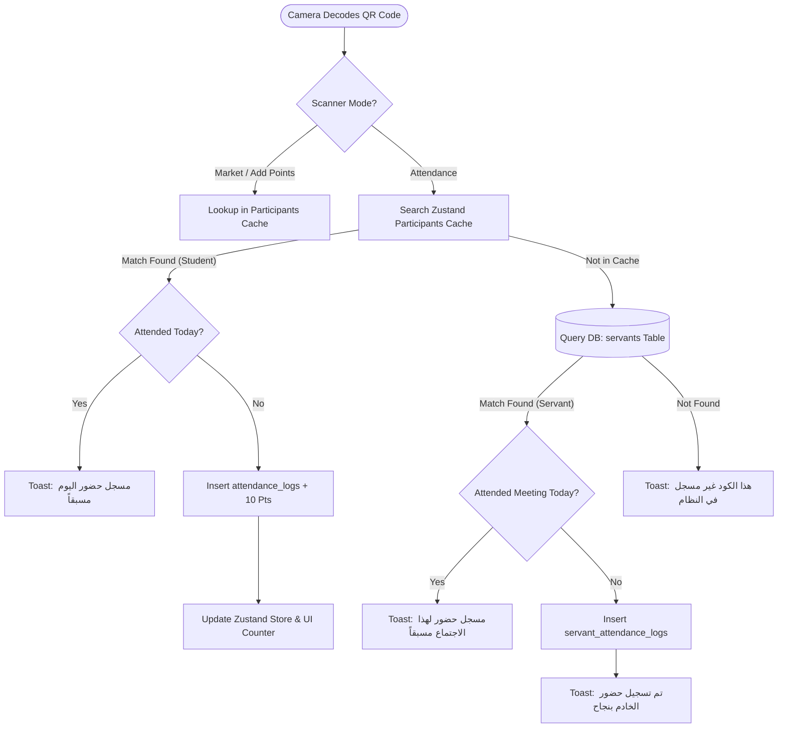

# Church Management System
## Unified Master Technical Architecture & Developer Reference Manual

**System Version:** `2.3.0` (Servant Attendance Module, Smart QR Router, Developer God-Mode, Actionable Contacts, Dual-Login, Global Zustand Store)  
**Target Platform:** Mobile-First Responsive Web Application / Progressive Web App (PWA-Ready)  
**Primary Language & Direction:** Arabic (`ar`) / Right-to-Left (`dir="rtl"`)  
**Parish / Church:** Church of the Great Martyr St. Mina the Wonderworker & Pope Kyrillos VI - Aswan, Egypt  
**File Location:** `MD/PROJECT-DOCUMENTATION.md`  
**Last Updated:** September 2026  

---

## Table of Contents
- [Church Management System](#church-management-system)
  - [Unified Master Technical Architecture \& Developer Reference Manual](#unified-master-technical-architecture--developer-reference-manual)
  - [Table of Contents](#table-of-contents)
  - [1. Project Idea \& Concept](#1-project-idea--concept)
    - [Executive Summary](#executive-summary)
    - [Core Business Problems Solved](#core-business-problems-solved)
  - [2. Tech Stack \& Tooling](#2-tech-stack--tooling)
    - [Core Dependencies \& Architectural Rationale](#core-dependencies--architectural-rationale)
    - [Build Pipeline \& Configuration](#build-pipeline--configuration)
  - [3. User Roles \& Workflows](#3-user-roles--workflows)
    - [Role-Based Access Control (RBAC) Matrix](#role-based-access-control-rbac-matrix)
    - [Critical System Workflows](#critical-system-workflows)
      - [Workflow A: Smart QR Routing (Student vs. Servant Check-in)](#workflow-a-smart-qr-routing-student-vs-servant-check-in)
      - [Workflow B: Manual Servant Attendance Logging](#workflow-b-manual-servant-attendance-logging)
      - [Workflow C: Dual-Login Credential Resolution](#workflow-c-dual-login-credential-resolution)
      - [Workflow D: Compensating Point Rollbacks \& Overdraft Guards](#workflow-d-compensating-point-rollbacks--overdraft-guards)
  - [4. Architecture \& State Management](#4-architecture--state-management)
    - [End-to-End Data Flow](#end-to-end-data-flow)
    - [Zustand Reactive Store Architecture](#zustand-reactive-store-architecture)
    - [Database Schema Specification (Supabase PostgreSQL)](#database-schema-specification-supabase-postgresql)
    - [Database Functions \& Stored Procedures](#database-functions--stored-procedures)
      - [`delete_servant_completely(target_user_id UUID)`](#delete_servant_completelytarget_user_id-uuid)
  - [5. Folder Structure \& Deep Dive](#5-folder-structure--deep-dive)
    - [`src/` Directory ASCII Tree](#src-directory-ascii-tree)
    - [Module \& Directory Explanations](#module--directory-explanations)
  - [6. Developer Guide \& Architectural Invariants](#6-developer-guide--architectural-invariants)
    - [The Coptic Heritage Palette Design System](#the-coptic-heritage-palette-design-system)
    - [Non-Negotiable Architectural Invariants](#non-negotiable-architectural-invariants)
      - [1. Smart ID Gap-Filling Scheme](#1-smart-id-gap-filling-scheme)
      - [2. iOS Safari Camera Freeze Prevention](#2-ios-safari-camera-freeze-prevention)
      - [3. Actionable Contact Protocol](#3-actionable-contact-protocol)
      - [4. Developer Stealth Mode \& God-Mode Bypass](#4-developer-stealth-mode--god-mode-bypass)
      - [5. Static Asset Import Requirement](#5-static-asset-import-requirement)
      - [6. PostgREST Query Chunking](#6-postgrest-query-chunking)
  - [7. Troubleshooting Guide](#7-troubleshooting-guide)
    - [1. Logos Not Displaying on ID Cards](#1-logos-not-displaying-on-id-cards)
    - [2. ID Card Download Failing or Blank](#2-id-card-download-failing-or-blank)
    - [3. Arabic Text Rendering Backwards or Disconnected](#3-arabic-text-rendering-backwards-or-disconnected)
    - [4. iOS Safari Camera Freezing on Scan](#4-ios-safari-camera-freezing-on-scan)
    - [5. Camera Permission Denied](#5-camera-permission-denied)
    - [6. Duplicate Key Constraint Error on Attendance](#6-duplicate-key-constraint-error-on-attendance)
  - [8. System Changelog](#8-system-changelog)
    - [\[2.3.0\] - September 2026 (Current Version)](#230---september-2026-current-version)
    - [\[1.6.1\] - 2026-06-17](#161---2026-06-17)
    - [\[1.5.0\] - 2026-06-05](#150---2026-06-05)
    - [\[1.1.0\] - 2026-05-24](#110---2026-05-24)
    - [\[1.0.0\] - 2026-05-00](#100---2026-05-00)

---

## 1. Project Idea & Concept

### Executive Summary
**Project_Overview**  is an enterprise-grade, mobile-first church management platform . Built as a reactive single-page application (SPA), the system digitizes, coordinates, and unifies the operational lifecycle of summer deacon schools, spiritual competitions, weekly services, and parishioner databases across all educational cohorts from Kindergarten through University Graduates.

The platform provides a unified operational dashboard for church clergy, general service leaders (أمناء الخدمة), stage supervisors (أمناء المراحل والفصول), servants (خدام وخادمات), and students (مخدومين), streamlining attendance tracking, behavioral points economics, badge printing, stage-level analytics, and ministry treasury ledgers.

---

### Core Business Problems Solved

```
┌─────────────────────────────────────────────────────────────────────────────┐
│                          OPERATIONAL BOTTLENECKS                            │
├───────────────────────────────┬─────────────────────────────────────────────┤
│ 1. Morning Check-in Chaos     │ Sub-300ms QR decoding with camera & gallery │
│ 2. Attendance & Points Fraud  │ DB-level unique constraints per date/cohort │
│ 3. Badge Wear, Loss & Cost    │ Client-side SVG/Canvas 350x550px Smart IDs  │
│ 4. Arbitrary Token Economics  │ Double-entry audit ledger with zero-overdraft│
│ 5. Multi-Cohort Data Leakage  │ Strict Stage-level scope partitioning        │
│ 6. Fragmented Communications  │ Native 1-tap call (tel:) & WhatsApp (wa.me) │
│ 7. Servant Accountability Gap │ Dual-meeting tracking (Class vs. Prep Mtgs) │
│ 8. Complex Login Credentials  │ Dual-Login: Smart ID or 11-Digit Egyptian No│
└───────────────────────────────┴─────────────────────────────────────────────┘
```

1. **Morning Arrival Bottlenecks & Queuing Delays:**  
   Handling hundreds of children arriving simultaneously during Sunday liturgy or summer school previously resulted in paper-roster bottlenecks. Aribsalin's hardware-accelerated QR scanner decodes badges and updates reactive state in under 300ms, providing instant visual feedback and background database persistence.
2. **Attendance Fraud & Duplicate Claims:**  
   Eliminates double-counting through multi-tier deduplication. In-memory Set checks are backed by PostgreSQL unique composite constraints (`unique_daily_attendance` on `(participant_id, attendance_date)` and `unique_servant_daily_attendance` on `(servant_id, attendance_date, meeting_type)`).
3. **Loss and Wear of Physical Badges:**  
   Physical paper badges degrade or get lost. Aribsalin renders pixel-perfect, Coptic-themed Smart ID Badges (`IDCard.tsx`) entirely in the browser using SVG and canvas rendering, exportable as high-resolution PNGs or batch-downloadable PDF card decks.
4. **Disorganized Reward Economy:**  
   Prevents subjective token inflation with an immutable, append-only double-entry points ledger (`points_transactions`). Points are earned via verified attendance (+10 pts) or manual supervisor grants, and redeemed at the church market with strict overdraft protection.
5. **Decentralized Multi-Stage Management:**  
   Partitions student rosters, statistics, and financial tracking into six educational stages (`kg`, `primary_12`, `primary_34`, `primary_56`, `preparatory`, `secondary`, `university_graduate`), ensuring class supervisors focus exclusively on their flock while general supervisors maintain 360° oversight.
6. **Financial Opacity in Ministry Operations:**  
   An integrated Treasury Ledger (`financial_transactions`) tracks all festival revenues, donations, and expenses linked to specific educational stages and accountable servants, visualized using interactive Recharts graphs.
7. **Servant Login Friction:**  
   Servants frequently forget auto-generated alphanumeric IDs. The Dual-Login Engine dynamically accepts either their Smart ID (e.g., `T101`) or their standard 11-digit Egyptian mobile phone number (`010...`, `011...`, `012...`, `015...`), resolving credentials transparently.
8. **Communication Gaps Between Servants & Guardians:**  
   Profile views embed actionable contact anchors linking directly to device dialers (`tel:${phone}`) and authentic WhatsApp API chats (`https://wa.me/201...`) without requiring manual copying or phonebook synchronization.
9. **Servant Attendance & Spiritual Meeting Tracking (v2.3.0):**  
   Sunday school servants have dual obligations: attending their assigned class session (`class` / حصة) and attending the weekly servant preparation meeting (`service_meeting` / اجتماع خدمة). The new `servant_attendance_logs` module tracks both types independently without contaminating student attendance metrics.

---

## 2. Tech Stack & Tooling

### Core Dependencies & Architectural Rationale

| Dependency | Version | Architectural Purpose & Selection Rationale |
|---|---|---|
| **React** | `18.3.1` | Declarative UI layer, virtual DOM reconciliation, and Concurrent Mode transitions (`useTransition`, `Suspense`). |
| **React Router v7** | `^7.18.3` | Single-page client routing, URL parameter extraction, deep linking for profiles (`/profile/:id`, `/servant-profile/:id`), and RBAC route protection (`RoleGuard`, `AuthGuard`). |
| **Zustand** | `^5.0.15` | **High-frequency global reactive micro-store.**<br>*Architectural Rationale:* React Context triggers component re-render cascades across the entire component subtree whenever any store property changes. During continuous 30-60 FPS camera QR scanning, Context-driven re-renders cause severe frame drops, UI lag, and camera freezes. Zustand provides external subscriptions outside React's render loop, enabling instantaneous cache reads and updates without re-rendering the active camera view. |
| **Vite** | `6.3.5` | Next-generation bundler delivering Sub-50ms Hot Module Replacement (HMR), Rollup tree-shaking, and custom asset alias resolution (`@/` to `src/`). |
| **Tailwind CSS v4** | `4.1.12` | Modern styling engine with `@tailwindcss/vite` plugin and `@theme inline` directive mapping CSS variables directly to semantic design tokens. |
| **Supabase JS** | `^2.106.2` | Managed PostgreSQL BaaS client handling database operations, PostgREST queries, row-level security, auth session persistence, and Storage bucket uploads. |
| **html5-qrcode** | `^2.3.8` | Cross-platform hardware camera stream decoding supporting front/rear camera switching, continuous stream analysis, and isolated off-screen canvas file scanning (`#file-qr-reader`). |
| **html2canvas** | `^1.4.1` | Client-side DOM rasterization engine rendering ID cards at `scale: 2` with `useCORS: true` for crisp 300 DPI badge downloads without external server roundtrips. |
| **jspdf** | `^4.2.1` | Client-side vector document generation for bulk printing and multi-card PDF synthesis. |
| **qrcode.react** | `^4.2.0` | SVG-based QR code generation configured with Level-H error correction (`level="H"`, 30% recovery rate) ensuring reliable scanning even on worn or damaged badges. |
| **Sonner** | `2.0.3` | High-performance toast notification system with built-in Arabic Right-to-Left (`dir="rtl"`) styling and auto-dismiss stacking. |
| **Lucide React** | `0.487.0` | Clean, accessible SVG iconography representing liturgical, administrative, and communication metaphors. |
| **Recharts** | `^2.15.2` | SVG-based responsive charting library powering stage attendance distributions and treasury breakdowns. |

---

### Build Pipeline & Configuration

- **`vite.config.ts`:**
  - Plugin pipeline: `react()`, `tailwindcss()`, and custom `figmaAssetResolver()` for asset routing.
  - Path alias: `@` strictly resolves to the absolute path of `src/`.
  - Static asset inclusion: Explicit support for raw SVGs and CSV exports via `assetsInclude: ['**/*.svg', '**/*.csv']`.
- **`vercel.json`:**
  - Configures `@vercel/static-build` targeting the `dist` directory with automatic route rewrites for client-side routing.
- **`package.json`:**
  - Production build command: `vite build`.
  - Development server: `vite` (starts local HTTP/HTTPS server with instant HMR).

---

## 3. User Roles & Workflows

### Role-Based Access Control (RBAC) Matrix

The system enforces 5 distinct roles governed by [`RoleGuard.tsx`](file:///D:/Aribsalin/Aribsalin/src/components/auth/RoleGuard.tsx):

| Capability / Route | Student (`student`) | Servant (`normal`) | Supervisor (`supervisor`) | Administrator (`admin`) | Developer (`developer`) |
|---|:---:|:---:|:---:|:---:|:---:|
| **Authentication Credential** | Smart ID (`P-xxx`) | T-ID or Mobile Phone | T-ID or Mobile Phone | T-ID or Mobile Phone | T-ID or Mobile Phone |
| **Student Portal (`/student-portal`)** | Read-Only Self | Read-Only | Read-Only | Read-Only | Full Access |
| **Dashboard (`/dashboard`)** | Denied | View Metrics | View Metrics (Stage) | View Metrics (Global) | View Metrics (Global) |
| **QR Scanner (`/scanner`)** | Denied | Check-in / Market | Check-in / Market | Check-in / Market | Check-in / Market |
| **Participant Directory (`/participants`)**| Denied | Read-Only | Manage (Own Stage) | Manage (All Stages) | Manage (All Stages) |
| **Manual Points Adjustment** | Denied | Denied | Authorized (Stage) | Authorized (Global) | Authorized (Global) |
| **Marketplace Points Redemption** | Denied | Authorized | Authorized | Authorized | Authorized |
| **Servant Directory (`/teachers`)** | Denied | Denied | Denied | Full Access | Full Access |
| **Manual Servant Attendance** | Denied | Denied | Denied | Authorized | Authorized |
| **Stage Statistics (`/statistics`)** | Denied | Denied | Authorized (Stage) | Authorized (Global) | Authorized (Global) |
| **Treasury & Finance (`/finance`)** | Denied | Denied | Denied | Full Access | Full Access |
| **Session Wipe & Ops (`/sessions`)** | Denied | Denied | Denied | Full Access | Full Access |
| **Registration Requests (`/requests`)** | Denied | Denied | Denied | Full Access | Full Access |
| **Servant Roster Visibility** | N/A | Visible | Visible | Visible | **Stealth Mode (Hidden)** |
| **RoleGuard Universal Bypass** | No | No | No | No | **God Mode (Bypasses All)** |

---

### Critical System Workflows

#### Workflow A: Smart QR Routing (Student vs. Servant Check-in)
The scanner handles both participants and servants within a unified video stream:



1. Camera captures QR code string.
2. In `attendance` mode, the user selects the meeting type: **حصة** (`class`) or **اجتماع خدمة** (`service_meeting`).
3. System searches the local in-memory participant cache (`useFestivalStore.participants`).
4. **Student Branch:** If matched, verifies `attended` status for today. If not attended, commits record to `attendance_logs`, awards 10 points, inserts a `points_transactions` record, increments the global attendance count, and displays a success toast.
5. **Servant Branch (Smart Fallback):** If not found in participant cache, queries `servants` table by `teacher_id` or `id`. If found, verifies whether a record already exists in `servant_attendance_logs` for `(servant_id, attendance_date, meeting_type)`. If absent, inserts record linked to `scanned_by: currentServant.id`. No points are awarded.
6. **Rejection:** If neither student nor servant matches, displays an error: *"هذا الكود غير مسجل في النظام"*.

---

#### Workflow B: Manual Servant Attendance Logging
Located in [`TeachersPage.tsx`](file:///D:/Aribsalin/Aribsalin/src/pages/TeachersPage.tsx):
1. Administrator or supervisor locates the servant card and clicks the `CalendarCheck` icon.
2. A modal opens with the servant's name pre-populated.
3. User selects the attendance date (defaulted to `CURRENT_DATE`, constrained by `max={today}`) and the meeting type (`class` or `service_meeting`).
4. The system queries `servant_attendance_logs` to ensure no duplicate entry exists for that servant, date, and meeting type.
5. If unique, inserts the log record with `scanned_by: currentServant.id` and presents a success notification.

---

#### Workflow C: Dual-Login Credential Resolution
Located in [`LoginPage.tsx`](file:///D:/Aribsalin/Aribsalin/src/pages/LoginPage.tsx):
1. User enters their identifier (Smart ID or Egyptian Mobile Number) and password.
2. The system executes regex pattern matching: `/^01[0125][0-9]{8}$/`.
3. **If Mobile Number:** Dispatches a query to `servants` table searching for `mobile_personal`. Upon match, retrieves the associated `teacher_id`.
4. **Credential Synthesis:** Combines the resolved `teacher_id` into a standardized synthetic email: `${teacherId.toLowerCase()}@aribsalin.com`.
5. Authenticates against Supabase Auth: `supabase.auth.signInWithPassword({ email, password })`.
6. [`AuthInitializer.tsx`](file:///D:/Aribsalin/Aribsalin/src/components/auth/AuthInitializer.tsx) catches the active session, loads the servant's database record, and hydrates the global Zustand store.

---

#### Workflow D: Compensating Point Rollbacks & Overdraft Guards
Located in [`MarketModal.tsx`](file:///D:/Aribsalin/Aribsalin/src/components/modals/MarketModal.tsx) & [`ManualPointsModal.tsx`](file:///D:/Aribsalin/Aribsalin/src/components/modals/ManualPointsModal.tsx):
1. Market checkouts strictly guard against negative balances:
   $$\text{NewBalance} = \max(0, \text{CurrentBalance} - \text{DebitAmount})$$
   If $\text{CurrentBalance} < \text{DebitAmount}$, the transaction is aborted with an error toast.
2. The transaction is written to `points_transactions` with negative points and `transaction_type = 'subtraction'`.
3. If an error occurs during the balance update, the operation throws an exception, preventing partial writes.

---

## 4. Architecture & State Management

### End-to-End Data Flow

```
┌─────────────────────────────────────────────────────────────┐
│                 REACT PRESENTATION LAYER                    │
│    Pages (Dashboard, Scanner, TeachersPage, Profiles)       │
└──────────────────────────────┬──────────────────────────────┘
                               │ Dispatches Actions / Selects State
                               ▼
┌─────────────────────────────────────────────────────────────┐
│               ZUSTAND GLOBAL STORE (Memory)                 │
│                   useFestivalStore.ts                       │
│  - In-Memory Participant Graph (stitched with logs)         │
│  - Current Authenticated Servant & Role                     │
│  - Today Attendance Counter                                 │
└──────────────────────────────┬──────────────────────────────┘
                               │ Async REST & RPC Calls
                               ▼
┌─────────────────────────────────────────────────────────────┐
│               SUPABASE CLIENT INTERFACE                     │
│                       lib/supabase.ts                       │
└──────────────────────────────┬──────────────────────────────┘
                               │ HTTPS (PostgREST + Auth + Storage)
                               ▼
┌─────────────────────────────────────────────────────────────┐
│                 SUPABASE POSTGRESQL DB                      │
│  - participants             - attendance_logs               │
│  - servants                 - servant_attendance_logs       │
│  - points_transactions      - financial_transactions        │
│  - Stored Procedures (delete_servant_completely)            │
└─────────────────────────────────────────────────────────────┘
```

---

### Zustand Reactive Store Architecture
Defined in [`useFestivalStore.ts`](file:///D:/Aribsalin/Aribsalin/src/store/useFestivalStore.ts):

- **Data Stitching Algorithm (`fetchData`):**  
  To avoid N+1 query waterfalls and foreign key join timeouts, the store executes a two-phase data aggregation:
  1. *Phase 1:* Queries all active records from `participants` ordered by `created_at DESC`.
  2. *Phase 2:* Queries up to 50,000 records from `attendance_logs` (`participant_id, scanned_at, attendance_date`).
  3. *Phase 3 (In-Memory Stitching):* Iterates through participants, filters their specific logs, extracts unique dates, computes whether `attendanceDays.includes(today)`, and creates an indexed, searchable memory graph.

```typescript
// Sample State Shape
interface FestivalState {
  isAuthenticated: boolean;
  currentServant: Servant | null;
  viewerRole: 'servant' | 'student';
  participants: ParticipantItem[];
  todayAttendance: number;
  isInitialized: boolean;
  fetchData: () => Promise<void>;
  logout: () => Promise<void>;
  initializeAuth: () => Promise<void>;
}
```

---

### Database Schema Specification (Supabase PostgreSQL)

```sql
-- 1. PARTICIPANTS (STUDENTS) TABLE
CREATE TABLE public.participants (
  id uuid NOT NULL DEFAULT gen_random_uuid(),
  participant_id text UNIQUE,
  full_name text NOT NULL,
  gender text CHECK (gender IN ('male', 'female')),
  educational_stage text NOT NULL,
  academic_year text,
  birth_date date,
  class_or_job text,
  father_of_confession text,
  mobile_personal text,
  mobile_father text,
  mobile_mother text,
  address_area text,
  address_details text,
  points_balance integer DEFAULT 0,
  photo_url text,
  created_at timestamp with time zone DEFAULT now(),
  CONSTRAINT participants_pkey PRIMARY KEY (id)
);

-- 2. SERVANTS TABLE
CREATE TABLE public.servants (
  id uuid NOT NULL DEFAULT gen_random_uuid(),
  teacher_id text NOT NULL UNIQUE,
  full_name text NOT NULL,
  gender text CHECK (gender IN ('male', 'female')),
  educational_stage text,
  academic_year text,
  class_or_job text,
  birth_date date,
  father_of_confession text,
  mobile_personal text UNIQUE,
  address_area text,
  address_details text,
  photo_url text,
  role text CHECK (role IN ('normal', 'supervisor', 'admin', 'developer')),
  class_stage text,
  status text DEFAULT 'approved' CHECK (status IN ('pending', 'approved')),
  created_at timestamp with time zone DEFAULT now(),
  CONSTRAINT servants_pkey PRIMARY KEY (id),
  CONSTRAINT servants_auth_fkey FOREIGN KEY (id) REFERENCES auth.users(id) ON DELETE CASCADE
);

-- 3. STUDENT ATTENDANCE LOGS TABLE
CREATE TABLE public.attendance_logs (
  id uuid NOT NULL DEFAULT gen_random_uuid(),
  participant_id uuid NOT NULL,
  servant_id uuid,
  attendance_date date DEFAULT CURRENT_DATE,
  scanned_at timestamp with time zone DEFAULT now(),
  CONSTRAINT attendance_logs_pkey PRIMARY KEY (id),
  CONSTRAINT attendance_logs_participant_id_fkey FOREIGN KEY (participant_id) REFERENCES public.participants(id) ON DELETE CASCADE,
  CONSTRAINT attendance_logs_servant_id_fkey FOREIGN KEY (servant_id) REFERENCES public.servants(id) ON DELETE SET NULL,
  CONSTRAINT unique_daily_attendance UNIQUE (participant_id, attendance_date)
);

-- 4. SERVANT ATTENDANCE LOGS TABLE (v2.3.0)
CREATE TABLE public.servant_attendance_logs (
  id uuid NOT NULL DEFAULT gen_random_uuid(),
  servant_id uuid NOT NULL,
  scanned_by uuid,
  meeting_type text NOT NULL CHECK (meeting_type IN ('class', 'service_meeting')),
  attendance_date date DEFAULT CURRENT_DATE,
  scanned_at timestamp with time zone DEFAULT now(),
  CONSTRAINT servant_attendance_logs_pkey PRIMARY KEY (id),
  CONSTRAINT servant_attendance_logs_servant_id_fkey FOREIGN KEY (servant_id) REFERENCES public.servants(id) ON DELETE CASCADE,
  CONSTRAINT servant_attendance_logs_scanned_by_fkey FOREIGN KEY (scanned_by) REFERENCES public.servants(id) ON DELETE SET NULL,
  CONSTRAINT unique_servant_daily_attendance UNIQUE (servant_id, attendance_date, meeting_type)
);

-- 5. POINTS TRANSACTIONS (DOUBLE-ENTRY LEDGER)
CREATE TABLE public.points_transactions (
  id uuid NOT NULL DEFAULT gen_random_uuid(),
  participant_id uuid NOT NULL,
  servant_id uuid,
  transaction_type text CHECK (transaction_type IN ('addition', 'subtraction', 'manual')),
  points_amount integer NOT NULL,
  description text,
  created_at timestamp with time zone DEFAULT timezone('utc'::text, now()),
  CONSTRAINT points_transactions_pkey PRIMARY KEY (id),
  CONSTRAINT points_transactions_participant_id_fkey FOREIGN KEY (participant_id) REFERENCES public.participants(id) ON DELETE CASCADE,
  CONSTRAINT points_transactions_servant_id_fkey FOREIGN KEY (servant_id) REFERENCES public.servants(id) ON DELETE SET NULL
);

-- 6. FINANCIAL TRANSACTIONS (TREASURY LEDGER)
CREATE TABLE public.financial_transactions (
  id uuid NOT NULL DEFAULT gen_random_uuid(),
  type text CHECK (type IN ('income', 'expense')),
  title text NOT NULL,
  amount integer NOT NULL,
  transaction_date date DEFAULT CURRENT_DATE,
  education_stage text,
  person_name text,
  description text,
  servant_id uuid,
  created_at timestamp with time zone DEFAULT now(),
  CONSTRAINT financial_transactions_pkey PRIMARY KEY (id),
  CONSTRAINT financial_transactions_servant_id_fkey FOREIGN KEY (servant_id) REFERENCES public.servants(id) ON DELETE SET NULL
);

-- 7. RESIDENTIAL AREAS LOOKUP TABLE
CREATE TABLE public.areas (
  id uuid NOT NULL DEFAULT gen_random_uuid(),
  name character varying NOT NULL UNIQUE,
  created_at timestamp with time zone DEFAULT timezone('utc'::text, now()),
  CONSTRAINT areas_pkey PRIMARY KEY (id)
);
```

---

### Database Functions & Stored Procedures

#### `delete_servant_completely(target_user_id UUID)`
Eliminates orphaned foreign keys across auth and data tables when removing a servant:
```sql
CREATE OR REPLACE FUNCTION public.delete_servant_completely(target_user_id uuid)
RETURNS void
LANGUAGE plpgsql
SECURITY DEFINER
AS $$
BEGIN
  -- 1. Remove servant attendance logs
  DELETE FROM public.servant_attendance_logs WHERE servant_id = target_user_id OR scanned_by = target_user_id;
  
  -- 2. Nullify references in attendance and points ledgers
  UPDATE public.attendance_logs SET servant_id = NULL WHERE servant_id = target_user_id;
  UPDATE public.points_transactions SET servant_id = NULL WHERE servant_id = target_user_id;
  UPDATE public.financial_transactions SET servant_id = NULL WHERE servant_id = target_user_id;
  
  -- 3. Remove servant profile record
  DELETE FROM public.servants WHERE id = target_user_id;
  
  -- 4. Delete Supabase Auth user
  DELETE FROM auth.users WHERE id = target_user_id;
END;
$$;
```

---

## 5. Folder Structure & Deep Dive

### `src/` Directory ASCII Tree

```
src/
├── app/
│   ├── App.tsx                          # Master routing switch, route guards, and code-splitting
│   └── utils/
│       └── stageHelpers.ts              # Stage label definitions and cohort mapping logic
├── assets/
│   └── images/
│       ├── church logo.png              # Official St. Mina & Pope Kyrillos VI Church emblem
│       └── service logo.png             # Official Aribsalin Ministry emblem
├── components/
│   ├── auth/
│   │   ├── AuthInitializer.tsx         # Session watcher; hydrates Zustand store on load
│   │   └── RoleGuard.tsx               # RBAC route guard enforcing permissions & God Mode
│   ├── forms/
│   │   └── RegistrationForm.tsx        # Multi-stage participant onboarding form
│   ├── layout/
│   │   └── AppMain.tsx                 # Core responsive application wrapper
│   ├── modals/
│   │   ├── AddPointsModal.tsx          # Manual positive reward modal
│   │   ├── BulkIDDownloadModal.tsx     # Batch ZIP/PDF generation of digital ID cards
│   │   ├── ManualPointsModal.tsx       # Double-entry balance adjustment modal with audit notes
│   │   └── MarketModal.tsx             # Points store deduction modal with overdraft checks
│   ├── shared/
│   │   ├── IDCard.tsx                  # Polymorphic digital badge (Student vs. Servant)
│   │   ├── ImageWithFallback.tsx       # Safe avatar renderer with fallback icons
│   │   ├── ParticipantsList.tsx        # Virtualized participant roster table
│   │   ├── QRScanner.tsx               # Hardware camera reader & Smart Router
│   │   ├── TestQRCode.tsx              # Testing utility rendering test QR matrix
│   │   └── WelcomeScreen.tsx           # Initial splash and onboarding presentation
│   └── ui/                             # 40+ atomic Radix UI & Tailwind component primitives
│       ├── accordion.tsx, alert.tsx, avatar.tsx, badge.tsx, button.tsx,
│       ├── calendar.tsx, card.tsx, dialog.tsx, drawer.tsx, dropdown-menu.tsx,
│       ├── input.tsx, select.tsx, sonner.tsx, table.tsx, tabs.tsx, etc.
├── lib/
│   ├── supabase.ts                     # Initialized Supabase singleton client
│   └── uploadHelper.ts                 # UUID-based storage uploader for profile photos
├── pages/
│   ├── Dashboard.tsx                   # Central operational hub with quick actions & metrics
│   ├── FinancePage.tsx                 # Treasury ledger, income/expense records, and charts
│   ├── LoginPage.tsx                   # Dual-login entry (Smart ID or Egyptian Mobile)
│   ├── ParticipantsPage.tsx            # Participant management, attendance & points actions
│   ├── RegistrationPage.tsx            # Admin interface for direct student/servant creation
│   ├── RegistrationRequestsPage.tsx    # Servant onboarding request approval workflow
│   ├── RoleSelectionPage.tsx           # Entry gateway selecting Student vs. Servant portals
│   ├── ServantProfile.tsx              # Servant profile, ID card download, and attendance logs
│   ├── SessionsManagementPage.tsx      # Macro session wipes and batch maintenance operations
│   ├── SignupPage.tsx                  # Public servant onboarding registration form
│   ├── StatisticsPage.tsx              # Stage attendance percentages & demographic graphs
│   ├── StudentPortalLogin.tsx          # Simplified student QR/ID access portal
│   ├── StudentProfile.tsx              # Student dossier, actionable contacts, points, & badge
│   └── TeachersPage.tsx                # Servant directory, stealth filter, & manual attendance
├── store/
│   └── useFestivalStore.ts             # Central Zustand reactive store & data stitcher
├── styles/
│   ├── fonts.css                       # Tajawal & Cairo typography declarations
│   ├── globals.css                     # Base element resets and body defaults
│   ├── index.css                       # Root CSS aggregator
│   ├── tailwind.css                    # Tailwind CSS v4 import directives
│   └── theme.css                       # The Coptic Heritage Palette CSS variable definitions
├── types/
│   └── index.ts                        # TypeScript interfaces for students, servants, and cards
├── utils/
│   └── textUtils.ts                    # Arabic diacritic normalization and search normalization
├── main.tsx                            # React root hydration entry point
└── vite-env.d.ts                       # TypeScript environment variable definitions
```

---

### Module & Directory Explanations

- **`src/components/shared/QRScanner.tsx`:**  
  The core scanning component. Operates the active camera stream, controls meeting type selection (`class` vs. `service_meeting`), and executes the Smart Router logic to branch decoded tokens between student and servant handlers.
- **`src/components/shared/IDCard.tsx`:**  
  The polymorphic digital badge renderer. Automatically detects whether the input model is a student or servant:
  - *For Students:* Displays "رقم المشارك", education stage, academic year, and encodes `participant_id` in the Level-H QR code.
  - *For Servants:* Displays "كود الخادم", ecclesiastical role (خادم, أمين فصل, أمين خدمة), class stage, and encodes `teacher_id` in the QR code.
- **`src/pages/TeachersPage.tsx`:**  
  The servant directory. Groups servants by educational cohort, excludes developers via Stealth Mode, and houses the Manual Servant Attendance Modal.
- **`src/pages/StudentProfile.tsx` & `src/pages/ServantProfile.tsx`:**  
  Detailed profiles featuring live attendance percentage calculations, point gauges, hidden canvas wrappers for PNG/QR badge downloads, and actionable contact buttons.
- **`src/utils/textUtils.ts` (`normalizeArabicText`):**  
  Essential search normalization function. Strips Arabic diacritics (التشكيل), normalizes Alef variations (`أ`, `إ`, `آ` to `ا`), Taa Marbouta (`ة` to `ه`), and Alef Maksoura (`ى` to `ي`) to ensure reliable search matching regardless of spelling variations.

---

## 6. Developer Guide & Architectural Invariants

### The Coptic Heritage Palette Design System
The visual identity reflects the liturgical heritage of the Coptic Orthodox Church, defined in [`theme.css`](file:///D:/Aribsalin/Aribsalin/src/styles/theme.css):

```css
:root {
  /* Primary: Imperial Coptic Burgundy (دم الشهداء والأصالة القبطية) */
  --primary: #8B1538;
  --primary-foreground: #ffffff;

  /* Secondary: Ecclesiastical Gold (المجد والبر الإلهي) */
  --secondary: #C9A961;
  --secondary-foreground: #3D2817;

  /* Deep Icon Bronze: Ancient Wood & Frescoes */
  --foreground: #3D2817;
  --muted-foreground: #6B5744;

  /* Background: Warm Liturgical Parchment (المخطوطات العتيقة) */
  --background: #FAF7F2;
  --card: #ffffff;
  
  /* Borders & Accents */
  --border: rgba(139, 21, 56, 0.15);
  --ring: #C9A961;
}
```

---

### Non-Negotiable Architectural Invariants

#### 1. Smart ID Gap-Filling Scheme
When auto-generating participant IDs, the system must **never** perform naive increments (e.g., `count + 1`). Instead, it scans existing IDs within the cohort, extracts numeric suffixes, sorts them, and assigns the lowest available missing integer (e.g., if `P101`, `P102`, and `P104` exist, the algorithm assigns `P103` to fill the gap).

#### 2. iOS Safari Camera Freeze Prevention
**Strict Invariant:** Never invoke `navigator.vibrate()` within QR scanning loops. Apple Safari on iOS crashes or permanently freezes active `MediaStreamTrack` video instances when vibration APIs are called concurrently with camera frame capture.

#### 3. Actionable Contact Protocol
Every phone number displayed across the application must be rendered with actionable links:
- **Phone Dialer:** `<a href="tel:${cleanNumber}">`
- **WhatsApp Chat:** `<a href="https://wa.me/2${cleanNumber}" target="_blank" rel="noopener noreferrer">`
- Egyptian numbers must be prefixed with `2` (e.g., `01012345678` $\rightarrow$ `https://wa.me/201012345678`).

#### 4. Developer Stealth Mode & God-Mode Bypass
- **Universal Bypass (`RoleGuard.tsx`):**
  ```typescript
  const userRole = currentServant.role || 'normal';
  if (userRole !== 'developer' && !allowedRoles.includes(userRole)) {
    return <Navigate to="/dashboard" replace />;
  }
  ```
  The `developer` role must bypass all route restrictions across the application.
- **Stealth Mode (`TeachersPage.tsx`):**
  All queries populating the public servant directory must filter out developers:
  ```typescript
  const { data } = await supabase
    .from('servants')
    .select('*')
    .neq('role', 'developer');
  ```
  Developers must remain completely invisible on public church servant rosters.

#### 5. Static Asset Import Requirement
**Strict Invariant:** Bundled image assets (e.g., church logos) must always be imported using static ES module syntax:
```typescript
// CORRECT
import churchLogo from '../../assets/images/church logo.png';


// FORBIDDEN - Causes broken images in production builds
const logoUrl = new URL('../../assets/images/church logo.png', import.meta.url).href;
```

#### 6. PostgREST Query Chunking
When performing bulk database operations with `.in('id', array)`, arrays containing more than 200 items must be chunked into sub-batches of 200 to prevent HTTP 414 (*URI Too Long*) errors.

---

## 7. Troubleshooting Guide

### 1. Logos Not Displaying on ID Cards
- **Root Cause:** Dynamic asset resolution using `new URL()` fails under Vite production bundling.
- **Resolution:** Convert all image paths to static ES module imports (`import churchLogo from '...'`).

### 2. ID Card Download Failing or Blank
- **Root Cause:** `html2canvas` cannot access remote image assets without CORS or cannot find the container.
- **Resolution:** Verify the target element has `id="id-card"`, ensure `useCORS: true` is configured in `html2canvas`, and ensure all images originate from local static imports or CORS-enabled storage buckets.

### 3. Arabic Text Rendering Backwards or Disconnected
- **Root Cause:** Missing Right-to-Left CSS context.
- **Resolution:** Ensure the parent container has `dir="rtl"` and uses an Arabic-supported font (`Tajawal`, `Cairo`, `sans-serif`).

### 4. iOS Safari Camera Freezing on Scan
- **Root Cause:** `navigator.vibrate()` call triggered on barcode detection locks the iOS hardware camera thread.
- **Resolution:** Remove all calls to `navigator.vibrate()`. Manage scan throttling strictly via React `useRef` timestamps.

### 5. Camera Permission Denied
- **Root Cause:** Modern browsers block camera access on non-secure origins.
- **Resolution:** Serve the application over `https://` or `localhost`. Plain `http://` domain hosting will block `getUserMedia()`.

### 6. Duplicate Key Constraint Error on Attendance
- **Root Cause:** Attempting to insert a duplicate record for a participant or servant on the same date.
- **Resolution:** The UI gracefully handles error code `23505` by displaying an informative toast (*"تم تسجيل الحضور اليوم مسبقاً"*), preventing application crashes.

---

## 8. System Changelog

### [2.3.0] - September 2026 (Current Version)
- **Added:** Servant Attendance Module (`servant_attendance_logs` table) tracking `class` and `service_meeting` types.
- **Added:** Smart QR Router in `QRScanner.tsx` dynamically identifying Students vs. Servants from a single camera feed.
- **Added:** Meeting Type Selector UI toggle in `QRScanner.tsx` allowing one-tap switching between Class and Service Meeting attendance.
- **Added:** Manual Servant Attendance feature and modal in `TeachersPage.tsx` with duplicate checking.
- **Added:** Developer "God Mode" (Stealth Mode invisibility on servant rosters + Universal RBAC Bypass in `RoleGuard.tsx`).
- **Added:** Polymorphic `IDCard.tsx` component supporting both Students and Servants.
- **Added:** Actionable contact links (`tel:` for phone dialers and authentic SVG brand icon for `wa.me` WhatsApp chats) across `StudentProfile.tsx` and `ServantProfile.tsx`.
- **Added:** Servant attendance record listing and deletion capabilities in `ServantProfile.tsx`.
- **Added:** Secure database RPC `delete_servant_completely` for cascading servant deletions.

### [1.6.1] - 2026-06-17
- **Fixed:** Signup session persistence and path normalization.
- **Fixed:** ID Card download stability across mobile WebKit browsers.

### [1.5.0] - 2026-06-05
- **Added:** Isolated File Scanner (`#file-qr-reader`) for processing uploaded QR badge photos.
- **Fixed:** iOS Safari camera freeze resolved by eliminating `navigator.vibrate()` calls.
- **Fixed:** Blurry QR code borders corrected via canvas normalization without smoothing.

### [1.1.0] - 2026-05-24
- **Added:** `IDCard` component with high-resolution PNG generation via `html2canvas`.
- **Fixed:** Critical logo display issue resolved by enforcing static ES imports.

### [1.0.0] - 2026-05-00
- **Initial Release:** Core platform release, Sunday school participant registration, QR check-in, points ledger, and financial management.